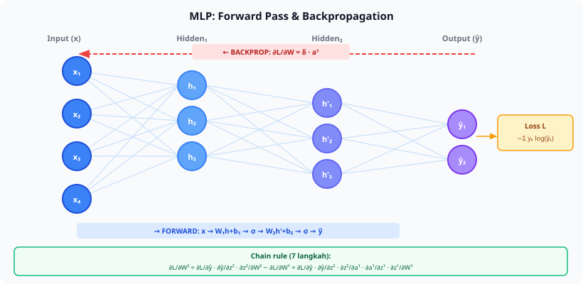
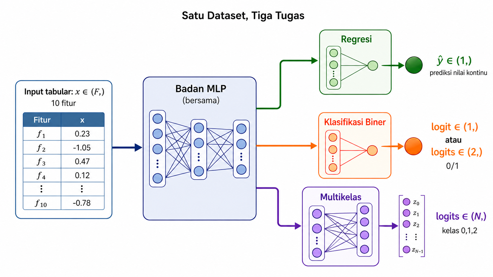
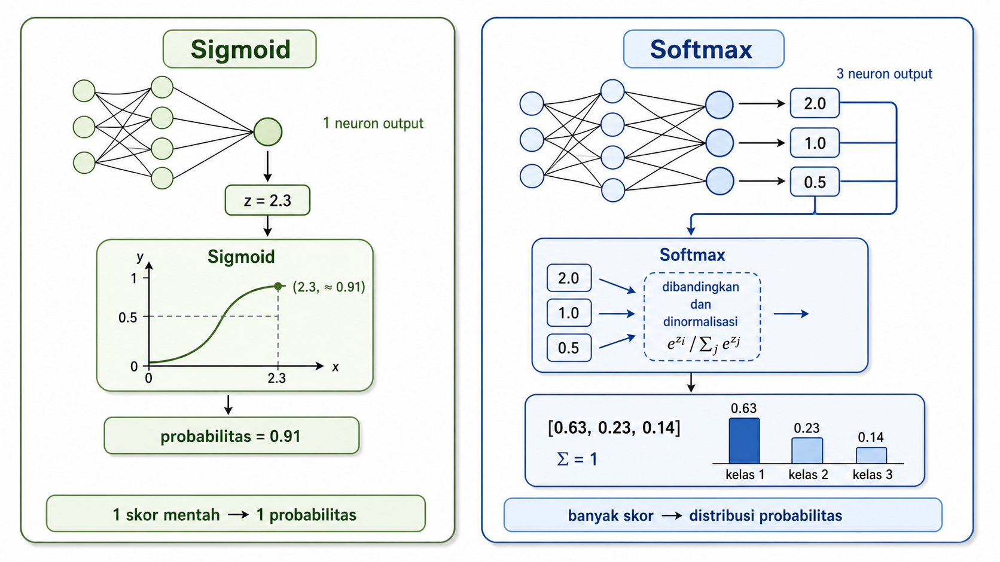
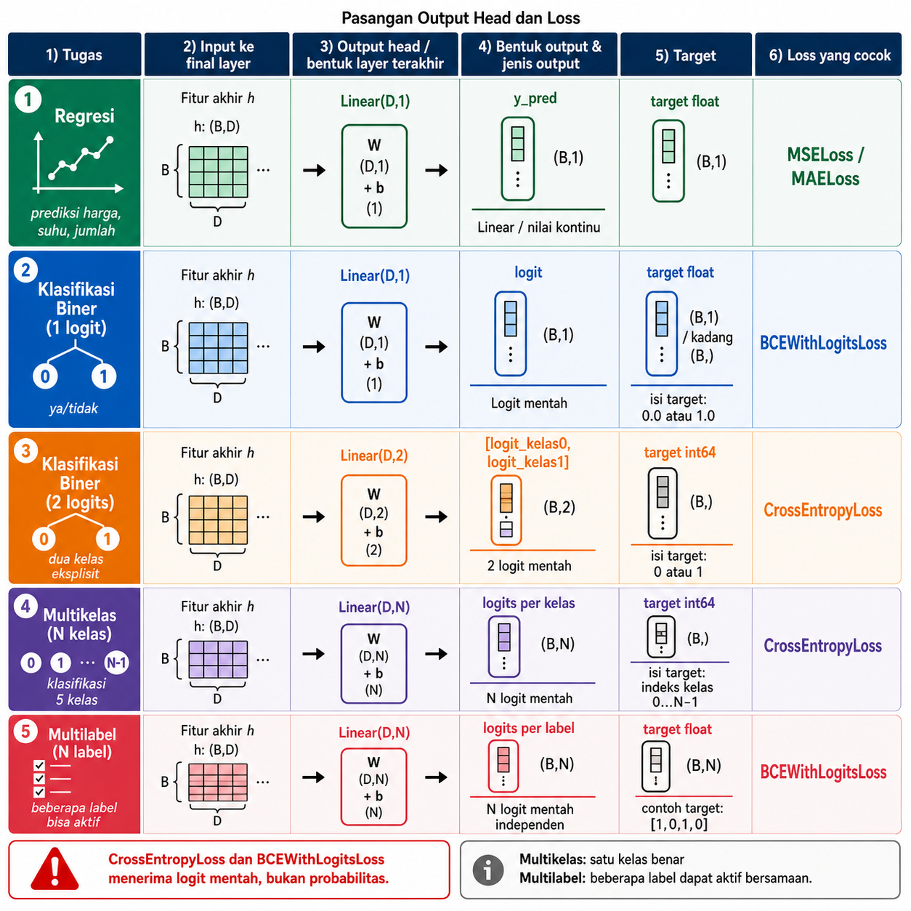

<details>
<summary>📂 Navigasi Modul (klik untuk buka)</summary>

| # | Modul | Minggu |
|---|-------|--------|
| 00 | [Pendahuluan](00_Pendahuluan.md) | 1 |
| 00a | [Prasyarat Modul](00a_Prasyarat.md) | – |
| ▶ 01 | W1 - Tabular & Output Heads | 1 |
| 02 | [W2 - Images, CNN & Smoke Test](02_W2_Images_CNN_Smoke_Test.md) | 2 |
| 03 | [W3 - Loss, Optimizer & Evaluasi](03_W3_Loss_Optimizer_Evaluasi.md) | 3 |
| 04 | [W4 - Reproducibility & Matriks Eksperimen](04_W4_Reproducibility_Experiment_Matrix.md) | 4 |
| 05 | [W5 - Sequences: RNN & LSTM](05_W5_Sequences_RNN_LSTM.md) | 5 |
| 06 | [W6 - Representations & Temporal Leakage](06_W6_Representations_Temporal_Leakage.md) | 6 |
| 07 | [W7 - Text, Transformers & Repo Adoption](07_W7_Text_Transformers_Repo_Adoption.md) | 7 |
| 08 | [W8 - Foundation Models](08_W8_Foundation_Models.md) | 8 |
| 09 | [W9 - Multimodal Reasoning](09_W9_Multimodal_Reasoning.md) | 9 |
| 10 | [W10 - Paper Reading & Implementation](10_W10_Paper_Reading.md) | 10 |
| 11 | [W11 - Research Framing](11_W11_Research_Framing.md) | 11 |
| 12 | [Capstone - Proyek Riset](12_Capstone.md) | 12-15 |
| 13 | [Rubrik Penilaian](13_Rubrik_Penilaian.md) | – |
| 14 | [Lampiran](14_Lampiran.md) | – |
| 15 | [Panduan Instruktur](15_Panduan_Instruktur.md) | – |

</details>

---

# 01 · W1 - Tabular & Output Heads

Kali ini kita akan membahas:

1. **MLP Mengubah Bentuk Tensor** - body bersama yang mengekstrak fitur, dan head yang berubah mengikuti tugas.
2. **Pencocokan Output Head dan Loss** - tiga pasangan kanonik untuk regression, binary, dan multiclass.
3. **Training Loop PyTorch** - lima langkah yang berulang dari W1 sampai capstone, plus pipeline data di sekitarnya.
4. **Observasi Sebelum Kesimpulan** - memisahkan apa yang teramati dari apa yang disimpulkan.

Di pertemuan sebelumnya kita sudah membahas prasyarat modul: cara membaca shape tensor, satu langkah training PyTorch, dan kalkulus dasar untuk chain rule. Kalau salah satu masih terasa asing, baca ulang [Prasyarat Modul](00a_Prasyarat.md) sebelum lanjut. Minggu ini adalah training MLP pertama yang dijalankan end-to-end, dengan satu refleks yang dipakai sepanjang bootcamp: saat melihat tugas baru, identifikasi shape input dan shape output, lalu pilih keluarga model yang memetakan keduanya. W1 memakai tabular karena kompleksitas domainnya paling rendah: satu vektor fitur masuk, satu prediksi keluar, tanpa augmentasi gambar atau tokenisasi teks.

---

## 1. MLP Mengubah Bentuk Tensor

Multilayer Perceptron (MLP) mengambil vektor fitur `(F,)` dan menghasilkan vektor output `(D_out,)`. Setiap layer `Linear(in, out)` menjalankan transformasi affine `y = W x + b`, lalu diikuti aktivasi non-linear seperti ReLU.



```text
input (F,) -> Linear(F, 64) -> ReLU -> Linear(64, 32) -> ReLU -> Linear(32, D_out) -> output (D_out,)
```

`D_out` ditentukan oleh tugas, bukan oleh data. Regression scalar memakai `D_out = 1`, binary classification memakai `D_out = 1` (logit tunggal) atau `D_out = 2` (logits dua kelas), dan multiclass dengan N kelas memakai `D_out = N`. Bagian utama model tetap sama; hanya output terakhir yang berubah mengikuti tugas.

### 1.1 Linear Layer: Mekanik dengan Angka Kecil

Satu `Linear(in=3, out=2)` mengambil vektor 3 elemen dan mengeluarkan vektor 2 elemen lewat perkalian matriks dan penambahan bias:

```
y = W x + b

W berukuran (2, 3), b berukuran (2,)
```

Anggap `W = [[1, 0, -1], [2, 1, 0]]` dan `b = [0.5, -1.0]`. Untuk input `x = [3, 4, 2]`:

```
y[0] = 1*3 + 0*4 + (-1)*2 + 0.5  = 1.5
y[1] = 2*3 + 1*4 +   0*2 + (-1)  = 9.0
```

Jadi `Linear(3, 2)` dengan parameter di atas memetakan `[3, 4, 2]` ke `[1.5, 9.0]`. Dalam praktiknya, `W` dan `b` dipelajari otomatis lewat training; nilainya tidak ditebak manual.

ReLU diperlukan karena tanpa aktivasi non-linear, dua `Linear` yang ditumpuk setara dengan satu `Linear`: `W₂(W₁ x + b₁) + b₂ = (W₂ W₁) x + (W₂ b₁ + b₂)`. Walaupun lebih dalam secara struktur, kapasitas representasi tidak naik. Aktivasi non-linear menambahkan titik patah di antara layer, sehingga komposisi dua layer bisa membentuk decision boundary lengkung. `ReLU(x) = max(0, x)` adalah aktivasi paling sederhana: input positif dilewatkan apa adanya, input negatif diubah menjadi nol.

```
ReLU(x)
   |
 3 |                   /
   |                  /
 2 |                /
   |               /
 1 |             /
   |            /
 0 |__________/_________ x
  -3  -2  -1  0  1  2  3
```

Kombinasi `Linear → ReLU → Linear → ReLU → ...` adalah resep MLP standar. Kedalaman menambah kapasitas representasi, dan ReLU menjaga gradient tetap terhitung lewat banyak layer.

### 1.2 Body dan Head: Struktur Dua Bagian

Model dibagi dua bagian. **Body** adalah bagian yang sama untuk semua tugas pada data ini: rangkaian `Linear → ReLU` yang mengekstrak fitur generik dari input. **Head** adalah lapisan akhir yang spesifik untuk tugas: berapa output dan dengan aktivasi seperti apa.

```
                  Body (shared)                      Head (per-task)
input  ──►  Linear(F, 64) ──► ReLU ──► Linear(64, 32) ──► ReLU ──► Linear(32, D_out) ──►  output
   (F,)                                                                    │
                                                       D_out berubah sesuai tugas:
                                                          regression  → 1
                                                          binary      → 1 (logit) atau 2 (logits)
                                                          multiclass(N) → N
```



Diagram di atas ditulis langsung dalam PyTorch: satu body bersama, tiga head paralel, dan satu forward pass menghasilkan tiga output sekaligus.

```python
import torch
import torch.nn as nn

class ArsitekturMultiTugas(nn.Module):
    def __init__(self, jumlah_fitur=10, jumlah_kelas=3):
        super().__init__()
        self.badan_mlp = nn.Sequential(
            nn.Linear(jumlah_fitur, 64), nn.ReLU(),
            nn.Linear(64, 32), nn.ReLU(),
        )
        self.kepala_regresi = nn.Linear(32, 1)
        self.kepala_biner = nn.Linear(32, 1)
        self.kepala_multikelas = nn.Linear(32, jumlah_kelas)

    def forward(self, x):
        fitur = self.badan_mlp(x)
        return self.kepala_regresi(fitur), self.kepala_biner(fitur), self.kepala_multikelas(fitur)

model = ArsitekturMultiTugas()
data_input_x = torch.randn(1, 10)
hasil_regresi, hasil_biner, hasil_multikelas = model(data_input_x)

print("1. Output Regresi (1 nilai):", hasil_regresi.item())
print("2. Output Logit Biner (1 nilai):", hasil_biner.item())
print("3. Output Logits Multikelas (3 nilai):", hasil_multikelas.detach().numpy())
```

Pola body-head ini sama dengan cara kerja model pretrained di W7-W8: backbone CNN atau Transformer pretrained menjadi body yang di-freeze, dan hanya head kecil yang dilatih untuk tugas baru. Memisahkan body dan head sejak W1 memudahkan transisi ke pola adaptasi tersebut, yang dibahas lengkap di [W7](07_W7_Text_Transformers_Repo_Adoption.md) dan [W8](08_W8_Foundation_Models.md).

---

## 2. Pencocokan Output Head dan Loss

Pasangan output head dan loss tidak bebas dipilih. Tugas menentukan bentuk head, dan head menentukan loss yang dipakai. Kita pahami tiga pasangan utama lewat satu contoh angka kecil masing-masing, baru lihat tabel ringkasannya.

### 2.1 Regression: MSE dan Jarak Kuadrat

Tugas regression memprediksi angka kontinu seperti harga rumah, suhu besok, atau kadar glukosa. Output head yang dipakai adalah `Linear(D, 1)` tanpa aktivasi. Loss yang dipakai adalah **Mean Squared Error**:

```
MSE = (1/N) Σ (ŷ - y)²
```

Untuk satu sampel dengan prediksi `ŷ = 0.9` dan target `y = 1.0`, MSE per-sampel adalah `(0.9 - 1.0)² = 0.01`. Loss ini menghukum prediksi yang jauh secara kuadratis: prediksi yang meleset 0.5 menyumbang loss `0.25`, prediksi yang meleset 1.0 menyumbang loss `1.0` (empat kali lebih besar, bukan dua kali). Sifat ini membuat MSE peka terhadap outlier. Kalau dataset penuh outlier, **Mean Absolute Error** (`MAE = |ŷ - y|`) sering lebih stabil.

### 2.2 Binary Classification: BCE dan Sigmoid

Tugas binary memprediksi ya atau tidak, positif atau negatif. Output head yang dipakai adalah `Linear(D, 1)` yang menghasilkan satu **logit** (angka real, bukan probabilitas). Loss yang dipakai adalah **Binary Cross-Entropy with Logits**:

```
BCE = -[y log(σ(z)) + (1 - y) log(1 - σ(z))]
σ(z) = 1 / (1 + e^(-z))            # sigmoid: peras logit ke (0, 1)
```

**Sigmoid** memetakan logit `z = 0` ke probabilitas 0.5, `z = 2` ke ~0.88, dan `z = -2` ke ~0.12. Kalau target `y = 1` dan model output logit `z = 2` (yakin benar), loss kecil ≈ 0.13. Kalau target `y = 1` tetapi model output `z = -2` (yakin salah), loss besar ≈ 2.13. Inilah arti "log menghukum yang salah tapi yakin": penalti naik tajam saat prediksi makin yakin di sisi yang salah.

PyTorch menyediakan `BCEWithLogitsLoss` yang menggabung sigmoid dan log dalam satu langkah yang stabil secara numerik. Hindari `Sigmoid` lalu `BCELoss` terpisah, karena bisa underflow saat logit ekstrem.

### 2.3 Multiclass: CrossEntropy dan Softmax

Tugas multiclass dengan N kelas memprediksi salah satu dari N kategori (misal anjing, kucing, kelinci dengan N=3). Output head yang dipakai adalah `Linear(D, N)` yang menghasilkan **vektor logit** panjang N. Loss yang dipakai adalah **Cross-Entropy**:

```
CE = -log(softmax(z)[y])
softmax(z)[i] = e^(z_i) / Σ_j e^(z_j)
```

**Softmax** memetakan vektor logit ke distribusi probabilitas yang jumlahnya 1. Misal logit `z = [2.0, 1.0, 0.5]` menghasilkan softmax kira-kira `[0.62, 0.23, 0.15]`. Kalau target benar adalah kelas 0, loss adalah `-log(0.62) ≈ 0.48`. Kalau target benar adalah kelas 2, loss adalah `-log(0.15) ≈ 1.90`.

`CrossEntropyLoss` di PyTorch menggabung `LogSoftmax + NLLLoss` agar stabil secara numerik. Input yang diterima adalah **logit mentah**, bukan probabilitas. Kesalahan paling umum pemula adalah menambahkan `softmax` di akhir model lalu mengirimnya ke `CrossEntropyLoss`. Akibatnya gradient mengecil tidak wajar dan training tidak konvergen.

> [!IMPORTANT]
> **Logit mentah** adalah output `Linear` terakhir tanpa aktivasi. `BCEWithLogitsLoss` dan `CrossEntropyLoss` keduanya mengharapkan logit mentah. Sigmoid dan softmax dilakukan di dalam loss function untuk stabilitas numerik.



### 2.4 Tabel Ringkasan Pasangan Head dan Loss

Setelah memahami ketiga pasangan di atas, tabel berikut dipakai sebagai rujukan cepat. Cetak dan tempel di samping monitor saat Lab.

| Tugas | Output head | Aktivasi akhir | Loss yang cocok | Bentuk target |
|---|---|---|---|---|
| Regression scalar | `Linear(D, 1)` | tidak ada (linear) | MSE atau MAE | `float` |
| Binary classification | `Linear(D, 1)` | tidak ada (logit raw) | `BCEWithLogitsLoss` | `float` 0/1 |
| Binary classification (alt) | `Linear(D, 2)` | tidak ada (logits) | `CrossEntropyLoss` | `int64` 0/1 |
| Multiclass (N kelas) | `Linear(D, N)` | tidak ada (logits raw) | `CrossEntropyLoss` | `int64` 0..N-1 |
| Multilabel | `Linear(D, N)` | tidak ada (logits raw) | `BCEWithLogitsLoss` | `float` vektor 0/1 |



Ketidakcocokan loss dan head sering merusak training tanpa pesan error yang jelas. Kalau target `int` diberi ke MSE atau target `float` diberi ke CrossEntropy, pesan error PyTorch sering tidak deskriptif, dan ciri training rusak adalah loss konstan dari epoch pertama atau berubah dengan cara yang tidak masuk akal. Sebelum mendebug arsitektur, periksa dulu pasangan loss, head, dan target. Lab minggu ini meminta satu run dengan pasangan yang sengaja salah supaya efek ini terlihat langsung.

---

## 3. Training Loop PyTorch

MLP belajar lewat **backpropagation**. Setelah loss dihitung di output, gradient dari loss terhadap setiap parameter dihitung mundur lewat chain rule, lalu optimizer memperbarui parameter ke arah penurunan loss.

Jaringan adalah rantai operasi: `x → Linear₁ → ReLU₁ → Linear₂ → ReLU₂ → Linear₃ → loss`. Saat `loss.backward()` dipanggil, PyTorch berjalan mundur lewat rantai ini dan menghitung kontribusi setiap parameter terhadap loss lewat chain rule (rantai turunan; lihat §4 di [Prasyarat Modul](00a_Prasyarat.md)). Setiap layer punya turunan untuk operasinya sendiri, dan library autograd menggabungkannya menjadi gradient utuh untuk seluruh model. Setelah gradient siap, `optimizer.step()` menggeser parameter sedikit ke arah `-gradient`.

Itu cukup sebagai gambaran W1. Chain rule tidak perlu diturunkan manual minggu ini. Derivasi 7-langkah yang ketat (`MSE loss + sigmoid` pada MLP dua layer) tersedia di [Lampiran A.13](14_Lampiran.md#a13-backpropagation-derivasi-manual) untuk dibaca setelah ada beberapa run sukses. Lab 1b (MLP numpy from-scratch) menerapkan backprop secara konkret pada MNIST sebagai breadth lab opsional.

Pola minimum training MLP di PyTorch muat dalam belasan baris. Snippet ini menggabungkan konsep §1-§2 dalam satu tempat, bukan kode siap-jalankan untuk Lab.

```python
import torch
import torch.nn as nn

# Body + head MLP untuk multiclass 3 kelas (lihat §1.2)
model = nn.Sequential(
    nn.Linear(10, 64), nn.ReLU(),     # body layer 1: 10 fitur -> 64 hidden
    nn.Linear(64, 32), nn.ReLU(),     # body layer 2: 64 -> 32 hidden
    nn.Linear(32, 3),                 # head: 32 -> 3 logit
)

criterion = nn.CrossEntropyLoss()                   # logit mentah, target int (lihat §2.3)
optimizer = torch.optim.AdamW(model.parameters(), lr=3e-4)

for epoch in range(10):
    for x, y in train_loader:                       # x: (B, 10) float, y: (B,) int64
        logits = model(x)                           # forward: (B, 3)
        loss = criterion(logits, y)                 # skalar
        optimizer.zero_grad()                       # reset gradient lama
        loss.backward()                             # chain rule mundur (lihat atas)
        optimizer.step()                            # geser parameter
```

Lima langkah ini berulang sepanjang modul, dari W1 (tabular) sampai capstone:

1. **`logits = model(x)`** menjalankan forward pass; shape input `(B, F)`, shape output sesuai tugas.
2. **`loss = criterion(logits, y)`** menghitung loss; shape target harus cocok dengan loss yang dipakai (lihat tabel §2.4).
3. **`optimizer.zero_grad()`** dipanggil sebelum backward; tanpa ini, gradient batch sebelumnya menumpuk dan training kacau.
4. **`loss.backward()`** menjalankan autograd mundur dan mengisi `.grad` di setiap parameter.
5. **`optimizer.step()`** memperbarui parameter memakai gradient yang baru dihitung.

Yang berubah antar minggu hanyalah definisi `model`, pilihan `criterion`, dan cara `train_loader` dibangun. Pemilihan loss dan optimizer yang lebih teliti dibahas di [W3 §2.1-§2.2](03_W3_Loss_Optimizer_Evaluasi.md).

Di sekitar training loop ada pipeline data. Input per-sampel berbentuk `(F,)` dikelompokkan menjadi batch `(B, F)` untuk efisiensi, dan loss dihitung sebagai rata-rata atas seluruh batch. Dataloader membungkus dataset, melakukan shuffling, lalu menghasilkan batch satu per satu. Data dibagi menjadi `train` (melatih parameter), `val` (*early stopping* dan tuning hyperparameter), dan `test` (disentuh sekali di akhir untuk angka final). Aturan paling penting di pipeline ini adalah statistik preprocessing (mean, std) dihitung dari train saja, lalu diterapkan ke val dan test. Pelanggaran aturan ini disebut *preprocessing leakage* dan dibahas mendalam di [W6](06_W6_Representations_Temporal_Leakage.md).

---

## 4. Observasi Sebelum Kesimpulan

Lab minggu ini menjalankan tiga tugas pada satu dataset tabular sintetis dengan 10 fitur. Dari fitur yang sama dibuat tiga target: `y_regression` adalah kombinasi linear dari fitur ditambah noise (kontinu), `y_binary` adalah hasil sign dari kombinasi linear (0/1), dan `y_multiclass` adalah hasil bucketize ke 3 kuantil (kelas 0/1/2). Input identik di ketiga tugas, sedangkan output head dan loss berubah. Tiga konfigurasi yang dijalankan diatur lewat tiga field di config:

```yaml
# configs/mlp_tabular.yaml - ubah field di bawah untuk mengganti tugas
data.task: regression   # atau binary, multiclass
loss.name: mse          # atau binary_cross_entropy, cross_entropy
model.num_classes: 1    # atau 2, 3
```

Untuk setiap run, catat train loss dan val loss pada akhir epoch terakhir, lalu satu metrik yang sesuai: MAE untuk regression, accuracy untuk binary, dan accuracy plus macro-F1 untuk multiclass.

Kebiasaan inti W1 adalah memisahkan apa yang teramati dari apa yang disimpulkan. **Observasi** adalah angka dan bentuk kurva yang terlihat. **Kesimpulan** adalah interpretasi dan hipotesis yang ditarik dari observasi. Tulis observasi murni dulu, baru tafsiran. Pemisahan ini menahan godaan menyamakan satu angka accuracy yang bagus dengan model yang berhasil, padahal confusion matrix belum dilihat. Pada multiclass dengan kelas tidak seimbang, accuracy bisa menyesatkan; W3 membahas confusion matrix dan macro-F1 secara serius, dan untuk W1 cukup mencatat accuracy plus ukuran tiap kelas.

Skeptisisme terhadap hasil dimulai dari sini. Sebelum mengklaim sebuah training berhasil, periksa apakah accuracy hanya mendekati 1/K (model tidak belajar lebih baik dari tebakan acak), apakah loss benar-benar turun, dan apakah pasangan loss dan head sudah benar. Kebiasaan menulis observasi sebelum kesimpulan menjadi dasar pelaporan hasil ke dosen yang dilatih penuh mulai [W4](04_W4_Reproducibility_Experiment_Matrix.md).

> [!NOTE]
> MLP dengan 5 layer tersembunyi sering lebih buruk daripada 2 layer pada tabular kecil. Tabular bukan domain di mana kedalaman selalu menang. Mulai dari arsitektur dangkal, lalu naikkan kedalaman hanya kalau ada bukti underfitting.

---

## Lab

Buka [lab_w1_tabular_heads.ipynb](https://colab.research.google.com/github/muhammad-zainal-muttaqin/Module-DS/blob/master/template/notebooks/lab_w1_tabular_heads.ipynb). Tugas mengikuti urutan empat materi di atas. Estimasi waktu 3-4 jam.

1. Jalankan `--dry-run` untuk memastikan pipeline hidup tanpa error (smoke test).
2. Jalankan regression: `task=regression`, `loss=mse`, `num_classes=1`, 20 epoch. Catat MAE val.
3. Jalankan binary: `task=binary`, `loss=cross_entropy`, `num_classes=2`. Catat accuracy val.
4. Jalankan multiclass: `task=multiclass`, `loss=cross_entropy`, `num_classes=3`. Catat accuracy plus macro-F1 val.
5. Jalankan satu run dengan pasangan loss dan head yang sengaja salah (mis. tugas biner dengan `loss=mse`). Amati kegagalannya, lalu tulis 2 kalimat tentang apa yang gagal.
6. Tulis satu paragraf observasi murni (angka dan bentuk kurva yang dilihat) dan satu paragraf interpretasi (apa yang menurut Anda terjadi), terpisah.

Lab 1b (MLP numpy from-scratch) bersifat opsional dan menerapkan backprop 7-langkah secara konkret pada MNIST. Kerjakan kapan saja setelah ada satu run sukses.

Checklist:

- [ ] Smoke test (`--dry-run`) berhasil tanpa error.
- [ ] Tiga run (regression, binary, multiclass) tersimpan di `experiments/`.
- [ ] Run dengan pasangan loss dan head yang salah dijalankan dan kegagalannya dicatat.
- [ ] Notebook lab tersimpan dengan seluruh sel output terisi.
- [ ] File `observasi_vs_interpretasi.md` ditulis mengikuti template di [Lampiran C.6](14_Lampiran.md#c6-template-entri-portofolio-mandiri), dengan observasi dan interpretasi terpisah.

---

## Refleksi

Tulis jawaban singkat (1-2 paragraf masing-masing) di [`notebooks/portofolio_mandiri.ipynb`](https://github.com/muhammad-zainal-muttaqin/Module-DS/blob/master/template/notebooks/portofolio_mandiri.ipynb) sebagai entri pra-W4 (tidak masuk hitungan portofolio resmi tapi melatih kebiasaan).

1. Binary classification bisa dijalankan dengan `Linear(D, 1) + BCEWithLogitsLoss` atau `Linear(D, 2) + CrossEntropyLoss`. Apa konsekuensi praktis tiap pilihan, mana yang Anda pakai untuk Lab, dan mengapa?
2. Sebutkan satu pengamatan dari Lab yang tergoda Anda interpretasikan terlalu cepat. Pertanyaan tambahan apa yang seharusnya diajukan sebelum menyimpulkan?
3. Tulis dua baris peta besar: satu untuk regression Lab dan satu untuk multiclass Lab. Apa bentuk input, bentuk output, dan keluarga modelnya? Tambahkan baris baru pada setiap minggu berikutnya.

---

## Lanjut ke W2

W2 masuk ke tensor citra `(C, H, W)`, cara kerja CNN sebagai pendeteksi pola lokal, dan smoke test tiga level sebagai kebiasaan debugging utama. Pola body-head, pencocokan head dan loss, training loop lima langkah, dan kebiasaan menulis observasi sebelum kesimpulan dari minggu ini dipakai di setiap minggu berikutnya.

Buka [W2 - Images, CNN & Smoke Test](02_W2_Images_CNN_Smoke_Test.md) ketika siap.
