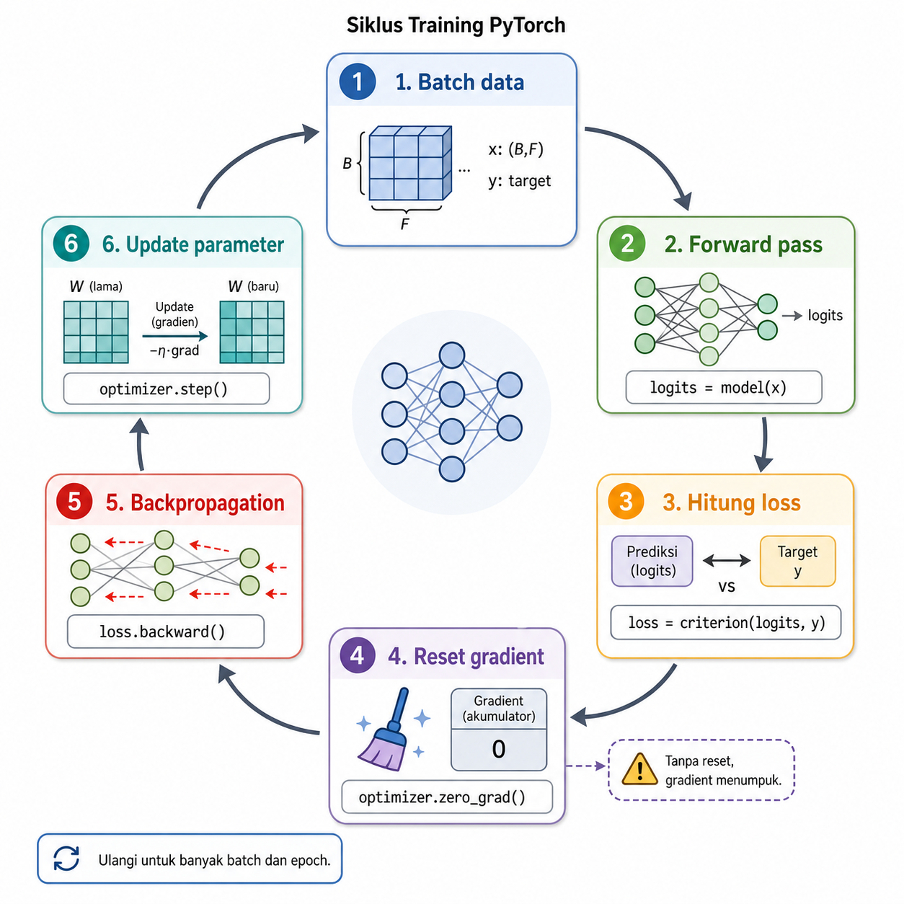
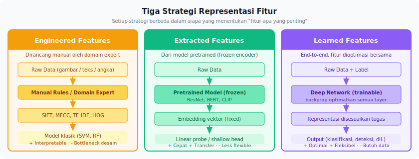
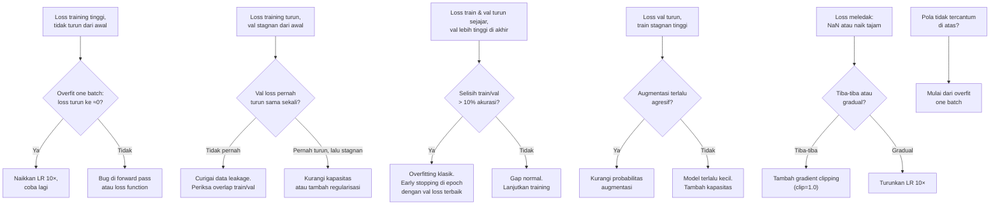



📂 Navigasi Modul (klik untuk buka)

| # | Modul | Minggu |
|---|-------|--------|
| 00 | [Pendahuluan](00_Pendahuluan.md) | 1 |
| 00a | [Prasyarat Modul](00a_Prasyarat.md) | – |
| 01 | [W1 - Tabular & Output Heads](01_W1_Tabular_Output_Heads.md) | 1 |
| 02 | [W2 - Images, CNN & Smoke Test](02_W2_Images_CNN_Smoke_Test.md) | 2 |
| ▶ 03 | W3 - Loss, Optimizer & Evaluasi | 3 |
| 04 | [W4 - Reproducibility & Matriks Eksperimen](04_W4_Reproducibility_Experiment_Matrix.md) | 4 |
| 05 | [W5 - Sequences: RNN & LSTM](05_W5_Sequences_RNN_LSTM.md) | 5 |
| 06 | [W6 - Representations & Temporal Leakage](06_W6_Representations_Temporal_Leakage.md) | 6 |
| 07 | [W7 - Text, Transformers & Repo Adoption](07_W7_Text_Transformers_Repo_Adoption.md) | 7 |
| 08 | [W8 - Foundation Models](08_W8_Foundation_Models.md) | 8 |
| 09 | [W9 - Multimodal Reasoning](09_W9_Multimodal_Reasoning.md) | 9 |
| 10 | [W10 - Paper Reading & Implementation](10_W10_Paper_Reading.md) | 10 |
| 11 | [W11 - Research Framing](11_W11_Research_Framing.md) | 11 |
| 12 | [Capstone - Proyek Riset](12_Capstone.md) | 12-15 |
| 13 | [Rubrik Penilaian](13_Rubrik_Penilaian.md) | – |
| 14 | [Lampiran](14_Lampiran.md) | – |
| 15 | [Panduan Instruktur](15_Panduan_Instruktur.md) | – |

---

# 03 · W3 - Loss, Optimizer & Evaluasi

> *Training selesai, kurva loss muncul di layar. Inilah saat banyak pemula berhenti karena tidak tahu harus membaca apa. Loss curve bukan sekadar "turun = bagus, naik = buruk" - dari bentuk kurvanya, Anda bisa mulai mendiagnosis hasil training bahkan sebelum memeriksa kode.*

**Baris peta besar** adalah `(C, H, W) -> (N,)` (lanjutan W2, fokus alur kerja).
**Kebiasaan riset** yang ditanamkan minggu ini adalah: ubah satu hal pada satu waktu.
**Dataset** yang dipakai adalah CIFAR-10 (reuse dari W2).
**Lab utama** minggu ini adalah Lab 1 selesai + Lab 2 ([lab_w3_loss_ablation.ipynb](https://colab.research.google.com/github/muhammad-zainal-muttaqin/Module-DS/blob/master/template/notebooks/lab_w3_loss_ablation.ipynb)).

---

## 0. Peta Bab

W3 adalah minggu berbasis contoh. Sebelum membaca teori tentang loss dan optimizer, Anda mengamati lima contoh training konkret dan diminta mengidentifikasi apa yang terjadi. Baru setelah itu kita menarik pola dan penjelasannya.

- **§1.5** memulai dengan galeri lima training konkret (sebelum teori).
- **§2.1** membahas cara memilih loss yang sesuai, bukan sekadar memakai bawaan default.
- **§2.2** menjelaskan cara optimizer memutuskan langkah dan peran weight decay.
- **§2.3** menguraikan evaluasi yang tidak bisa diringkas jadi satu angka.
- **§2.4** membandingkan tiga strategi representasi fitur.
- **§2.5** menutup dengan kerangka diagnosis loss curve lengkap.

Sebagai rekap W2: Anda sudah memahami tensor I/O, empat keluarga arsitektur, dan smoke test tiga level. W3 melanjutkan fondasi itu.

---

## 1.5 Galeri Lima Training: Sebelum Membaca Teori

Bagian ini bukan soal - melainkan latihan observasi.

Perhatikan lima loss curve berikut. Masing-masing menampilkan train loss dan val loss selama 20 epoch.

**Run 1 - Konvergensi normal:** Train loss dan val loss turun sejajar, keduanya mencapai angka rendah. Val sedikit di atas train; gap stabil.

**Run 2 - Overfitting:** Train loss terus turun mulus, val loss turun sampai epoch 6 lalu naik perlahan. Jarak kedua kurva makin lebar.

**Run 3 - Tidak belajar:** Train loss tidak bergerak dari epoch pertama. Val juga stagnan. Kedua kurva datar.

**Run 4 - Training tidak stabil:** Train loss turun sampai epoch 12, lalu tiba-tiba meledak ke `NaN`. Val loss ikut hilang.

**Run 5 - Bising tetapi membaik:** Train loss turun tetapi sangat bising (naik-turun tiap epoch). Val loss cenderung turun meski fluktuatif.

**Pertanyaan untuk Anda:**

- Run mana yang paling mengkhawatirkan? Kenapa?
- Untuk Run 3, apa hipotesis pertama Anda?
- Untuk Run 2, perubahan apa yang akan Anda coba pertama?
- Run 5: apakah ini masalah? Kapan noise di loss curve mulai menjadi masalah?

Tuliskan jawaban singkat sebelum membaca bagian berikutnya. Kita akan kembali ke galeri ini di §2.5 dengan kerangka diagnosis lengkap.

---

## 1. Motivasi: Ketika Training Terasa Aneh

Anda menjalankan SimpleCNN 20 epoch. Loss training turun mulus. Saat dibandingkan dengan loss validasi, ternyata loss validasi stagnan sejak epoch 4. Apa yang salah? Atau, loss tiba-tiba melompat ke `NaN` di epoch ke-8. Atau, loss training tidak bergerak sama sekali dari epoch pertama.

Tiga skenario di atas bukan pengecualian - mereka adalah rutinitas riset sehari-hari. Bab ini memberi Anda bahasa untuk menamai masalah-masalah tersebut dan langkah sistematis untuk menanganinya.

---

## 2. Konsep Inti

### 2.1 Memilih Loss yang Sesuai

Loss menentukan *apa yang dianggap salah oleh model*. Mengganti loss berarti mengubah jenis kesalahan yang paling ditekan selama training.

> [!NOTE]
> Untuk rekap rumus dan cara kerja MSE / BCE / CrossEntropy dengan contoh angka kecil, lihat [W1 §2.2.1-§2.2.3](01_W1_Tabular_Output_Heads.md). Bagian ini fokus pada **kapan memilih loss tertentu** dan dua varian lanjutan (focal loss, label smoothing).

**Untuk klasifikasi:**

- **Cross-entropy** adalah pilihan default untuk klasifikasi. Loss ini mengukur jarak antara distribusi probabilitas prediksi dan label. Pakai `CrossEntropyLoss` di PyTorch (otomatis gabung softmax + log-likelihood).
- **Focal loss** (Lin et al., 2017) adalah modifikasi cross-entropy dengan faktor `(1-p_t)^γ` yang menurunkan bobot sampel mudah (saat model sudah benar dan yakin) dan menaikkan bobot sampel sulit. Loss ini berguna pada kelas yang sangat tidak seimbang.
  - **Contoh numerik.** Untuk kelas minor dengan prediksi `p_t = 0.2` (model salah-yakin) dan `γ = 2`: faktor `(1 - 0.2)² = 0.64`. Untuk kelas mayor dengan `p_t = 0.95` (model benar-yakin): faktor `(1 - 0.95)² = 0.0025`. Loss kelas minor diberi bobot 256× lebih besar dari kelas mayor di iterasi yang sama.
- **Label smoothing** adalah teknik yang mengganti label one-hot `[0, 1, 0]` dengan distribusi yang dilembutkan `[0.033, 0.933, 0.033]` (smoothing 0.1, 3 kelas). Teknik ini mencegah model terlalu percaya diri (overconfident) dan sering memperbaiki kalibrasi probabilitas.

**Untuk regresi:**

- **MSE** menerapkan penalti kuadratik pada residu. Loss ini sensitif terhadap outlier (residu meleset 5 menyumbang loss 25×), cocok saat residu kecil sudah bermasalah.
- **MAE** mengukur residu secara linear. Loss ini lebih robust terhadap outlier, tetapi gradientnya konstan di sekitar nol sehingga konvergensi sering lebih lambat.
- **Huber loss** menggabungkan keduanya: kuadratik untuk `|residu| < δ` dan linear untuk residu yang lebih besar. Default δ = 1.0 di PyTorch.

Pertanyaan yang selalu relevan sebelum mengganti loss: *jenis kesalahan apa yang konsekuensinya paling besar di aplikasi Anda?* Jika false negative pada kelas minor lebih mahal, focal loss atau pembobotan kelas langsung layak dicoba. Jika tidak ada alasan yang jelas, pertahankan loss baseline agar eksperimen tidak menambah variabel baru.

### 2.2 Optimizer: Bagaimana Langkah Diputuskan

Optimizer mengubah gradient menjadi langkah pembaruan pada parameter.

- **SGD (+ momentum)** adalah optimizer paling tua dan paling sederhana, tetapi sering menghasilkan performa sangat kuat setelah tuning yang tekun. SGD membutuhkan *learning rate schedule* yang dirancang hati-hati. Banyak paper *state-of-the-art* di visi komputer tetap memakai SGD.
- **Adam dan AdamW** bersifat adaptif - setiap parameter mendapat learning rate yang disesuaikan, sehingga sangat cepat konvergen di epoch awal. AdamW memperbaiki Adam dengan memisahkan *weight decay* dari gradient momentum.
- **LAMB** adalah varian yang dirancang untuk *batch size* besar (ribuan sampel). LAMB relevan di pre-training besar (BERT, GPT), dan jarang diperlukan di proyek kuliah.

> [!NOTE]
> **`weight_decay` di AdamW bukan L2 regularisasi.** Pada SGD, menambahkan L2 regularisasi (`λ ||w||²` ke loss) ekuivalen dengan mengurangkan `λw` dari setiap parameter. Pada Adam, hal ini **tidak berlaku**: Adam membagi gradient dengan estimasi variansi, sehingga penalti L2 yang ditambahkan ke loss mendapat efek yang tidak proporsional antar parameter. AdamW memperbaiki ini dengan menerapkan weight decay *langsung* ke parameter (bukan lewat gradient). Akibat praktisnya: `weight_decay=0.01` di AdamW memberi efek regularisasi yang lebih konsisten daripada nilai yang sama di Adam biasa.

Optimizer dipasangkan dengan *scheduler*, yaitu mekanisme yang menurunkan (atau menaikkan lalu menurunkan) learning rate selama training. `OneCycleLR`, `CosineAnnealingLR`, dan `ReduceLROnPlateau` adalah tiga pola yang paling sering Anda jumpai.

> [!TIP]
> **Aturan praktis Adam vs AdamW.** Pakai **AdamW** sebagai default untuk training dari nol modern (CNN, Transformer). Hindari "Adam + L2 manual ditambahkan ke loss" - itu yang membuat regularisasi tidak konsisten antar parameter. Range yang masuk akal: `lr=3e-4` (Karpathy constant), `weight_decay=1e-4` sampai `1e-2`. Untuk fine-tuning pretrained model, pakai `lr` 10× lebih kecil dari training-dari-nol.

> [!NOTE]
> **Tentang scheduler dan warmup.** Untuk Lab 2 di W3, learning rate **konstan** sudah cukup; `OneCycleLR`/`CosineAnnealingLR`/`ReduceLROnPlateau` dan **warmup** (naikkan lr dari 0 ke target di beberapa epoch awal) baru dibahas di W4 saat matriks eksperimen mulai melibatkan banyak run. Sekarang fokus dulu ke pasangan dasar loss dan optimizer.

### 2.3 Evaluasi: Bukan Satu Angka

Satu kesalahan klasik yang sering terjadi adalah membanggakan akurasi 95% tanpa menyadari bahwa kelas positif hanya 5% dari data. Dalam kondisi itu, *dummy classifier* yang selalu memprediksi "negatif" juga mencapai 95%.

| Metrik | Kapan dipakai | Kelemahan |
| --- | --- | --- |
| Accuracy | Kelas seimbang | Menyesatkan pada imbalance |
| Precision / Recall / F1 | Kelas imbalance, fokus satu kelas | Perlu memilih ambang batas |
| ROC-AUC | Evaluasi probabilistik binary | Tidak mencerminkan performa pada ambang tertentu |
| PR-AUC | Imbalance ekstrem | Lebih sulit diinterpretasikan non-teknis |
| Perplexity | Model bahasa | Hanya bermakna relatif antar model |

Di samping metrik, Anda juga perlu strategi validasi:

- **Hold-out split** memisahkan data menjadi train/val/test satu kali; val dipakai untuk tuning, test untuk pengukuran final. Pendekatan ini cepat tetapi sensitif terhadap keberuntungan pembagian.
- **K-fold cross-validation** membagi data menjadi k bagian dan menjalankan training k kali dengan tiap bagian jadi validasi bergantian. Estimasi yang dihasilkan lebih stabil, dengan biaya k kali training.
- **Stratified split/fold** menjamin distribusi kelas sama di setiap bagian; strategi ini wajib untuk klasifikasi dengan imbalance.

### 2.4 Representasi Fitur: Tiga Pilihan Desain

Salah satu keputusan yang paling sering menentukan performa model bukan pilihan arsitektur, melainkan pilihan representasi. Keputusan ini diambil jauh sebelum training dimulai. Pada modalitas dan tugas yang sama, perbedaan representasi kerap menghasilkan selisih performa lebih besar daripada pergantian arsitektur.

**Engineered** adalah representasi yang dirancang manusia dengan pengetahuan domain, berupa statistik agregat, transformasi matematis, atau fitur klasik. Pada gambar, contohnya adalah histogram warna, HOG, dan SIFT; pada sinyal CGM, contohnya adalah mean, koefisien variasi, dan *time-in-range*. Representasi *engineered* memiliki biaya komputasi rendah, mudah diinterpretasi, dan sering menjadi baseline yang sangat kuat ketika data latih terbatas.

**Extracted** adalah representasi yang diambil dari *hidden layer* sebuah model *pretrained* yang di-freeze. Pada visi, contohnya adalah *hidden states* dari CNN atau ViT yang di-pretrain pada ImageNet; pada teks, contohnya adalah token `[CLS]` atau mean pooling dari BERT. Strategi ini menawarkan kompromi yang menarik: kita mendapat representasi dari model besar tanpa biaya training penuh, dengan syarat domain target tidak terlalu jauh dari domain pretraining.

**Learned** adalah strategi yang mempelajari representasi langsung dari data melalui training *end-to-end* atau *self-supervised*. Fine-tuning BERT, melatih 1D CNN dari nol pada sinyal ECG, atau fine-tune ResNet pada dataset medis semuanya termasuk kategori ini. Strategi ini biasanya paling kuat ketika data latih memadai, tetapi paling membutuhkan banyak data dan memiliki biaya training paling tinggi.

| Domain | Engineered | Extracted | Learned |
| --- | --- | --- | --- |
| Gambar | Histogram warna, HOG, SIFT | Hidden states CNN/ViT pretrained (frozen) | CNN di-fine-tune end-to-end |
| Teks | TF-IDF, n-gram | `[CLS]` / mean pooling BERT (frozen) | BERT di-fine-tune untuk task hilir |
| Sinyal CGM | Mean, CV, TIR, TBR | Hidden states Chronos/TimesFM (frozen) | 1D CNN/Transformer dari nol |
| Audio | MFCC, spectral centroid | Embedding Wav2Vec2/AST (frozen) | CNN di atas spektrogram, end-to-end |

Setelah memilih jalur utama, beberapa keputusan turunan segera mengikuti: apakah model *pretrained* di-freeze penuh atau sebagian? Layer mana yang dibuka? Bagaimana mereduksi *hidden states* menjadi satu vektor - token `[CLS]`, mean pooling, atau konkatenasi beberapa layer?

Taksonomi ini penting saat merumuskan variabel eksperimen. Membandingkan "BERT frozen + head kecil" dengan "BERT fine-tune penuh" bukan sekadar membandingkan dua model - Anda membandingkan dua strategi representasi dengan tingkat kebebasan yang sangat berbeda.

### 2.5 Mendiagnosis Hasil Training dari Loss Curve

Lima pola berikut paling sering ditemui, masing-masing dengan hipotesis dan langkah tes. Diagram di bawah adalah peta diagnosis cepat; jika Anda baru pertama kali mendiagnosis, mulai dari pertanyaan di simpul paling atas dan ikuti cabang sesuai kondisi Anda.

**Pola 1: Loss training tinggi, tidak turun dari awal.**
Pola ini menandakan model tidak belajar sama sekali. Hipotesis: (a) learning rate terlalu kecil, atau (b) bug di forward pass. Langkah tes: jalankan *overfit one batch* - ambil 4-8 sampel, jalankan ratusan iterasi hanya pada sampel itu. Jika loss tidak turun mendekati nol, ada bug di arsitektur atau loss function. Jika turun, model sehat - masalahnya di tempat lain. Naikkan LR 10× dan lihat apakah kurva mulai bergerak.

**Pola 2: Loss training turun, tapi loss validasi stagnan atau lebih tinggi sejak awal.**
Pola ini menunjukkan overfitting yang terjadi sangat cepat. Hipotesis: dataset terlalu kecil relatif terhadap kapasitas model, atau ada data leakage. Langkah tes: kurangi kapasitas model atau tambah regularisasi. Jika val loss tidak membaik sama sekali, curigai leakage.

**Pola 3: Loss training dan validasi turun sejajar, tetapi val jauh di atas train di akhir.**
Pola ini adalah overfitting klasik. Langkah tes: identifikasi epoch terbaik dari kurva val sebelum kedua kurva mulai menjauh, lalu gunakan *early stopping*.

**Pola 4: Loss validasi turun tapi loss training stagnan di angka tinggi.**
Pola ini mengindikasikan *underfitting* - model terlalu kecil atau LR terlalu rendah. Paradoksnya, val bisa lebih baik dari train jika val set kebetulan lebih mudah. Langkah tes: periksa apakah augmentasi terlalu agresif.

**Pola 5: Loss meledak - tiba-tiba `NaN` atau naik tajam.**
Pola ini menandakan gradient explosion. Hipotesis: (a) LR terlalu besar, atau (b) tidak ada gradient clipping. Langkah tes: kurangi LR 10× atau tambahkan `grad_clip = 1.0`. Untuk RNN dan Transformer, gradient clipping hampir selalu diperlukan.

**Overfit satu batch** adalah pemeriksaan terpenting untuk membedakan bug kode dari masalah hiperparameter. Karpathy menyebutnya *"the most important debugging tool"*.

Jika loss curve Anda tidak cocok dengan kelima pola di atas, jangan menebak. Kembali ke simpul paling atas diagram: overfit satu batch. Hasil tes itu - apakah loss turun ke nol atau tidak - akan memisahkan bug kode dari masalah hiperparameter dan mengarahkan Anda ke cabang diagnosis yang tepat.

---

## 3. Worked Example: Evaluasi dengan Metrik yang Sesuai

Setelah training SimpleCNN dari [W2](02_W2_Images_CNN_Smoke_Test.md), ada tiga pemeriksaan yang perlu diselesaikan sebelum menulis angka di laporan:

1. **Overfitting?** Bandingkan train accuracy dengan val accuracy. Selisih > 10% biasanya sinyal overfitting.
2. **Akurasi per kelas** perlu diperiksa secara terpisah. Pada CIFAR-10, kelas `cat` vs `dog` biasanya lebih sulit. Confusion matrix menunjukkan pola kesalahan.
3. **Sampel yang salah** perlu divisualisasikan: ambil 10 gambar yang paling *confident* tetapi salah prediksi. Sering kali ada pola kesalahan yang bisa dijelaskan.

---

## 4. Pitfalls & Miskonsepsi

**"Loss turun berarti model membaik."** Turunnya training loss tanpa validation yang terpantau bisa berarti model menghafal, bukan belajar.

**"Mengganti loss pasti meningkatkan performa jika diimplementasi benar."** Tidak ada loss yang unggul secara universal. Focal loss membantu pada imbalance ekstrem tetapi bisa memperburuk performa pada kelas seimbang karena menurunkan sinyal dari mayoritas sampel.

**"Loss validasi sedikit di atas loss training itu normal."** Pernyataan ini benar untuk gap kecil. Tapi jika val loss tidak pernah turun atau mulai naik sementara train loss terus turun, itu bukan "sedikit" - itu sinyal yang perlu ditangani.

---

## 5. Lab

### Lab 1 - Baseline CNN (selesai Minggu 3)

Buka [lab_w2_cnn_baseline.ipynb](https://colab.research.google.com/github/muhammad-zainal-muttaqin/Module-DS/blob/master/template/notebooks/lab_w2_cnn_baseline.ipynb). Selesaikan empat tugas:

1. Lengkapi training loop dengan evaluasi pada validation set setiap epoch.
2. Simpan `train_loss`, `val_loss`, `train_acc`, `val_acc` per epoch, lalu plotkan.
3. Hitung dan plot confusion matrix pada test set.
4. Pilih 10 kesalahan dengan confidence tertinggi, visualisasikan, lalu tulis 3-4 kalimat amatan tentang pola kesalahan.

**Checklist verifikasi:**
- [ ] Train accuracy ≥ 75%, val accuracy ≥ 70% setelah 20 epoch.
- [ ] Selisih train - val accuracy dilaporkan; jika > 10% dijelaskan.
- [ ] Confusion matrix tersimpan sebagai gambar di `experiments/lab1/`.
- [ ] Notebook dapat dijalankan ulang dari atas ke bawah tanpa error.

### Lab 1b - Membandingkan Tiga Strategi Representasi (opsional, sangat dianjurkan)

Buka [lab_w6_feature_representation.ipynb](https://colab.research.google.com/github/muhammad-zainal-muttaqin/Module-DS/blob/master/template/notebooks/lab_w6_feature_representation.ipynb). Pada CIFAR-10 yang sama, bandingkan tiga strategi:

1. **Engineered**: pakai HOG manual + MLP kecil (tanpa pretrained weights apapun).
2. **Extracted**: pakai ResNet-18 pretrained pada ImageNet yang di-freeze seluruhnya - hanya linear probe.
3. **Learned**: pakai ResNet-18 pretrained yang di-fine-tune penuh.

Jawab pertanyaan berikut setelah menyelesaikan lab: Pada dataset terbatas (500 sampel per kelas), strategi mana yang paling menguntungkan? Pada dataset penuh, apakah jawabannya berubah?

---

## 6. Refleksi

1. Saat Anda mengganti `CrossEntropyLoss` menjadi `FocalLoss`, apa saja variabel yang *secara implisit* juga berubah walaupun Anda tidak menyentuhnya? (Petunjuk: pikirkan learning rate efektif, tekanan pada kelas minor, stabilitas awal training.) Bagaimana ini memengaruhi cara Anda merancang perbandingan?
2. Anda ditugaskan membangun klasifikasi kualitas biji kopi dari foto *close-up* dengan hanya 300 gambar per kelas untuk empat kelas. Bandingkan tiga strategi representasi secara singkat. Manakah yang paling masuk akal dicoba terlebih dahulu dan mengapa? Pada penambahan data sejumlah berapa strategi perlu dipertimbangkan ulang?
3. **Koneksi ke Capstone:** Saat masuk Capstone (W12-W15) nanti, Anda diminta memilih topik dan membangun baseline. Dari kerangka tensor input → output, empat keluarga arsitektur, dan tiga strategi representasi, tuliskan satu kalimat: *"Saat membaca repo Capstone nanti, pertanyaan pertama yang saya ajukan ke diri sendiri adalah ..."*.

---

## 7. Bacaan Lanjutan

- **Andrej Karpathy - *A Recipe for Training Neural Networks*** (2019). Bagian "overfit a single batch" dan "visualize just before the net" adalah checklist diagnosis yang sangat praktis.
- **Lin et al. - *Focal Loss for Dense Object Detection*** (ICCV 2017). Baca bagian 3 untuk gambaran konseptualnya; lewati eksperimen detection.
- **The Deep Learning Book (Goodfellow et al.), Bab 8.** Bab ini membahas optimizer secara lebih mendalam.

---

## Lanjut ke W4

Anda sudah memiliki alur dasar untuk memahami sistem ML/DL dari tensor input sampai diagnosis loss curve. W4 melanjutkannya ke perancangan eksperimen yang bisa diulang: YAML config, penguncian seed, struktur folder run, dan matriks eksperimen.

Buka [W4 - Reproducibility & Matriks Eksperimen](04_W4_Reproducibility_Experiment_Matrix.md) ketika siap.
