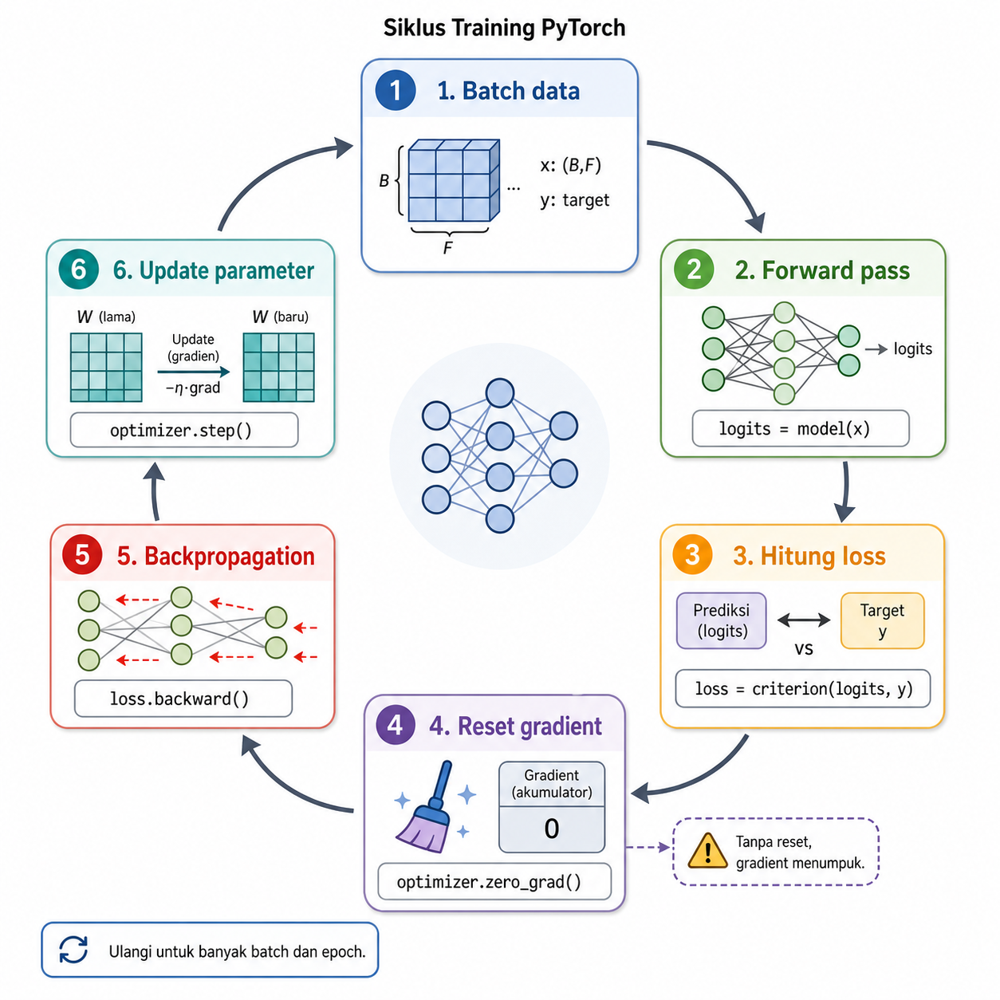
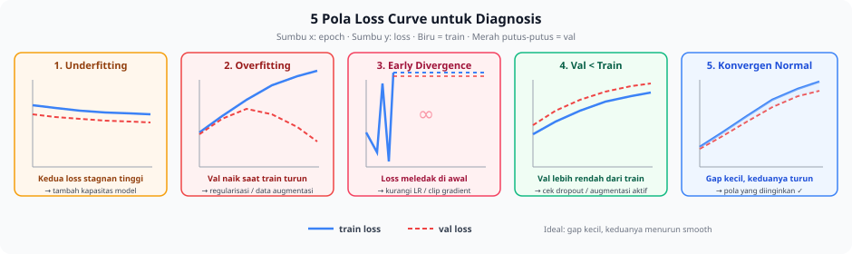
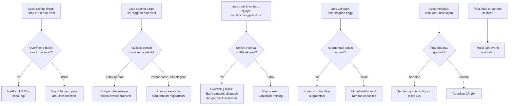
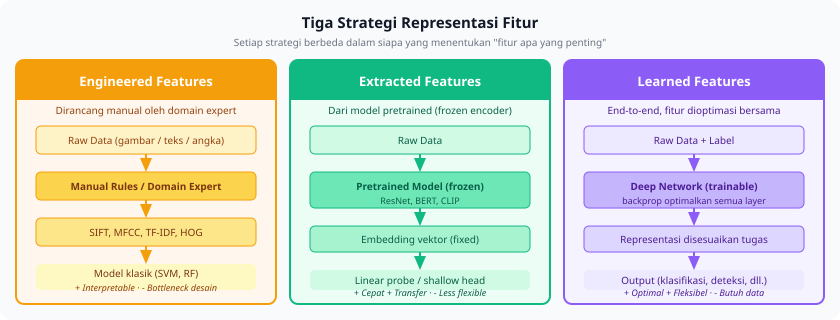

📂 Navigasi Modul (klik untuk buka)

| # | Modul | Minggu |
|---|-------|--------|
| 00 | [Pendahuluan](00_Pendahuluan.md) | 1 |
| 00a | [Prasyarat Modul](00a_Prasyarat.md) | – |
| 01 | [W1 - Tabular & Output Heads](01_W1_Tabular_Output_Heads.md) | 1 |
| 02 | [W2 - Images, CNN & Smoke Test](02_W2_Images_CNN_Smoke_Test.md) | 2 |
| ▶ 03 | W3 - Loss, Optimizer & Evaluasi | 3 |
| 04 | [W4 - Reproducibility & Matriks Eksperimen](04_W4_Reproducibility_Experiment_Matrix.md) | 4 |
| 05 | [W5 - Sequences: RNN & LSTM](05_W5_Sequences_RNN_LSTM.md) | 5 |
| 06 | [W6 - Representations & Temporal Leakage](06_W6_Representations_Temporal_Leakage.md) | 6 |
| 07 | [W7 - Text, Transformers & Repo Adoption](07_W7_Text_Transformers_Repo_Adoption.md) | 7 |
| 08 | [W8 - Foundation Models](08_W8_Foundation_Models.md) | 8 |
| 09 | [W9 - Multimodal Reasoning](09_W9_Multimodal_Reasoning.md) | 9 |
| 10 | [W10 - Paper Reading & Implementation](10_W10_Paper_Reading.md) | 10 |
| 11 | [W11 - Research Framing](11_W11_Research_Framing.md) | 11 |
| 12 | [Capstone - Proyek Riset](12_Capstone.md) | 12-15 |
| 13 | [Rubrik Penilaian](13_Rubrik_Penilaian.md) | – |
| 14 | [Lampiran](14_Lampiran.md) | – |
| 15 | [Panduan Instruktur](15_Panduan_Instruktur.md) | – |

---

# 03 · W3 - Loss, Optimizer & Evaluasi

Kali ini kita akan membahas:

1. **Galeri Lima Training** - mengamati lima loss curve dan menamai gejalanya sebelum tahu nama tekniknya.
2. **Diagnosis Loss Curve** - mengubah gejala jadi hipotesis dan langkah tes lewat peta diagnosis.
3. **Memilih Loss** - menentukan loss yang sesuai dengan jenis kesalahan yang paling ingin ditekan.
4. **Optimizer dan Learning Rate** - memahami bagaimana parameter diperbarui dan peran learning rate.
5. **Evaluasi** - menilai model dengan metrik yang sesuai kondisi kelas, bukan satu angka akurasi.
6. **Representasi Fitur** - membandingkan tiga strategi membentuk fitur dari data mentah.

Di pertemuan sebelumnya (W2) kita sudah membangun SimpleCNN, memahami tensor citra `(N, C, H, W)`, dan menjalankan [smoke test tiga level](02_W2_Images_CNN_Smoke_Test.md). Output W2 yang dipakai minggu ini adalah satu baseline CIFAR-10 yang sudah dilatih beserta loss curve-nya. W3 menggeser fokus dari membangun model ke membaca apa yang model lakukan saat dilatih. Pencocokan output head dan loss dari [W1 §2.2](01_W1_Tabular_Output_Heads.md) dipakai lagi saat kita membahas kapan focal loss atau label smoothing menggantikan cross-entropy.

---

## 1. Galeri Lima Training

Bagian ini latihan observasi, bukan soal dengan jawaban tunggal. Loss yang stagnan, meledak ke `NaN`, atau tidak bergerak sama sekali adalah kejadian rutin dalam riset, dan langkah pertama menanganinya adalah mengenali gejalanya dari bentuk kurva.

Perhatikan lima loss curve berikut. Masing-masing menampilkan train loss dan val loss selama 20 epoch.

| Run | Pola yang terlihat |
| --- | --- |
| Run 1 - Konvergensi normal | Train loss dan val loss turun sejajar sampai keduanya rendah. Val sedikit di atas train, gap stabil. |
| Run 2 - Overfitting | Train loss terus turun mulus. Val loss turun sampai epoch 6 lalu naik perlahan, jarak kedua kurva makin lebar. |
| Run 3 - Tidak belajar | Train loss tidak bergerak sejak epoch pertama. Val ikut stagnan, kedua kurva datar. |
| Run 4 - Training tidak stabil | Train loss turun sampai epoch 12 lalu tiba-tiba meledak ke `NaN`. Val loss ikut hilang. |
| Run 5 - Bising tetapi membaik | Train loss turun tetapi sangat bising, naik-turun tiap epoch. Val loss cenderung turun meski fluktuatif. |

Sebelum lanjut, jawab empat pertanyaan ini secara tertulis:

1. Run mana yang paling mengkhawatirkan, dan apa alasannya?
2. Untuk Run 3 yang tidak belajar, apa hipotesis pertama yang akan Anda uji?
3. Untuk Run 2 yang overfit, perubahan apa yang Anda coba pertama?
4. Untuk Run 5 yang bising, kapan noise di loss curve mulai menjadi masalah?

Tuliskan jawaban singkat sebelum membaca §2. Kita kembali ke galeri ini dengan peta diagnosis lengkap. Kebiasaan mengamati dulu sebelum menyimpulkan, yang dikenalkan di [W1 §1](01_W1_Tabular_Output_Heads.md), adalah inti bagian ini.

---

## 2. Diagnosis Loss Curve

Loss curve adalah rekaman nilai loss di sepanjang ribuan iterasi training. Setiap batch melewati siklus enam langkah yang sama, dan loss curve merekam nilai dari langkah ketiga. Saat training terasa aneh, gejalanya hampir selalu bisa dilacak ke salah satu langkah ini.

Tiga langkah paling sering jadi sumber kesalahan. Reset gradient yang terlupa membuat gradient batch lama menumpuk, sehingga update parameter salah arah; panggil `optimizer.zero_grad()` di awal tiap iterasi. Forward pass yang keliru, misalnya shape atau loss function yang salah, membuat loss tidak turun meski pipeline berjalan tanpa error. Update parameter bergantung pada learning rate: nilai yang terlalu besar membuat loss meledak, terlalu kecil membuat loss seolah tidak bergerak.

Lima pola berikut paling sering ditemui, masing-masing dengan hipotesis dan langkah tes. Diagram di bawah adalah peta diagnosis cepat. Kalau Anda baru pertama kali mendiagnosis, mulai dari pertanyaan di simpul paling atas dan ikuti cabang sesuai kondisi Anda.

```mermaid
flowchart TD
    A["Loss training tinggi,<br/>tidak turun dari awal"] --> B{"Overfit one batch:<br/>loss turun ke ≈0?"}
    B -->|Ya| C["Naikkan LR 10×,<br/>coba lagi"]
    B -->|Tidak| D["Bug di forward pass<br/>atau loss function"]

    E["Loss training turun,<br/>val stagnan dari awal"] --> F{"Val loss pernah<br/>turun sama sekali?"}
    F -->|"Tidak pernah"| G["Curigai data leakage.<br/>Periksa overlap train/val"]
    F -->|"Pernah turun, lalu stagnan"| H["Kurangi kapasitas<br/>atau tambah regularisasi"]

    I["Loss train & val turun sejajar,<br/>val lebih tinggi di akhir"] --> J{"Selisih train/val<br/>&gt; 10% akurasi?"}
    J -->|Ya| K["Overfitting klasik.<br/>Early stopping di epoch<br/>dengan val loss terbaik"]
    J -->|Tidak| L["Gap normal.<br/>Lanjutkan training"]

    M["Loss val turun,<br/>train stagnan tinggi"] --> N{"Augmentasi terlalu<br/>agresif?"}
    N -->|Ya| O["Kurangi probabilitas<br/>augmentasi"]
    N -->|Tidak| P["Model terlalu kecil.<br/>Tambah kapasitas"]

    Q["Loss meledak:<br/>NaN atau naik tajam"] --> R{"Tiba-tiba atau<br/>gradual?"}
    R -->|"Tiba-tiba"| S["Tambah gradient clipping<br/>(clip=1.0)"]
    R -->|"Gradual"| T["Turunkan LR 10×"]

    U["Pola tidak tercantum<br/>di atas?"] --> V["Mulai dari overfit<br/>one batch"]
```

**Pola 1: Loss training tinggi, tidak turun dari awal.** Model tidak belajar sama sekali. Hipotesis: learning rate terlalu kecil, atau ada bug di forward pass. Langkah tes adalah *overfit one batch*: ambil 4-8 sampel, jalankan ratusan iterasi hanya pada sampel itu. Jika loss tidak turun mendekati nol, ada bug di arsitektur atau loss function. Jika turun, model sehat dan masalahnya di tempat lain; naikkan LR 10× dan lihat apakah kurva mulai bergerak.

**Pola 2: Loss training turun, val stagnan atau lebih tinggi sejak awal.** Pola ini menunjukkan overfitting yang terjadi sangat cepat. Hipotesis: dataset terlalu kecil relatif terhadap kapasitas model, atau ada data leakage. Langkah tes: kurangi kapasitas model atau tambah regularisasi. Jika val loss tidak membaik sama sekali, curigai leakage.

**Pola 3: Loss training dan validasi turun sejajar, tetapi val jauh di atas train di akhir.** Pola ini overfitting klasik. Langkah tes: identifikasi epoch terbaik dari kurva val sebelum kedua kurva menjauh, lalu gunakan *early stopping*.

**Pola 4: Loss validasi turun tetapi loss training stagnan di angka tinggi.** Pola ini mengindikasikan *underfitting*: model terlalu kecil atau LR terlalu rendah. Val bisa lebih baik dari train kalau val set kebetulan lebih mudah. Langkah tes: periksa apakah augmentasi terlalu agresif.

**Pola 5: Loss meledak, tiba-tiba `NaN` atau naik tajam.** Pola ini menandakan gradient explosion. Hipotesis: LR terlalu besar, atau tidak ada gradient clipping. Langkah tes: kurangi LR 10× atau tambahkan `grad_clip = 1.0`. Untuk RNN dan Transformer, gradient clipping hampir selalu diperlukan.

Kalau loss curve Anda tidak cocok dengan kelima pola, jangan menebak. Kembali ke simpul paling atas diagram: overfit satu batch. Hasil tes itu, apakah loss turun ke nol atau tidak, memisahkan bug kode dari masalah hiperparameter dan mengarahkan Anda ke cabang yang tepat. Karpathy menyebut overfit satu batch sebagai *"the most important debugging tool"*.

---

## 3. Memilih Loss

Loss menentukan apa yang dianggap salah oleh model. Mengganti loss berarti mengubah jenis kesalahan yang paling ditekan selama training.

> [!NOTE]
> Untuk rekap rumus dan cara kerja MSE / BCE / CrossEntropy dengan contoh angka kecil, lihat [W1 §2.2.1-§2.2.3](01_W1_Tabular_Output_Heads.md). Bagian ini fokus pada kapan memilih loss tertentu dan dua varian lanjutan: focal loss dan label smoothing.

Untuk klasifikasi:

- **Cross-entropy** adalah pilihan default. Loss ini mengukur jarak antara distribusi probabilitas prediksi dan label. Pakai `CrossEntropyLoss` di PyTorch yang otomatis menggabungkan softmax dan log-likelihood.
- **Focal loss** (Lin et al., 2017) adalah modifikasi cross-entropy dengan faktor `(1-p_t)^γ` yang menurunkan bobot sampel mudah dan menaikkan bobot sampel sulit. Loss ini berguna pada kelas yang sangat tidak seimbang. Untuk kelas minor dengan prediksi `p_t = 0.2` (model salah-yakin) dan `γ = 2`, faktornya `(1 - 0.2)² = 0.64`. Untuk kelas mayor dengan `p_t = 0.95` (model benar-yakin), faktornya `(1 - 0.95)² = 0.0025`. Loss kelas minor diberi bobot 256× lebih besar dari kelas mayor di iterasi yang sama.
- **Label smoothing** mengganti label one-hot `[0, 1, 0]` dengan distribusi yang dilembutkan `[0.033, 0.933, 0.033]` (smoothing 0.1, 3 kelas). Teknik ini mencegah model terlalu percaya diri dan sering memperbaiki kalibrasi probabilitas.

Untuk regresi:

- **MSE** menerapkan penalti kuadratik pada residu. Loss ini sensitif terhadap outlier (residu meleset 5 menyumbang loss 25×), cocok saat residu kecil sudah bermasalah.
- **MAE** mengukur residu secara linear. Loss ini lebih robust terhadap outlier, tetapi gradientnya konstan di sekitar nol sehingga konvergensi sering lebih lambat.
- **Huber loss** menggabungkan keduanya: kuadratik untuk `|residu| < δ` dan linear untuk residu yang lebih besar. Default δ = 1.0 di PyTorch.

Pertanyaan yang selalu relevan sebelum mengganti loss: jenis kesalahan apa yang konsekuensinya paling besar di aplikasi Anda? Kalau false negative pada kelas minor lebih merugikan, focal loss atau pembobotan kelas layak dicoba. Kalau tidak ada alasan yang jelas, pertahankan loss baseline agar eksperimen tidak menambah variabel baru.

---

## 4. Optimizer dan Learning Rate

Optimizer mengubah gradient menjadi langkah pembaruan pada parameter, dan learning rate menentukan seberapa besar tiap langkah itu.

- **SGD (+ momentum)** adalah optimizer paling tua dan paling sederhana, tetapi sering sangat efektif setelah tuning yang tekun. SGD membutuhkan *learning rate schedule* yang dirancang hati-hati. Banyak paper *state-of-the-art* di visi komputer tetap memakai SGD.
- **Adam dan AdamW** bersifat adaptif: setiap parameter mendapat learning rate yang disesuaikan, sehingga cepat konvergen di epoch awal. AdamW memperbaiki Adam dengan memisahkan *weight decay* dari gradient momentum.
- **LAMB** dirancang untuk *batch size* besar (ribuan sampel). LAMB relevan di pre-training besar seperti BERT dan GPT, dan jarang diperlukan di proyek kuliah.

> [!NOTE]
> **`weight_decay` di AdamW bukan L2 regularisasi.** Pada SGD, menambahkan L2 regularisasi (`λ ||w||²` ke loss) ekuivalen dengan mengurangkan `λw` dari setiap parameter. Pada Adam hal ini tidak berlaku: Adam membagi gradient dengan estimasi variansi, sehingga penalti L2 yang ditambahkan ke loss mendapat efek yang tidak proporsional antar parameter. AdamW memperbaiki ini dengan menerapkan weight decay langsung ke parameter, bukan lewat gradient. Akibat praktisnya, `weight_decay=0.01` di AdamW memberi efek regularisasi yang lebih konsisten daripada nilai yang sama di Adam biasa.

Optimizer dipasangkan dengan *scheduler*, yaitu mekanisme yang menurunkan (atau menaikkan lalu menurunkan) learning rate selama training. `OneCycleLR`, `CosineAnnealingLR`, dan `ReduceLROnPlateau` adalah tiga pola yang paling sering Anda jumpai.

> [!TIP]
> **Aturan praktis Adam vs AdamW.** Pakai **AdamW** sebagai default untuk training dari nol modern (CNN, Transformer). Hindari menambahkan L2 manual ke loss pada Adam, karena itu yang membuat regularisasi tidak konsisten antar parameter. Range yang masuk akal: `lr=3e-4` (Karpathy constant), `weight_decay=1e-4` sampai `1e-2`. Untuk fine-tuning pretrained model, pakai `lr` 10× lebih kecil dari training-dari-nol.

> [!NOTE]
> **Tentang scheduler dan warmup.** Untuk Lab W3, learning rate konstan sudah cukup. Scheduler (`OneCycleLR`, `CosineAnnealingLR`, `ReduceLROnPlateau`) dan warmup (naikkan lr dari 0 ke target di beberapa epoch awal) baru dibahas di [W4](04_W4_Reproducibility_Experiment_Matrix.md) saat matriks eksperimen mulai melibatkan banyak run. Sekarang fokus dulu ke pasangan dasar loss dan optimizer.

---

## 5. Evaluasi

Satu angka akurasi sering belum cukup. Akurasi 95% terdengar bagus sampai Anda sadar kelas positif hanya 5% dari data; dalam kondisi itu, *dummy classifier* yang selalu memprediksi "negatif" juga mencapai 95%. Kebiasaan riset minggu ini adalah curiga pada angka yang terlalu bagus, lalu memeriksanya dengan metrik yang sesuai kondisi data sebelum menuliskannya di laporan.

Pilihan metrik mengikuti keseimbangan kelas dan jenis kesalahan yang paling ingin dihindari:

| Metrik | Kapan dipakai | Kelemahan |
| --- | --- | --- |
| Accuracy | Kelas seimbang | Menyesatkan pada imbalance |
| Precision / Recall / F1 | Kelas imbalance, fokus satu kelas | Perlu memilih ambang batas |
| ROC-AUC | Evaluasi probabilistik binary | Tidak mencerminkan performa pada ambang tertentu |
| PR-AUC | Imbalance ekstrem | Lebih sulit diinterpretasi non-teknis |
| Perplexity | Model bahasa | Hanya bermakna relatif antar model |

Di samping metrik, strategi validasi menentukan seberapa stabil angka yang dilaporkan:

- **Hold-out split** memisahkan data menjadi train/val/test satu kali; val dipakai untuk tuning, test untuk pengukuran final. Pendekatan ini cepat tetapi sensitif terhadap keberuntungan pembagian.
- **K-fold cross-validation** membagi data menjadi k bagian dan menjalankan training k kali dengan tiap bagian jadi validasi bergantian. Estimasi yang dihasilkan lebih stabil, dengan biaya k kali training.
- **Stratified split/fold** menjaga distribusi kelas sama di setiap bagian; strategi ini wajib untuk klasifikasi dengan imbalance.

Setelah melatih SimpleCNN dari [W2](02_W2_Images_CNN_Smoke_Test.md), tiga pemeriksaan menutup ruang salah baca sebelum angka masuk laporan:

1. **Overfitting.** Bandingkan train accuracy dengan val accuracy. Selisih > 10% biasanya sinyal overfitting.
2. **Akurasi per kelas.** Periksa tiap kelas terpisah lewat confusion matrix. Pada CIFAR-10, pasangan `cat` dan `dog` biasanya paling sering tertukar.
3. **Sampel yang salah.** Ambil 10 gambar yang paling *confident* tetapi salah prediksi. Sering ada pola kesalahan yang bisa dijelaskan.

Saat melaporkan hasil ini ke dosen pembimbing, sebutkan metrik yang dipakai dan kondisi kelas yang mendasarinya, bukan satu angka akurasi tunggal. Satu kalimat ("akurasi 95%, tetapi recall kelas minor 0.4 karena kelas itu hanya 5% data") membuat keterbatasan model terlihat lebih awal.

> [!WARNING]
> **Loss turun belum tentu model membaik.** Turunnya train loss tanpa val yang terpantau bisa berarti model menghafal. Begitu juga, val loss sedikit di atas train itu normal untuk gap kecil; tetapi kalau val tidak pernah turun atau mulai naik sementara train terus turun, itu sinyal yang perlu ditangani.

---

## 6. Representasi Fitur

Salah satu keputusan yang paling sering menentukan performa adalah pilihan representasi, dan keputusan ini diambil jauh sebelum training dimulai. Pada modalitas dan tugas yang sama, perbedaan representasi kerap menghasilkan selisih performa lebih besar daripada pergantian arsitektur.

**Engineered** adalah representasi yang dirancang manusia dengan pengetahuan domain, berupa statistik agregat, transformasi matematis, atau fitur klasik. Pada gambar, contohnya histogram warna, HOG, dan SIFT; pada sinyal CGM, contohnya mean, koefisien variasi, dan *time-in-range*. Representasi ini berbiaya komputasi rendah, mudah diinterpretasi, dan sering menjadi baseline yang kuat ketika data latih terbatas.

**Extracted** adalah representasi yang diambil dari *hidden layer* sebuah model *pretrained* yang di-freeze. Pada visi, contohnya *hidden states* dari CNN atau ViT yang di-pretrain pada ImageNet; pada teks, contohnya token `[CLS]` atau mean pooling dari BERT. Strategi ini memberi representasi dari model besar tanpa biaya training penuh, dengan syarat domain target tidak terlalu jauh dari domain pretraining.

**Learned** adalah strategi yang mempelajari representasi langsung dari data melalui training *end-to-end* atau *self-supervised*. Fine-tuning BERT, melatih 1D CNN dari nol pada sinyal ECG, atau fine-tune ResNet pada dataset medis semuanya termasuk kategori ini. Strategi ini biasanya paling kuat ketika data latih memadai, tetapi paling membutuhkan banyak data dan berbiaya training paling tinggi.

| Domain | Engineered | Extracted | Learned |
| --- | --- | --- | --- |
| Gambar | Histogram warna, HOG, SIFT | Hidden states CNN/ViT pretrained (frozen) | CNN di-fine-tune end-to-end |
| Teks | TF-IDF, n-gram | `[CLS]` / mean pooling BERT (frozen) | BERT di-fine-tune untuk task hilir |
| Sinyal CGM | Mean, CV, TIR, TBR | Hidden states Chronos/TimesFM (frozen) | 1D CNN/Transformer dari nol |
| Audio | MFCC, spectral centroid | Embedding Wav2Vec2/AST (frozen) | CNN di atas spektrogram, end-to-end |

Setelah memilih jalur utama, beberapa keputusan turunan segera mengikuti. Apakah model *pretrained* di-freeze penuh atau sebagian? Layer mana yang dibuka? Bagaimana mereduksi *hidden states* menjadi satu vektor, lewat token `[CLS]`, mean pooling, atau konkatenasi beberapa layer?

Taksonomi ini penting saat merumuskan variabel eksperimen. Membandingkan "BERT frozen + head kecil" dengan "BERT fine-tune penuh" berarti membandingkan dua strategi representasi dengan tingkat kebebasan yang sangat berbeda, bukan dua model yang setara.

---

## Lab

### Lab W3 - Loss + Freeze Ablation

Buka [lab_w3_loss_ablation.ipynb](https://colab.research.google.com/github/muhammad-zainal-muttaqin/Module-DS/blob/master/template/notebooks/lab_w3_loss_ablation.ipynb). Lab ini memakai dataset toy yang learnable, bukan training CIFAR-10 penuh, supaya seluruh siklus ablation bisa dijalankan cepat di Colab. Tujuannya melatih cara merancang ablation kecil, membaca hasil beberapa seed, dan membatasi klaim sesuai skala eksperimen.

1. Jalankan sanity check bahwa `FocalLoss(gamma=0)` setara dengan `CrossEntropyLoss`.
2. Jalankan ablation 2×2 antara pilihan loss dan status freeze pada model kecil.
3. Ulangi setiap kondisi dengan beberapa seed, lalu simpan hasil ke `lab3_outputs/lab3_results.csv`.
4. Buat ringkasan mean/std dan bar chart dengan error bar.
5. Tulis interpretasi singkat tentang main effect, interaksi, dan batas klaim karena eksperimen ini memakai dataset toy.

Checklist verifikasi:

- [ ] Sanity check focal loss `gamma=0` lolos.
- [ ] Semua kondisi ablation 2×2 berjalan tanpa error.
- [ ] Hasil tersimpan di `lab3_outputs/lab3_results.csv`.
- [ ] Interpretasi menyebut mean/std, bukan hanya satu angka terbaik.
- [ ] Kesimpulan tidak mengklaim focal loss atau freeze pasti unggul di dataset nyata.

### Lab Penunjang - Membandingkan Tiga Strategi Representasi (opsional, sangat dianjurkan)

Buka [lab_w6_feature_representation.ipynb](https://colab.research.google.com/github/muhammad-zainal-muttaqin/Module-DS/blob/master/template/notebooks/lab_w6_feature_representation.ipynb). Pada CIFAR-10, bandingkan tiga strategi representasi dari §6:

1. **Engineered**: HOG manual + MLP kecil, tanpa pretrained weights apa pun.
2. **Extracted**: ResNet-18 pretrained ImageNet yang di-freeze seluruhnya, hanya linear probe.
3. **Learned**: ResNet-18 pretrained yang di-fine-tune penuh.

Setelah selesai, jawab: pada dataset terbatas (500 sampel per kelas), strategi mana yang paling menguntungkan? Pada dataset penuh, apakah jawabannya berubah?

### Bridge Assignment W3 → W4 - CIFAR-10 Diagnostic Brief

Lab W3 sengaja memakai dataset toy agar siklus ablation cepat dijalankan. Sebelum W4, kembali ke baseline CIFAR-10 dari W2 dan terapkan bahasa diagnosis §2 pada hasil training itu. Siapkan satu slide atau satu halaman ringkas untuk dipresentasikan singkat di awal W4.

Luaran minimal:

1. **Loss curve train/val** dari baseline CIFAR-10.
2. **Satu bukti evaluasi tambahan**, misalnya confusion matrix, akurasi per kelas, atau contoh prediksi *confident* tetapi salah.
3. **Diagnosis 3-5 kalimat** yang menjelaskan gejala utama, misalnya overfitting, stagnasi, kelas yang sering tertukar, atau training yang tidak stabil.
4. **Satu usulan ablation** yang masuk akal, misalnya focal loss, dropout, augmentasi, AdamW vs SGD, atau freeze blok awal.
5. **Satu hipotesis pendek** yang bisa diuji pada W4.

Contoh hipotesis: "Karena train accuracy jauh lebih tinggi daripada validation accuracy, saya menduga model overfit. Ablation yang saya usulkan adalah membandingkan baseline dengan dropout 0.3 atau augmentasi ringan." Di awal W4, diagnosis ini diubah menjadi matriks eksperimen yang reproducible.

---

## Refleksi

1. Saat Anda mengganti `CrossEntropyLoss` menjadi `FocalLoss`, variabel apa saja yang secara implisit juga berubah walaupun Anda tidak menyentuhnya? (Petunjuk: learning rate efektif, tekanan pada kelas minor, stabilitas awal training.) Bagaimana ini memengaruhi cara Anda merancang perbandingan?
2. Anda ditugaskan membangun klasifikasi kualitas biji kopi dari foto *close-up* dengan hanya 300 gambar per kelas untuk empat kelas. Bandingkan tiga strategi representasi secara singkat. Mana yang paling masuk akal dicoba lebih dulu dan mengapa? Pada penambahan data sejumlah berapa strategi perlu dipertimbangkan ulang?
3. **Koneksi ke Capstone.** Saat masuk Capstone (W12-W15) nanti, Anda diminta memilih topik dan membangun baseline. Dari kerangka tensor input → output, empat keluarga arsitektur, dan tiga strategi representasi, tuliskan satu kalimat: *"Saat membaca repo Capstone nanti, pertanyaan pertama yang saya ajukan ke diri sendiri adalah ..."*.

---

## Lanjut ke W4

W4 mengubah diagnosis loss curve dari minggu ini menjadi eksperimen yang bisa diulang: YAML config, penguncian seed, struktur folder run, dan matriks eksperimen. Pilihan loss, optimizer, dan metrik evaluasi dari W3 dipakai sebagai variabel di setiap eksperimen W4 dan seterusnya.

Buka [W4 - Reproducibility & Matriks Eksperimen](04_W4_Reproducibility_Experiment_Matrix.md) ketika siap.
