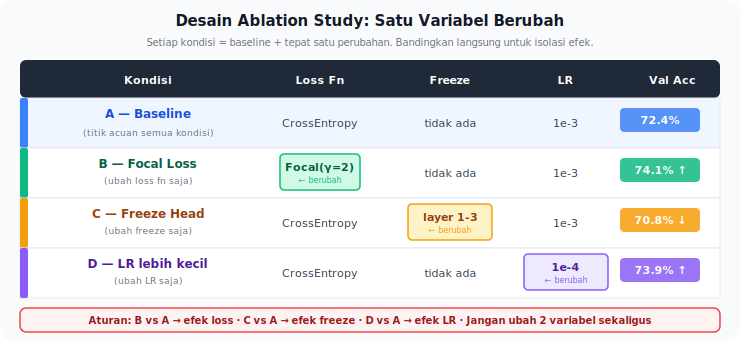
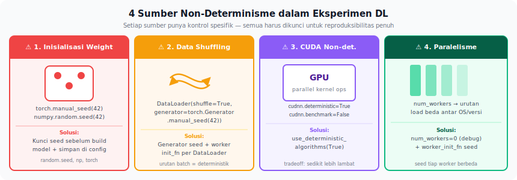
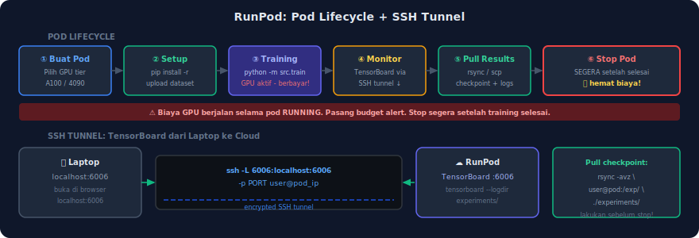
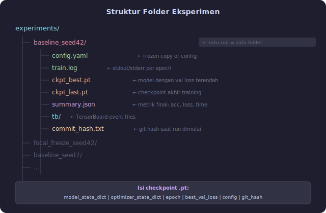

<details>
<summary>📂 Navigasi Modul (klik untuk buka)</summary>

| # | Modul | Minggu |
|---|-------|--------|
| 00 | [Pendahuluan](00_Pendahuluan.md) | 1 |
| 00a | [Prasyarat Modul](00a_Prasyarat.md) | – |
| 01 | [W1 - Tabular & Output Heads](01_W1_Tabular_Output_Heads.md) | 1 |
| 02 | [W2 - Images, CNN & Smoke Test](02_W2_Images_CNN_Smoke_Test.md) | 2 |
| 03 | [W3 - Loss, Optimizer & Evaluasi](03_W3_Loss_Optimizer_Evaluasi.md) | 3 |
| ▶ 04 | W4 - Reproducibility & Matriks Eksperimen | 4 |
| 05 | [W5 - Sequences: RNN & LSTM](05_W5_Sequences_RNN_LSTM.md) | 5 |
| 06 | [W6 - Representations & Temporal Leakage](06_W6_Representations_Temporal_Leakage.md) | 6 |
| 07 | [W7 - Text, Transformers & Repo Adoption](07_W7_Text_Transformers_Repo_Adoption.md) | 7 |
| 08 | [W8 - Foundation Models](08_W8_Foundation_Models.md) | 8 |
| 09 | [W9 - Multimodal Reasoning](09_W9_Multimodal_Reasoning.md) | 9 |
| 10 | [W10 - Paper Reading & Implementation](10_W10_Paper_Reading.md) | 10 |
| 11 | [W11 - Research Framing](11_W11_Research_Framing.md) | 11 |
| 12 | [Capstone - Proyek Riset](12_Capstone.md) | 12-15 |
| 13 | [Rubrik Penilaian](13_Rubrik_Penilaian.md) | – |
| 14 | [Lampiran](14_Lampiran.md) | – |
| 15 | [Panduan Instruktur](15_Panduan_Instruktur.md) | – |

</details>

---

# 04 · W4 - Reproducibility & Matriks Eksperimen

> *Eksperimen yang tidak bisa direproduksi hanyalah anekdot. Matriks eksperimen yang ditulis sebelum kode membuat hasil bisa dicek ulang dari rencana, konfigurasi, dan catatan run.*

**Baris peta besar** mencakup keluarga model yang sama dari W2-W3, kini dilengkapi dengan disiplin alur kerja riset.
**Kebiasaan riset** yang dibangun minggu ini adalah menyusun matriks eksperimen sebelum menulis kode.
**Dataset** yang dipakai adalah dataset baru (berbeda dari W2-W3) untuk menguji disiplin alur kerja di luar dataset yang sudah dikenal.
**Lab utama** minggu ini adalah Lab 3 ([lab_w4_experiment_tracking.ipynb](https://colab.research.google.com/github/muhammad-zainal-muttaqin/Module-DS/blob/master/template/notebooks/lab_w4_experiment_tracking.ipynb)).

---

## 0. Peta Bab

W4 adalah transisi dari "bisa training" menuju "bisa riset". Minggu ini membangun tiga lapis disiplin: merancang dulu (matriks eksperimen, lima pertanyaan sebelum kode, protokol satu halaman, hipotesis falsifiable), menjalankan dengan kontrol (satu variabel per waktu, replikasi seed, ambang signifikansi praktis), lalu mengikat hasil pada infrastruktur reproduksibilitas (YAML, seed lock, checkpoint metadata, git hash). Setelah W4, setiap eksperimen yang Anda laporkan punya jejak yang bisa ditunjukkan kepada siapapun.

---

## 1. Motivasi: Dua Cara Menjawab Email

Ingat email PI dari Bab 00:

> "Tolong uji focal loss dan freeze blok awal pada backbone. Bandingkan dengan baseline yang setara, lalu kirim ringkasan hasil hari Kamis."

**Cara A - langsung kerja.** Anda membuka `train.py`, mengganti `CrossEntropyLoss` menjadi `FocalLoss`, menambahkan `for p in model.block1.parameters(): p.requires_grad = False`, menjalankan training 20 epoch, mengirim akurasi ke Slack: *"baseline 78.4%, mod 80.1%, naik 1.7%"*.

**Cara B - merancang lebih dulu.** Anda duduk 30 menit dan menulis satu halaman yang menjawab: apa yang dimaksud "baseline"; `gamma` berapa untuk focal loss; apakah kedua run memakai seed sama; blok awal mana yang di-freeze, layer awal backbone pretrained atau `block1` pada CNN custom; apakah "bandingkan" berarti satu run masing-masing atau tiga run untuk mengurangi *noise*; metrik mana yang paling berbicara pada kelas minor (yang biasanya jadi motivasi utama memakai focal loss). Setelah semua jelas, Anda kerja selama tiga hari, melaporkan hasil dengan tabel, plot, dan interpretasi.

Kedua cara menghasilkan angka. Hanya Cara B menghasilkan *eksperimen* - hasil yang bisa dijelaskan ketika PI bertanya "kenapa kenaikan 1.7% ini bisa dipercaya?" Perbedaannya bukan kecerdasan; perbedaannya adalah *kebiasaan merancang sebelum menjalankan*.

Bab ini membangun kebiasaan itu.

---

## 2. Konsep Inti

> **Catatan sebelum mulai:** Eksperimen di bab ini - dan di seluruh modul - boleh menghasilkan hasil yang tidak sesuai hipotesis. Itu bukan kegagalan; itu data. Bagian §2.6 di bab ini membahas cara mendokumentasikan dan melaporkan saat hipotesis tidak terkonfirmasi - baca bagian itu dengan serius, karena situasi tersebut lebih sering terjadi daripada sebaliknya.

> [!IMPORTANT]
> **Tiga istilah kunci yang dipakai berulang di bab ini.** Definisi singkat di sini supaya tidak muncul tiba-tiba.
>
> - **Pre-registration** adalah dokumen tertulis (`protocol.md` di repo Anda) yang berisi hipotesis, variabel, metrik, dan threshold sukses yang ditulis **sebelum** eksperimen dijalankan. Tujuannya mencegah cerita-setelah-fakta dan konfirmasi bias. Istilah ini berasal dari riset psikologi tahun 2010-an dan kini menjadi standar di reproducible ML. Timestamp pre-reg adalah bukti bahwa Anda merencanakan sebelum melihat hasil.
> - **Seed variance** adalah selisih hasil antar run yang konfigurasinya identik kecuali RNG seed (inisialisasi bobot acak, urutan shuffle data, augmentasi acak). Pada CIFAR-10 baseline, seed variance biasanya ±0.5-1.5% akurasi, sehingga klaim "naik 1.7%" dengan seed variance ±1.5% bisa sekadar noise.
> - **Effect size** adalah selisih metrik antara dua kondisi (mis. baseline vs modifikasi). Threshold yang ditetapkan di pre-reg menjawab "berapa besar selisih yang dianggap bermakna untuk aplikasi ini?" - bukan dijawab post-hoc setelah melihat angka.

### 2.0 Matriks Eksperimen Sebelum Coding

Sebelum menyentuh kode, tulis **matriks eksperimen** - tabel yang mendaftar semua run yang akan Anda jalankan beserta konfigurasi masing-masing. Ini bukan formalitas; ini alat bantu berpikir yang mencegah tiga masalah umum:
1. lupa menjalankan satu kondisi penting,
2. baru menyadari di tengah jalan bahwa dua kondisi tidak sebanding,
3. tidak bisa menjelaskan apa yang berubah di antara run.

Format minimal yang disarankan adalah sebagai berikut:

| Run ID | Variabel berubah | Nilai | Seed | Status |
|---|---|---|---|---|
| baseline_s42 | – (kontrol) | – | 42 | planned |
| focal_s42 | `loss` | `FocalLoss(γ=2.0)` | 42 | planned |
| freeze_s42 | `freeze_until` | `block1` | 42 | planned |

Tulis matriks ini di `protocol.md` di folder eksperimen, **sebelum** baris kode pertama. Timestamp file adalah bukti bahwa Anda merencanakan sebelum melihat hasil.

> [!IMPORTANT]
> "Matriks eksperimen sebelum coding" adalah kebiasaan riset W4. Setiap eksperimen yang dilaporkan setelah W4 harus punya matriks tertulis. Tanpa matriks, angka yang dihasilkan sulit dicek ulang.

### 2.1 Lima Pertanyaan Sebelum Menyentuh Kode

Sebelum Anda membuka editor, jawab lima pertanyaan ini. Tulis jawabannya di file `protocol.md` di folder eksperimen.

**1. Variabel apa yang berubah?**  
Apa yang berbeda antara kondisi A (baseline) dan kondisi B (modifikasi)? Daftar harus spesifik: bukan "loss", tetapi "`CrossEntropyLoss` → `FocalLoss(gamma=2.0)`". Bukan "freeze layer", tetapi "`backbone.layer1.parameters()` dengan `requires_grad=False`". Jika ada lebih dari satu variabel berubah, pisahkan - Anda butuh satu eksperimen per variabel untuk atribusi yang jelas.

**2. Apa baseline yang setara?**  
Baseline harus identik dengan kondisi modifikasi pada *semua variabel lain*: arsitektur, data, augmentasi, optimizer, learning rate, seed, jumlah epoch. Jika baseline yang tersedia di repo berbeda di salah satu aspek, sesuaikan baseline atau tulis perbedaannya secara eksplisit.

**3. Apa hipotesis yang dapat dipalsukan?**  
Hipotesis yang baik berbentuk *pernyataan empiris yang bisa salah*. Contoh: "Focal loss dengan γ=2.0 meningkatkan F1-score pada kelas minor minimal 3 poin absolut, tanpa menurunkan akurasi keseluruhan lebih dari 1 poin." Hipotesis yang buruk: "Focal loss lebih baik." (Lebih baik pada metrik apa? Seberapa besar? Pada kondisi apa?)

**4. Metrik sukses apa?**  
Tentukan *sebelum* Anda melihat hasil. Urutkan: metrik utama, metrik sekunder, metrik pengaman (yang tidak boleh memburuk). Contoh untuk perubahan fokus pada kelas minor:

- Metrik utama adalah F1-score kelas minor.
- Metrik sekunder mencakup recall kelas minor dan confusion matrix.
- Metrik pengaman: akurasi keseluruhan tidak boleh turun > 1%, dan train/val gap tidak boleh meningkat drastis.

**5. Bentuk hasil apa yang Anda harapkan, dan apa yang tidak terduga?**  
Pikirkan dua kemungkinan sebelum menjalankan eksperimen: hipotesis benar, atau hipotesis salah. Apa yang akan terlihat di log? Apa yang akan Anda simpulkan? Jika Anda tidak bisa membayangkan keduanya, rancangan eksperimen belum cukup jelas.

### 2.2 Protokol Eksperimen Satu Halaman

Berikut adalah contoh protokol konkret yang bisa langsung ditiru:

```markdown
# Protocol: Focal Loss + Freeze Layer pada CIFAR-10

## Variabel
- A (baseline): CrossEntropyLoss, semua layer trainable.
- B: FocalLoss(gamma=2.0), backbone.block1 di-freeze (conv + BN).
- Semua variabel lain: SimpleCNN, AdamW lr=3e-4, batch 128,
  20 epoch, seed {42, 43, 44}.

## Hipotesis
- H1: F1-score kelas minor pada B naik ≥ 3 poin dibandingkan A.
- H2: Akurasi keseluruhan B tidak turun lebih dari 1 poin dari A.

## Metrik
- Utama: F1 kelas minor (rata-rata 3 seed).
- Sekunder: recall per kelas, confusion matrix.
- Pengaman: train/val gap, akurasi keseluruhan.

## Eksekusi
- Tiga seed per kondisi = 6 run total.
- Log ke TensorBoard; checkpoint akhir disimpan.
- Laporkan rata-rata ± std.

## Hasil yang diharapkan
- H1 terkonfirmasi → lanjut ke gamma sweep.
- H1 gagal tetapi H2 terpenuhi → cek distribusi kelas, pertimbangkan
  class weighting sebagai alternatif.
- H2 gagal → identifikasi kelas yang memburuk, hipotesis baru tentang
  trade-off.

## Waktu perkiraan
- Training: 6 × 25 menit = 2.5 jam.
- Analisis: 2 jam.
- Laporan: 2 jam.
- Total: setengah hari kerja.
```

Satu halaman ini mengubah "uji focal loss dan freeze blok awal" menjadi rancangan yang bisa dibaca, didiskusikan, dan dijalankan oleh orang lain tanpa tebakan. Protokol tersimpan di repo bersama kode. Dokumen ini merekam rencana sebelum hasil keluar; nanti, dokumen ini membantu mengecek apakah cerita Anda berubah setelah melihat data.

### 2.3 Mengendalikan Variabel

Prinsip yang terdengar klise tetapi sering dilanggar: *ubah satu hal pada satu waktu*. Jika Anda mengganti loss dan mengubah learning rate sekaligus, ketika akurasi naik Anda tidak tahu mana yang berjasa. Pada situasi tertentu, mengubah dua hal bersamaan justru tepat (misalnya ketika Anda tahu secara teori bahwa loss baru butuh learning rate berbeda untuk konvergen), tetapi dalam kasus itu Anda perlu eksperimen tambahan untuk mengisolasi efeknya.

Tabel konfigurasi adalah alat sederhana yang kuat:


| Run          | Loss  | γ   | Freeze | LR   | Seed | F1 minor |
| ------------ | ----- | --- | ------ | ---- | ---- | -------- |
| baseline_s42 | CE    | –   | none   | 3e-4 | 42   | ...      |
| baseline_s43 | CE    | –   | none   | 3e-4 | 43   | ...      |
| baseline_s44 | CE    | –   | none   | 3e-4 | 44   | ...      |
| focal_s42    | Focal | 2.0 | block1 | 3e-4 | 42   | ...      |
| focal_s43    | Focal | 2.0 | block1 | 3e-4 | 43   | ...      |
| focal_s44    | Focal | 2.0 | block1 | 3e-4 | 44   | ...      |


Baca secara vertikal: kolom `LR` seragam, berarti learning rate bukan variabel. Kolom `Loss` dan `Freeze` berubah bersamaan - inilah yang sedang Anda uji. Seed divariasikan untuk *replikasi*, bukan menjadi variabel eksperimen.



**Variabel yang saling bergantung.** Ada satu jebakan yang sering tidak disadari: *batch size dan learning rate saling terkait*. Menggandakan batch size sambil mempertahankan LR yang sama secara efektif mengurangi ukuran update relatif - hasilnya sering lebih lambat konvergen atau performa lebih rendah. Aturan praktis yang umum diterima: jika batch size naik k kali, LR juga naik k kali (*linear scaling rule*, Goyal et al. 2017). Ini bukan hukum besi, tetapi artinya ketika Anda mengubah batch size, LR bukan variabel yang aman untuk dianggap konstan.

**Tiga strategi menginisialisasi baseline hyperparameter.** Sebelum bisa mengontrol variabel, Anda perlu baseline yang konfigurasinya masuk akal. Tiga strategi umum, dari paling mudah ke paling teliti:

1. **Salin konfigurasi dari paper.** Jika paper asli menyertakan config (LR, batch size, weight decay), gunakan itu sebagai titik mulai. Waspadai: paper sering melapor setting terbaik mereka, bukan setting yang "wajar untuk dataset lebih kecil".
2. **Lakukan grid search kecil pada subset.** Ambil 10-20% data, jalankan grid LR × {1e-3, 3e-4, 1e-4} dengan 3 epoch. Cara ini jauh lebih cepat daripada training penuh dan cukup untuk menyingkirkan nilai LR yang jelas salah.
3. **Terapkan learning rate range test.** Mulai dari LR sangat kecil (1e-7), naikkan secara eksponensial setiap batch selama 100 iterasi. Plot loss vs LR - titik dengan penurunan loss paling curam adalah kandidat LR yang baik (Leslie Smith, 2017). Banyak library modern punya implementasi bawaan.

### 2.4 Noise, Seed, Replikasi, dan Kapan Perbedaan Bermakna

Model dengan inisialisasi berbeda sering menghasilkan akurasi yang berbeda beberapa poin persen, *bahkan tanpa perubahan apapun*. Ini disebut *seed variance*. Jika Anda melaporkan "baseline 78.4% vs mod 80.1%, naik 1.7%" tetapi seed variance baseline sendiri ±1.5%, kenaikan 1.7% mungkin sekadar noise.

Solusi: replikasi minimal tiga seed per kondisi, laporkan rata-rata dan standar deviasi. Idealnya lima seed, tetapi tiga sudah jauh lebih baik daripada satu. Jika Anda tidak punya waktu, akui keterbatasan ini di laporan - jangan pura-pura satu run adalah kebenaran.

Di luar seed, sumber noise lain yang perlu diperhatikan mencakup urutan data, kernel CUDA yang non-deterministik (beberapa operasi konvolusi), dan optimasi compiler. Untuk reproduksibilitas ketat, Anda juga perlu mengatur `torch.backends.cudnn.deterministic = True` - bab berikutnya membahas teknik ini lebih lengkap.

**Kapan perbedaan cukup besar untuk diklaim?** Mean ± std memberi gambaran variabilitas, tetapi tidak langsung menjawab pertanyaan "apakah ini sinyal yang sesungguhnya atau sekadar noise?" Dua aturan praktis yang berguna:

1. **Aturan 2σ** menyatakan bahwa jika Δ antara dua kondisi lebih besar dari 2 × σ gabungan keduanya, perbedaannya lebih mungkin bermakna daripada sekadar variasi seed. Aturan ini bukan uji statistik formal, tetapi cukup untuk laporan internal.

2. **Effect size threshold** mengharuskan Anda menetapkan δ minimum sebelum eksperimen berjalan (di pre-registration). Jika kenaikan yang diprediksi penting adalah 2 poin F1, kenaikan 0.3 poin tidak bermakna dalam praktiknya meski angkanya "naik". Peningkatan < 0.5 poin pada dataset besar dengan 3 seed hampir selalu noise.

Untuk publikasi atau laporan formal, pertimbangkan *paired t-test* atau *Wilcoxon signed-rank test* jika Anda punya cukup run (≥5 seed per kondisi). Namun di tahap eksplorasi awal, threshold δ yang ditetapkan sebelumnya lebih berguna daripada p-value yang dihitung setelah melihat data.

### 2.5 Hipotesis yang Dapat Dipalsukan vs Harapan

Ada perbedaan halus antara *hipotesis* dan *harapan*. Hipotesis berisi prediksi spesifik: "F1 kelas minor naik ≥ 3 poin." Harapan berisi keinginan samar: "focal loss akan membantu."

Hipotesis yang spesifik melindungi Anda dari dua bahaya:

1. **Bias konfirmasi** muncul saat tidak ada target konkret: hasil apa saja yang sedikit lebih baik mudah terbaca sebagai "bukti bahwa hipotesisnya benar". Dengan target 3 poin, kenaikan 0.5 poin adalah *tidak mengkonfirmasi*, bukan sukses kecil.
2. **Cerita setelah fakta** terbentuk tanpa prediksi tertulis sebelum run: Anda mudah menarasikan hasil aktual sebagai "yang kita harapkan sejak awal". Protokol tertulis mencegah ini.

Hipotesis tidak harus benar. Hipotesis yang ternyata salah sering lebih berguna daripada yang benar karena ia memaksa Anda mencari penjelasan. Laboratorium yang produktif mencatat hipotesis salah sebagai data, bukan sebagai kegagalan.

### 2.6 Ketika Hipotesis Tidak Terkonfirmasi

Ini situasi yang hampir pasti Anda alami: eksperimen sudah berjalan, hasilnya tidak sesuai pre-registration. Apa yang dilakukan? Ada tiga skenario yang berbeda cara penanganannya.

#### Skenario A - Hasil hampir mencapai threshold tapi tidak sampai

Misalnya hipotesis "F1 naik ≥ 3 poin" tapi hasil aktual Δ = 1.8 poin. Jangan langsung klaim "hipotesis terkonfirmasi sebagian" - itu bukan cara kerja pre-registration. Langkah yang tepat:

1. **Verifikasi bahwa protokol cocok persis** - apakah semua variabel benar-benar dikontrol sesuai pre-reg?
2. **Tambahkan 2 seed lagi** untuk memastikan angka tidak berubah arah.
3. **Jika hasilnya tetap 1.8 poin**, simpulkan hipotesis tidak terkonfirmasi dan catat sebagai temuan negatif.

#### Skenario B - Hasil berlawanan arah dari prediksi

Hipotesis "focal loss meningkatkan F1" tapi hasilnya F1 turun 1.2 poin. Ini lebih berguna dari skenario A karena arah hasilnya jelas berlawanan. Sebelum menyimpulkan "focal loss tidak efektif", lakukan:

1. **Audit implementasi:** apakah `gamma=0` menghasilkan CE yang identik?
2. **Periksa distribusi loss tiap kelas:** apakah focal loss terlalu agresif menekan kelas mudah?
3. **Investigasi baseline:** apakah baseline yang dipakai sudah setara (sama hyperparameter kecuali variabel yang diuji)?

Jika semua aman, hasil negatif ini valid dan layak dilaporkan.

#### Skenario C - Hasil sangat bagus, jauh di atas prediksi

Skenario ini *terutama* membutuhkan skeptisisme. Jika hipotesis "naik 3 poin" tapi aktual naik 12 poin, kemungkinan ada bug atau leakage yang tidak disengaja. Langkah yang perlu ditempuh:

1. **Jalankan ulang baseline** dengan seed berbeda untuk memastikan angka tidak berfluktuasi.
2. **Periksa test set** - apakah benar-benar tidak menyentuh training?
3. **Verifikasi intervensi** - apakah tidak secara tidak sengaja mengubah sesuatu yang lain (misal: augmentasi, normalisasi)?

> [!NOTE]
> **Hasil negatif yang didokumentasikan dengan baik adalah kontribusi berarti untuk riset** - ia mencegah orang lain membuang waktu di arah yang sama. Di lab Anda sendiri, catatan negatif melindungi Anda dari mengulangi eksperimen yang sama enam bulan kemudian.

### 2.7 Infrastruktur Reproduksibilitas: YAML, Seed, Checkpoint, Git Hash



Reproduksibilitas bertumpu pada empat pilar yang saling mengunci. Hyperparameter hidup di config YAML deklaratif, bukan di angka hardcoded yang berserakan di kode; config disimpan bersama checkpoint sehingga setiap hasil bisa ditelusuri ke konfigurasi persis yang menghasilkannya. Seed dikunci di awal training dengan `set_seed(cfg['seed'])` sebelum operasi apapun, dan untuk reproduksibilitas ketat di GPU disertai `torch.backends.cudnn.deterministic = True`; satu seed per run, variasi seed dipakai antar replikasi sebagai pengukur noise.

Dua pilar berikutnya mengikat hasil pada jejak yang bisa diaudit. Checkpoint menyimpan lebih dari sekadar `model.state_dict()` - di dalamnya ada `config`, `git_hash`, `epoch`, `metrics`, dan `timestamp`, karena checkpoint tanpa config hanyalah setengah bukti. Git hash mengikat setiap run ke commit yang menghasilkannya lewat `get_git_hash()`, dan flag "dirty" memperingatkan ketika ada perubahan yang belum di-commit. Implementasi keempat pilar tersedia di [`template/src/utils.py`](https://github.com/muhammad-zainal-muttaqin/Module-DS/blob/master/template/src/utils.py); Lab 3 ([lab_w4_experiment_tracking.ipynb](https://colab.research.google.com/github/muhammad-zainal-muttaqin/Module-DS/blob/master/template/notebooks/lab_w4_experiment_tracking.ipynb)) membangun keempatnya secara berurutan.

**Seperti apa bentuk YAML config yang akan Anda pakai?** Di bawah ini adalah `configs/baseline.yaml` dari template repo, contoh konkret yang dipakai di seluruh modul:

```yaml
# configs/baseline.yaml: SimpleCNN + CrossEntropy pada CIFAR-10
experiment_name: baseline

seed: 42                          # ← dikunci satu seed per run

data:
  name: cifar10
  root: ./data
  image_size: 32
  num_classes: 10
  batch_size: 128
  num_workers: 2
  val_split: 0.1
  augment: true

model:
  name: simple_cnn
  num_classes: 10
  freeze_until: null               # tidak ada yang di-freeze

loss:
  name: cross_entropy
  label_smoothing: 0.0

optim:
  name: sgd
  lr: 0.05
  momentum: 0.9
  weight_decay: 5.0e-4
  nesterov: true

scheduler:
  name: cosine
  warmup_epochs: 2

train:
  epochs: 30
  grad_clip: 1.0
  log_every: 50
  save_every: 5

output:
  root: ./experiments
```

Setiap hyperparameter dideklarasikan di sini, bukan tersebar di kode Python. Saat menjalankan eksperimen, [`src/train.py`](https://github.com/muhammad-zainal-muttaqin/Module-DS/blob/master/template/src/train.py) membaca YAML ini dan meneruskannya ke seluruh komponen. Untuk ablation, Anda membuat file YAML baru (mis. `focal_freeze.yaml`) yang hanya mengubah bagian yang relevan; arsitektur, data, dan optimizer tetap identik. Dengan begitu, dua hasil bisa dibandingkan secara setara karena perbedaannya diketahui persis.

> [!NOTE]
> Reproduksibilitas penuh (empat sumber non-determinisme, Worker seeding, TensorBoard setup, dan konvensi Git untuk riset eksperimental) dibahas di §2.7 di atas. Jika Anda baru di konsep ini, baca §2.2 (Protokol Eksperimen) lalu §2.7 sebelum mengerjakan W4 assignment.

### 2.8 Platform: Kapan Pindah ke RunPod

Tetap di laptop atau Colab selama training selesai di bawah 30 menit; pindah ke RunPod ketika satu run sudah melewati ambang itu dan Anda perlu menjalankan enam run atau lebih untuk replikasi, ketika dataset tidak muat di RAM laptop, atau ketika Anda butuh GPU dengan VRAM lebih dari 8 GB. Alur kerja RunPod dasar yang diperkenalkan minggu ini sederhana: launch pod, SSH masuk, jalankan training, pull checkpoint, lalu matikan pod. Konfigurasi minimal dan cara push/pull checkpoint lewat rsync atau rclone tersedia di [Lampiran D.1](14_Lampiran.md#d1-alat-riset-ringan).



> [!CAUTION]
> Mematikan pod setelah training selesai adalah kebiasaan paling penting di W4. Tagihan GPU terus berjalan selama pod hidup, termasuk saat Anda lupa setelah berhasil pull checkpoint. Pasang pengingat di kalender atau biasakan menutup pod sebelum menutup terminal.

---

## 3. Worked Example: Menerjemahkan Instruksi PI

Mari kita kerjakan email PI langkah demi langkah, membangun protokol yang baru saja kita bahas.

### 3.1 Membaca Instruksi dengan Cermat

Instruksi yang diterima berbunyi: *"Tolong uji focal loss dan freeze blok awal pada backbone. Bandingkan dengan baseline yang setara, lalu kirim ringkasan hasil hari Kamis."*

Ambiguitas yang harus Anda ajukan ke PI (lewat pesan singkat atau di pertemuan mingguan):

- **"Focal loss"** belum jelas: apakah yang dimaksud adalah versi asli Lin et al. 2017 (γ, α) atau variannya? Nilai γ berapa? α dipakai atau tidak?
- **"Blok awal"** perlu dikonfirmasi: bagian mana dalam kode yang dimaksud? Jika backbone ResNet-18, ini bisa berarti `conv1` atau `layer1`; jika SimpleCNN kita, istilah yang cocok adalah `block1`.
- **"Bandingkan"** membutuhkan kejelasan operasional: berapa seed, berapa epoch, dan metrik mana yang menentukan?
- **"Baseline"** perlu spesifikasi: konfigurasi mana persisnya? Apakah baseline yang ada di repo sudah pakai augmentasi, atau polos?

Jika PI sibuk dan jawabannya singkat ("pakai default"), Anda *menulis asumsi Anda* di protokol dan kirim satu kalimat konfirmasi: "OK, saya ambil γ=2.0, 3 seed, 20 epoch, metrik utama F1 kelas minor - beri tahu jika ingin lain." Ini memberi PI satu kesempatan menolak asumsi salah, dan memberi Anda jejak tertulis ketika nanti perlu menjelaskan pilihan.

### 3.2 Menulis Protokol

Setelah konfirmasi diperoleh, susun protokol seperti contoh di bagian 2.2 di atas. Perhatikan bagaimana protokol menutup seluruh ambiguitas: γ ditetapkan, seed ditentukan, metrik diurutkan prioritasnya, dan waktu diperkirakan.

### 3.3 Menulis Kode Modifikasi

```python
# losses.py
import torch
import torch.nn as nn
import torch.nn.functional as F

class FocalLoss(nn.Module):
    """Focal loss multi-kelas. Formula: L = -(1 - p_t)^gamma * log(p_t).
    
    gamma=0 → ekuivalen cross-entropy.
    gamma>0 → menurunkan bobot sampel mudah (p_t besar),
              menaikkan pengaruh sampel sulit (p_t kecil).
    """
    def __init__(self, gamma: float = 2.0, weight: torch.Tensor | None = None):
        super().__init__()
        self.gamma = gamma
        self.weight = weight

    def forward(self, logits: torch.Tensor, targets: torch.Tensor) -> torch.Tensor:
        ce = F.cross_entropy(logits, targets, weight=self.weight, reduction='none')
        pt = torch.exp(-ce)                    # p_t = prob prediksi kelas benar
        focal = ((1 - pt) ** self.gamma) * ce
        return focal.mean()
```

```python
# train.py, bagian freeze
def freeze_module(module: nn.Module) -> None:
    """Set requires_grad=False untuk seluruh parameter di module.
    Panggil ini setelah model dibuat, sebelum optimizer dibuat."""
    for p in module.parameters():
        p.requires_grad = False

# Penggunaan:
model = SimpleCNN()
if args.freeze_block1:
    freeze_module(model.block1)

# Optimizer hanya mendapat parameter yang trainable:
trainable = [p for p in model.parameters() if p.requires_grad]
optimizer = torch.optim.AdamW(trainable, lr=3e-4, weight_decay=1e-4)
```

Ada dua pelajaran implementasi yang perlu diperhatikan:

1. **`FocalLoss` menjelaskan alasan tiap bagian kode, bukan hanya apa yang dilakukan.** Komentar `gamma=0 → cross-entropy` memberi verifikasi cepat; ketika γ=0, hasil harus sama persis dengan baseline - ini uji minimal yang mudah untuk memastikan tidak ada bug.
2. **Optimizer hanya menerima parameter yang dilatih.** Ini lebih dari kosmetik: beberapa optimizer (termasuk AdamW) mempertahankan state per parameter; memasukkan parameter frozen akan membuang memori dan sedikit waktu. Lebih penting, filter ini membuat niat kode eksplisit.

### 3.4 Menjalankan dan Melaporkan

Protokol ini menghasilkan enam run total. Setiap log disimpan dalam folder per-eksperimen, lalu setelah seluruh run selesai, susun tabel agregat berikut:


| Kondisi       | F1 minor (mean ± std) | Acc keseluruhan | Train/val gap |
| ------------- | --------------------- | --------------- | ------------- |
| Baseline (CE) | 0.612 ± 0.018         | 0.781 ± 0.007   | 0.09          |
| Focal+Freeze  | 0.672 ± 0.014         | 0.774 ± 0.011   | 0.11          |


Tuliskan interpretasi berikut sebelum PI bertanya - jangan menunggu diminta:

- **H1 terkonfirmasi:** F1 minor naik 6 poin, melampaui ambang 3 poin, dan ketiga seed konsisten (std kecil).
- **H2 terkonfirmasi:** Akurasi turun 0.7 poin, masih di bawah ambang 1 poin, sehingga trade-off ini dapat diterima.
- **Catatan pengamanan:** Train/val gap naik tipis (0.09 → 0.11), yang merupakan sinyal awal overfitting lebih tinggi pada varian focal. Nilainya perlu dipantau jika eksperimen dilanjutkan ke dataset lebih besar.
- **Langkah berikutnya yang diusulkan:** Jalankan gamma sweep (γ ∈ {1.0, 2.0, 3.0}) untuk mencari titik optimal, lalu coba freeze parsial (hanya conv, bukan BN).

Laporan satu paragraf seperti contoh sebelumnya memberi PI informasi yang bisa dia pakai untuk keputusan berikutnya. Bandingkan dengan "baseline 78.4%, mod 80.1%, naik 1.7%" di Cara A.

### 3.5 Komunikasi Efektif dengan Dosen Pembimbing

Sejauh ini kita membahas penerjemahan instruksi PI menjadi protokol. Namun riset berlangsung berminggu-minggu, bukan satu email. Antara instruksi awal dan laporan akhir, ada puluhan titik komunikasi yang menentukan apakah PI tetap percaya pada progres Anda - atau mulai meragukan apakah Anda masih mengerjakan tugas.

#### 3.5.1 Format Update Mingguan ke PI

Update mingguan yang baik adalah kebiasaan paling sederhana dan paling berdampak dalam hubungan asisten-PI. Formatnya ringkas - empat bagian (progress, kendala, rencana, satu pertanyaan) yang dapat ditulis dalam 10-15 menit. Yang penting kirim *sebelum* diminta; konsistensi membangun kepercayaan lebih cepat daripada hasil spektakuler yang muncul mendadak.

Template salin-pakai lengkap dengan contoh terisi dan tiga prinsip update yang baik tersedia di [Lampiran §C.11](14_Lampiran.md#c11-template-update-mingguan-ke-pi). Pakai template ini sebagai titik awal, lalu sesuaikan dengan ritme komunikasi dosen Anda - sebagian PI lebih suka email, sebagian lebih suka shared document yang ditambah setiap pekan.

#### 3.5.2 Tiga Alat Komunikasi: SQRC, Saluran, Ketidakpastian

Di luar update rutin, ada tiga alat yang membentuk kebiasaan komunikasi seorang asisten riset. Pertama, kerangka **SQRC** (Situation, Question, Resolution attempt, Call/permintaan) memandu Anda menulis pertanyaan teknis yang menunjukkan Anda sudah berusaha sebelum meminta bantuan; ini membedakan asisten mandiri dari yang bergantung. Kedua, pemilihan saluran komunikasi mengikuti satu aturan praktis: jika butuh jawaban dalam hitungan menit pakai chat, jika butuh pemikiran lebih dalam pakai email, dan diskusi arah riset selalu lebih efisien tatap muka. Ketiga, ekspresi ketidakpastian profesional berarti menyebut keterbatasan, menahan generalisasi berlebihan, dan menyertai "saya tidak tahu" dengan langkah konkret berikutnya.

> [!TIP]
> Tabel SQRC dengan contoh kalimat, matriks lima saluran komunikasi, dan empat pasangan kalimat "kurang tepat vs lebih tepat" untuk ekspresi ketidakpastian tersedia lengkap di [Lampiran D.8](14_Lampiran.md#d8-komunikasi-pi). Baca sekali sebelum email pertama Anda ke PI; rujuk kembali ketika menulis pertanyaan teknis yang sulit.

---

## 4. Pitfalls & Miskonsepsi

**Menjalankan satu seed lalu menarik kesimpulan** adalah jebakan yang paling umum. Satu run adalah satu titik data di distribusi run yang mungkin; kesimpulan yang valid membutuhkan minimal tiga seed.

**Mengubah baseline di tengah jalan** merusak perbandingan yang sedang dibangun. Anda mulai dengan baseline A, menjalankan modifikasi B, akurasi B ternyata lebih rendah. Lalu Anda "memperbaiki" baseline (mengganti lr, menambah augmentasi) dan ternyata baseline sekarang kompetitif. Masalahnya: Anda tidak lagi punya pembanding yang setara. Jika baseline perlu diubah, ubah dulu, *lalu* jalankan modifikasi.

**Memilih metrik setelah melihat hasil** adalah bentuk konfirmasi bias. Anda berharap focal loss menaikkan akurasi; akurasi ternyata stagnan, tetapi F1 kelas minor naik, lalu Anda "menyadari" F1 adalah metrik yang tepat. Metrik harus dipilih di protokol sebelum run dijalankan. Boleh menambahkan metrik baru sebagai pengamatan, tetapi metrik utama tetap yang ditulis lebih dulu.

**Membandingkan run dengan jumlah epoch yang berbeda** mencampurkan dua variabel sekaligus. Jika baseline dilatih 20 epoch dan modifikasi dilatih 25 epoch "karena modelnya lebih rumit", maka yang sedang dibandingkan adalah dua hal sekaligus: modifikasi arsitektur dan durasi training. Pisahkan keduanya ke dalam run terpisah.

**Tidak menulis hipotesis sama sekali** membuat setiap hasil tampak "menarik". Dengan hipotesis yang tertulis, hasil terbagi jelas menjadi konfirmasi, sanggahan, atau kebetulan - dan langkah selanjutnya di masing-masing kasus menjadi jelas.

**Menyembunyikan ablation yang "gagal"** menyesatkan PI dan diri Anda sendiri di masa mendatang. Jika Anda menjalankan sepuluh eksperimen dan hanya satu yang berhasil, laporan yang hanya menampilkan yang berhasil menyembunyikan sembilan data berharga. Laporkan semua yang Anda jalankan; ablation yang gagal sering lebih berguna daripada yang berhasil.

---

## 5. Lab

### 5.1 Focal Loss + Freeze Layer dengan Ablation

Buka [lab_w3_loss_ablation.ipynb](https://colab.research.google.com/github/muhammad-zainal-muttaqin/Module-DS/blob/master/template/notebooks/lab_w3_loss_ablation.ipynb).

Tugas:

1. Tulis `protocol.md` di `experiments/lab2/` dengan lima bagian (variabel, hipotesis, metrik, eksekusi, waktu) *sebelum* menyentuh kode training.
2. Implementasi `FocalLoss` di [src/losses.py](../template/src/losses.py), sertakan uji: ketika γ=0 hasilnya identik dengan `CrossEntropyLoss`.
3. Jalankan enam run (3 seed × 2 kondisi) memakai `SimpleCNN` pada CIFAR-10.
4. Hasilkan tabel agregat dan plot F1 per kelas (baseline vs focal+freeze).
5. Tulis laporan singkat (1 halaman): hipotesis, hasil, interpretasi, langkah berikutnya.

**Checklist verifikasi**:

- `protocol.md` ditulis *sebelum* run pertama (periksa timestamp).
- FocalLoss dengan γ=0 reproduksi tepat baseline (selisih akurasi < 0.1%).
- Enam run selesai, metrik tersimpan dalam `results.csv`.
- Laporan mengacu spesifik pada hipotesis; hasil dinyatakan sebagai konfirmasi atau sanggahan, bukan netral.
- Ablation yang tidak direncanakan (jika ada) dijelaskan motivasinya.

---

### 5.2 Config, Logging & Reproducibility



Buka [lab_w4_experiment_tracking.ipynb](https://colab.research.google.com/github/muhammad-zainal-muttaqin/Module-DS/blob/master/template/notebooks/lab_w4_experiment_tracking.ipynb). Tugas:

1. Tulis `protocol.md` + matriks eksperimen sebelum menyentuh kode.
2. Refaktor konfigurasi dari hardcoded ke YAML.
3. Tambahkan `set_seed()` dan `get_git_hash()` ke training loop.
4. Logging TensorBoard per epoch (loss, accuracy, LR).
5. Checkpoint dengan metadata lengkap; verifikasi bisa di-resume.
6. Jalankan 3 seed per kondisi, buat tabel `results.csv`.

**Checklist:**
- [ ] `protocol.md` ditulis sebelum run (timestamp sebelum checkpoint).
- [ ] Config YAML + checkpoint disimpan bersamaan.
- [ ] Git hash tercatat di checkpoint.
- [ ] Training bisa dilanjutkan dari checkpoint (`--resume` flag).
- [ ] 3 seed berhasil; rata-rata ± std ada di `summary.json`.

---

## 6. Komponen Mandiri

Pilih satu pertanyaan dari materi W4 yang ingin Anda jelajahi lebih dalam. Boleh memakai dataset lab minggu ini atau dataset lain yang relevan.

**Beberapa pertanyaan pemantik** (tidak wajib salah satunya):
- Apakah loss function yang berbeda (mis. focal loss, label smoothing) mengubah perilaku training pada dataset yang Anda pakai?
- Seberapa besar pengaruh seed terhadap hasil - apakah variansi antar seed lebih besar dari perbedaan antar konfigurasi?
- Bagaimana cara merancang protokol eksperimen untuk pertanyaan riset yang belum pernah Anda jalankan?
- Apa yang terjadi jika checkpoint dari satu eksperimen dilanjutkan dengan config yang berbeda?

Kerjakan, dokumentasikan di [`notebooks/portofolio_mandiri.ipynb`](https://github.com/muhammad-zainal-muttaqin/Module-DS/blob/master/template/notebooks/portofolio_mandiri.ipynb) (entri pertama portofolio), dan presentasikan 10 menit di awal Pekan 5.

> [!TIP]
> Kriteria penilaian dan panduan presentasi tersedia di [Lampiran C.9](14_Lampiran.md#c9-template-komponen-mandiri) dan [Lampiran D.6](14_Lampiran.md#d6-indeks-lab).

---

## 7. Refleksi

1. Anda mendapati bahwa baseline di repo riset lab Anda memakai `lr=1e-3`, padahal pengalaman Anda bilang `3e-4` lebih stabil dengan AdamW. Anda ingin membandingkan focal loss dengan baseline. Tuliskan dua rencana eksperimen alternatif untuk menangani ketidakselarasan ini, beserta argumen kapan masing-masing lebih tepat.
2. Hipotesis Anda gagal: F1 kelas minor tidak naik, akurasi keseluruhan turun. Apa tiga pertanyaan berikutnya yang akan Anda kejar? Urutkan dari yang paling ringan (tidak perlu training baru) ke yang paling berat (butuh training baru atau inspeksi manual panjang).
3. Dosen pembimbing meminta Anda "cari teknik mitigasi imbalance yang paling ampuh untuk dataset kita". Instruksi ini jauh lebih terbuka daripada email di bagian 1. Tulis lima pertanyaan klarifikasi yang paling penting Anda ajukan *sebelum* memilih teknik apapun.
4. **Koneksi ke Capstone.** Di W11, proposal capstone lengkap akan ditulis untuk topik Anda sendiri. Latihan sekarang: untuk satu topik kandidat Capstone yang Anda pikirkan, tuliskan draft 3 bagian protokol (tujuan, variabel, hipotesis) hanya dalam satu paragraf. Bagian mana yang paling sulit Anda tulis sekarang, dan apa yang perlu Anda pelajari di bab-bab berikutnya agar bagian itu menjadi mudah?

---

## 8. Bacaan Lanjutan

- **Sebastian Raschka - *Model Evaluation, Model Selection, and Algorithm Selection in Machine Learning*** (2018). Paper panjang tetapi bagian 1-3 saja sudah cukup untuk memperdalam pemahaman tentang replikasi dan baseline yang setara.
- **Hullman & Gelman - *Designing for Interactive Exploratory Data Analysis Requires Theories of Graphical Inference*** (2021). Relevan untuk poin "hipotesis sebelum melihat data"; argumennya cocok juga ke evaluasi model.
- **Henderson et al. - *Deep Reinforcement Learning That Matters*** (AAAI 2018). Studi kasus tentang betapa noise-nya laporan RL tanpa replikasi; pelajarannya berlaku luas.

---

## Lanjut ke W5

Alur kerja reproduksibel kini terbangun. Minggu berikutnya memperluas Big Map ke domain sequence: tensor `(T, F)` masuk, dan arsitektur recurrent muncul karena urutan itu penting.

Buka [W5 - Sequences: RNN & LSTM](05_W5_Sequences_RNN_LSTM.md) ketika siap.
