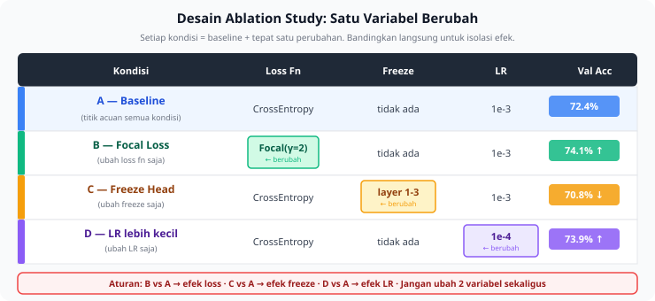
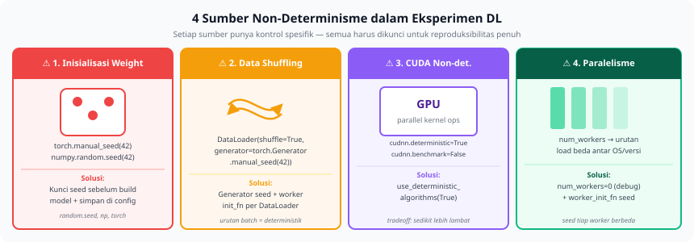
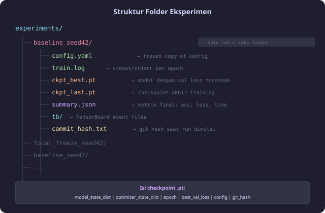

<details>
<summary>📂 Navigasi Modul (klik untuk buka)</summary>

| # | Modul | Minggu |
|---|-------|--------|
| 00 | [Pendahuluan](00_Pendahuluan.md) | 1 |
| 00a | [Prasyarat Modul](00a_Prasyarat.md) | – |
| 01 | [W1 - Tabular & Output Heads](01_W1_Tabular_Output_Heads.md) | 1 |
| 02 | [W2 - Images, CNN & Smoke Test](02_W2_Images_CNN_Smoke_Test.md) | 2 |
| 03 | [W3 - Loss, Optimizer & Evaluasi](03_W3_Loss_Optimizer_Evaluasi.md) | 3 |
| ▶ 04 | W4 - Reproducibility & Matriks Eksperimen | 4 |
| 05 | [W5 - Sequences: RNN & LSTM](05_W5_Sequences_RNN_LSTM.md) | 5 |
| 06 | [W6 - Representations & Temporal Leakage](06_W6_Representations_Temporal_Leakage.md) | 6 |
| 07 | [W7 - Text, Transformers & Repo Adoption](07_W7_Text_Transformers_Repo_Adoption.md) | 7 |
| 08 | [W8 - Foundation Models](08_W8_Foundation_Models.md) | 8 |
| 09 | [W9 - Multimodal Reasoning](09_W9_Multimodal_Reasoning.md) | 9 |
| 10 | [W10 - Paper Reading & Implementation](10_W10_Paper_Reading.md) | 10 |
| 11 | [W11 - Research Framing](11_W11_Research_Framing.md) | 11 |
| 12 | [Capstone - Proyek Riset](12_Capstone.md) | 12-15 |
| 13 | [Rubrik Penilaian](13_Rubrik_Penilaian.md) | – |
| 14 | [Lampiran](14_Lampiran.md) | – |
| 15 | [Panduan Instruktur](15_Panduan_Instruktur.md) | – |

</details>

---

# 04 · W4 - Reproducibility & Matriks Eksperimen

Kali ini kita akan membahas:

1. **Rancangan Penelitian** - menulis protokol sebelum menyentuh kode.
2. **Training Terkontrol** - menjalankan eksperimen dengan satu variabel berubah.
3. **Trace Result** - merekam tiap run supaya bisa direproduksi di komputer lain.
4. **Hasil Research** - melaporkan angka dan menyimpulkan terhadap hipotesis.

Di pertemuan sebelumnya (W3) kita sudah belajar membaca loss curve untuk mendiagnosis training, memilih loss dan optimizer, dan mengevaluasi dengan metrik yang sesuai. Output W3 yang dipakai minggu ini adalah satu diagnosis baseline CIFAR-10: gejala utama, satu usulan ablation, dan satu hipotesis. Minggu ini diagnosis itu diubah jadi eksperimen yang bisa dijalankan ulang. Smoke test tiga level dari [W2 §2.3](02_W2_Images_CNN_Smoke_Test.md) tetap dipakai sebelum setiap run penuh.

---

## 1. Rancangan Penelitian

Rancangan penelitian ditulis sebelum kode. Isinya empat hal: variabel yang diuji, baseline pembanding, hipotesis, dan metrik yang menentukan sukses atau gagal. Rancangan disimpan sebagai `protocol.md` di folder eksperimen. Tanggal file menjadi bukti bahwa rencana ditulis sebelum hasil keluar.

Contoh `protocol.md`:

```markdown
# Protokol: Focal Loss + Freeze pada CIFAR-10

Variabel uji : CrossEntropy -> FocalLoss(gamma=2.0), block1 di-freeze
Baseline     : SimpleCNN, CrossEntropy, semua layer trainable
Konstan      : AdamW lr=3e-4, batch 128, 20 epoch, seed {42, 43, 44}
Hipotesis    : F1 kelas minor naik >= 3 poin, akurasi total turun <= 1 poin
Metrik       : utama    -> F1 kelas minor (rata-rata 3 seed)
               sekunder -> recall per kelas, confusion matrix
               pengaman -> akurasi total, train/val gap
```

Tiap baris menutup satu ambiguitas. Tanpa rancangan ini, instruksi seperti "uji focal loss dan freeze blok awal" menyisakan banyak tebakan: gamma berapa, blok mana, berapa seed, dan metrik mana yang menentukan.

Sebelum menulis protokol, jawab lima pertanyaan:

1. **Variabel apa yang berubah?** Spesifik: `CrossEntropyLoss -> FocalLoss(gamma=2.0)`, bukan "ganti loss".
2. **Apa baseline yang setara?** Identik pada semua variabel lain: arsitektur, data, optimizer, lr, seed, epoch.
3. **Apa hipotesisnya?** Pernyataan yang bisa salah: "F1 kelas minor naik >= 3 poin", bukan "focal loss lebih baik".
4. **Metrik sukses apa?** Urutkan: utama, sekunder, pengaman. Ditetapkan sebelum melihat hasil.
5. **Bentuk hasil apa yang diharapkan?** Tuliskan apa yang terlihat di log saat hipotesis benar dan saat salah.

Satu hipotesis dari diagnosis W3 dipecah jadi baris-baris **matriks eksperimen**. Matriks mendaftar semua run yang akan dijalankan beserta konfigurasinya:

| Run ID | Variabel berubah | Nilai | Seed | Status |
|---|---|---|---|---|
| baseline_s42 | - (kontrol) | - | 42 | planned |
| focal_s42 | `loss` | `FocalLoss(gamma=2.0)` | 42 | planned |
| freeze_s42 | `freeze_until` | `block1` | 42 | planned |

Protokol ini juga yang dikirim ke dosen pembimbing untuk konfirmasi asumsi sebelum training berjalan. Satu pesan singkat ("saya ambil gamma=2.0, 3 seed, metrik utama F1 kelas minor") memberi kesempatan menolak asumsi yang salah lebih awal, dan menjadi catatan tertulis saat pilihan itu perlu dijelaskan.

---

## 2. Training Terkontrol

Aturan utama: **ubah satu variabel, kunci sisanya.** Kalau loss dan learning rate diganti bersamaan lalu akurasi naik, kontribusi masing-masing tidak bisa dipisahkan.

Daftar variabel yang umum diubah, dikunci, dan divariasikan dalam satu ablation:

```text
Diubah (satu per eksperimen):
  loss          CrossEntropy / FocalLoss / label smoothing
  optimizer     SGD / AdamW
  learning rate nilai lr
  freeze_until  layer mana yang dibekukan
  augmentasi    crop / flip / colorjitter

Dikunci (sama di semua run):
  arsitektur, dataset, jumlah epoch, batch size

Divariasikan untuk replikasi (bukan variabel uji):
  seed
```

Tabel konfigurasi dibaca vertikal untuk memastikan kontrol: kolom yang seragam bukan variabel, kolom yang berubah adalah yang diuji.

| Run | Loss | gamma | Freeze | LR | Seed |
|---|---|---|---|---|---|
| baseline_s42 | CE | – | none | 3e-4 | 42 |
| baseline_s43 | CE | – | none | 3e-4 | 43 |
| focal_s42 | Focal | 2.0 | block1 | 3e-4 | 42 |
| focal_s43 | Focal | 2.0 | block1 | 3e-4 | 43 |



Satu hal yang sering luput: batch size dan learning rate saling terkait. Kalau batch size naik k kali, lr umumnya juga dinaikkan k kali (*linear scaling rule*, Goyal et al. 2017). Jadi saat batch size diubah, lr bukan variabel yang aman dianggap konstan.

Satu run tidak cukup. Model dengan seed berbeda menghasilkan akurasi yang berbeda beberapa poin tanpa perubahan lain. Selisih ini disebut **seed variance**, pada CIFAR-10 baseline sekitar ±0.5-1.5%. Klaim "naik 1.7%" tidak bermakna kalau seed variance baseline sendiri ±1.5%.

Jalankan minimal tiga seed per kondisi, laporkan rata-rata dan standar deviasi. Dua aturan praktis menilai apakah selisih bermakna:

- **Aturan 2σ:** selisih dua kondisi dianggap bermakna kalau lebih besar dari 2 × standar deviasi gabungan.
- **Ambang efek:** tetapkan selisih minimum yang dianggap penting di protokol, sebelum melihat hasil. Selisih < 0.5 poin dengan 3 seed hampir selalu noise.

Pemilihan loss dan optimizer mengikuti [W3 §2.1-§2.2](03_W3_Loss_Optimizer_Evaluasi.md).

---

## 3. Trace Result

Hasil harus bisa direproduksi di komputer lain. Untuk itu, tiap run merekam empat hal:

1. **Config YAML** - semua hyperparameter dideklarasikan di satu file, bukan tersebar di kode.
2. **Seed** - dikunci di awal training dengan `set_seed(cfg['seed'])` sebelum operasi apa pun. Untuk GPU yang ketat, tambah `torch.backends.cudnn.deterministic = True`.
3. **Checkpoint metadata** - selain `model.state_dict()`, simpan `config`, `git_hash`, `epoch`, `metrics`, dan `timestamp`.
4. **Git hash** - mengikat run ke commit yang menghasilkannya. Flag "dirty" menandai perubahan yang belum di-commit.

Contoh `configs/baseline.yaml`:

```yaml
experiment_name: baseline
seed: 42

data:
  name: cifar10
  batch_size: 128
  val_split: 0.1
  augment: true

model:
  name: simple_cnn
  num_classes: 10
  freeze_until: null

loss:
  name: cross_entropy

optim:
  name: sgd
  lr: 0.05
  momentum: 0.9
  weight_decay: 5.0e-4

train:
  epochs: 30
  grad_clip: 1.0
```

Untuk ablation, buat YAML baru yang hanya mengubah bagian relevan (mis. `loss.name` dan `model.freeze_until`); sisanya identik. Dengan begitu dua run berbeda persis pada satu variabel.

Tiap run menulis ke folder sendiri:

```text
experiments/<config>_seed<N>/
  config.yaml      # konfigurasi persis run ini
  train.log
  ckpt_best.pt     # + metadata: git_hash, epoch, metrics, timestamp
  summary.json
  tb/              # log TensorBoard
```





Implementasi keempatnya ada di [`template/src/utils.py`](https://github.com/muhammad-zainal-muttaqin/Module-DS/blob/master/template/src/utils.py). Folder eksperimen direproduksi dari `config.yaml` + `commit_hash`.

---

## 4. Hasil Research

Hasil dilaporkan sebagai tabel mean ± std, diikuti interpretasi singkat terhadap hipotesis.

| Kondisi | F1 minor (mean ± std) | Akurasi total | Train/val gap |
|---|---|---|---|
| Baseline (CE) | 0.612 ± 0.018 | 0.781 ± 0.007 | 0.09 |
| Focal + Freeze | 0.672 ± 0.014 | 0.774 ± 0.011 | 0.11 |

Interpretasi:

- **H1 terkonfirmasi.** F1 minor naik 6 poin, melewati ambang 3 poin, std kecil di tiga seed.
- **H2 terkonfirmasi.** Akurasi total turun 0.7 poin, masih di bawah ambang 1 poin.
- **Catatan pengaman.** Train/val gap naik dari 0.09 ke 0.11, sinyal awal overfitting yang perlu dipantau pada dataset lebih besar.

Hasil ini dilaporkan ke dosen sebagai tabel plus satu paragraf interpretasi dan langkah berikutnya, bukan satu angka "naik 1.7%". Sebutkan batasannya: berapa seed, dataset apa, dan apa yang belum diuji.

Hipotesis sering meleset. Itu data, bukan kegagalan. Tiga situasi dan responsnya:

| Hasil | Respons |
|---|---|
| Mendekati ambang tapi tidak sampai (Δ = 1.8 dari target 3) | Tambah 2 seed. Kalau tetap, catat sebagai temuan negatif. Jangan klaim "terkonfirmasi sebagian". |
| Berlawanan arah (F1 turun 1.2 poin) | Audit implementasi (`gamma=0` harus identik dengan CE), pastikan baseline setara, baru simpulkan. |
| Jauh di atas prediksi (naik 12 poin) | Curigai bug atau leakage. Cek test set tidak menyentuh training, dan tidak ada variabel lain ikut berubah. |

Hasil negatif yang terdokumentasi mencegah orang lain, termasuk diri sendiri di kemudian hari, mengulang eksperimen yang sama.

---

## Lab

Buka [lab_w4_experiment_tracking.ipynb](https://colab.research.google.com/github/muhammad-zainal-muttaqin/Module-DS/blob/master/template/notebooks/lab_w4_experiment_tracking.ipynb). Tugas mengikuti urutan empat materi di atas.

1. Tulis `protocol.md` dan matriks eksperimen dari satu hipotesis bridge W3, sebelum menyentuh kode training baru.
2. Jalankan dua dry-run dengan seed dan config sama, lalu bandingkan `best_val_acc`.
3. Buka checkpoint dan periksa metadata: `config`, `git_hash`, `epoch`, `metrics`, dirty flag.
4. Uji deteksi dirty flag saat repo memiliki perubahan yang belum di-commit.
5. Verifikasi resume dari checkpoint melanjutkan epoch, bukan mulai dari epoch 1.
6. Kalau ada beberapa run seed berbeda, plot variasi val accuracy sebagai estimasi seed variance.

Checklist:

- [ ] `protocol.md` dan matriks eksperimen ditulis sebelum run baru.
- [ ] Dua dry-run seed sama menghasilkan `val_acc` identik atau hampir identik.
- [ ] Config dan checkpoint tersimpan bersama.
- [ ] Git hash atau dirty flag tercatat di checkpoint.
- [ ] Resume melanjutkan epoch, bukan memulai dari epoch 1.
- [ ] Ringkasan mean ± std ditulis kalau ada beberapa seed.

---

## Refleksi

1. Baseline repo memakai `lr=1e-3`, padahal pengalaman Anda `3e-4` lebih stabil dengan AdamW. Tulis dua rencana eksperimen untuk menangani ketidakselarasan ini, dan kapan masing-masing lebih tepat.
2. Hipotesis gagal: F1 kelas minor tidak naik, akurasi total turun. Tulis tiga pertanyaan berikutnya, urut dari yang tidak perlu training baru ke yang perlu training baru.
3. Untuk satu topik kandidat Capstone, tulis draft tiga bagian protokol (tujuan, variabel, hipotesis) dalam satu paragraf. Bagian mana yang paling sulit ditulis sekarang, dan apa yang perlu dipelajari agar bagian itu menjadi mudah?

---

## Lanjut ke W5

W5 masuk ke data sequence: tensor `(T, F)` dan arsitektur recurrent (RNN, LSTM) yang memproses urutan satu langkah waktu demi satu. Rancangan penelitian, kontrol satu variabel, dan trace result dari minggu ini dipakai di setiap eksperimen W5 dan seterusnya.

Buka [W5 - Sequences: RNN & LSTM](05_W5_Sequences_RNN_LSTM.md) ketika siap.
