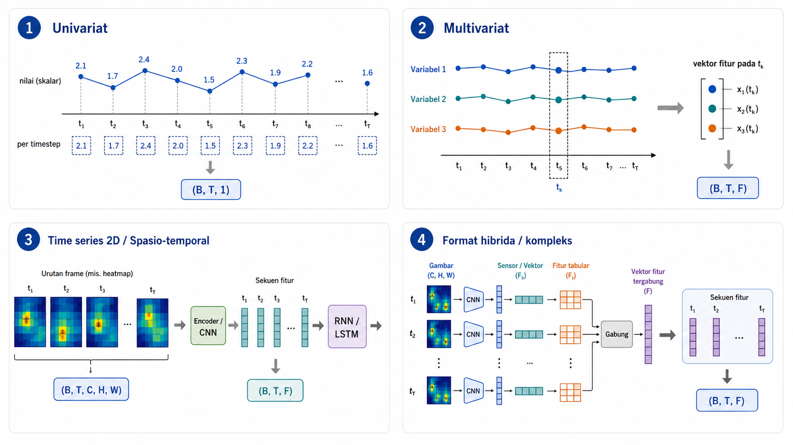
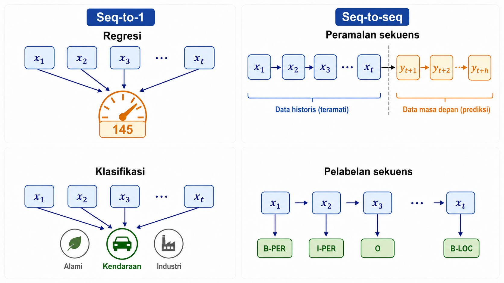
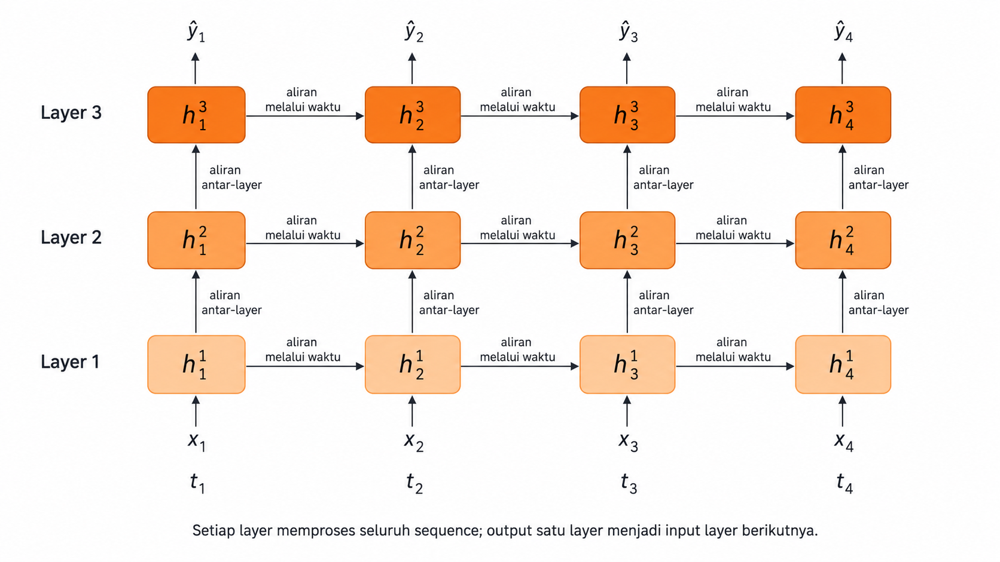
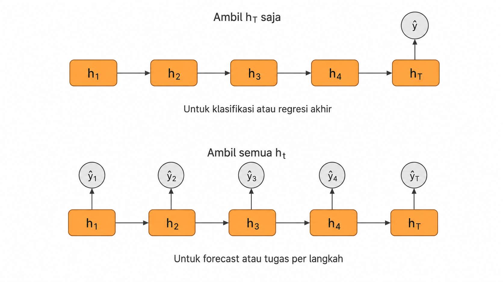
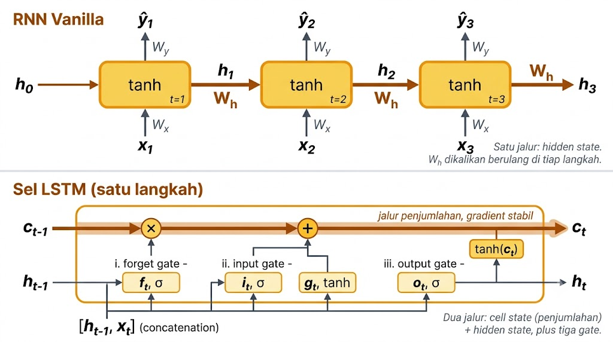
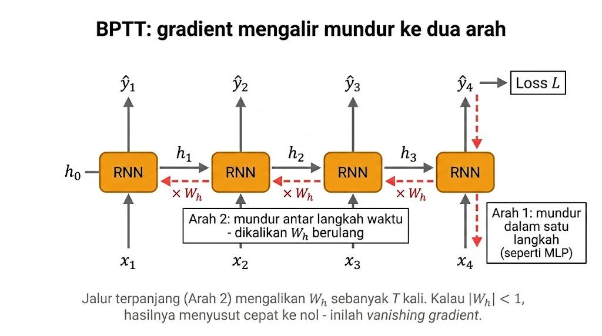
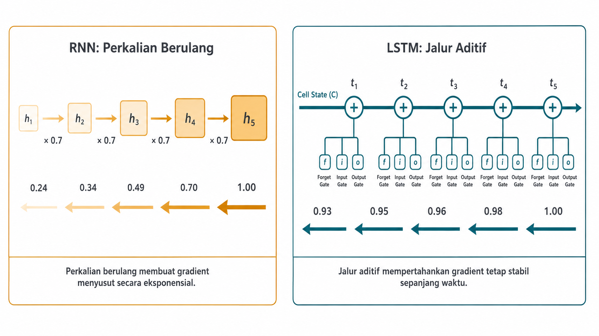
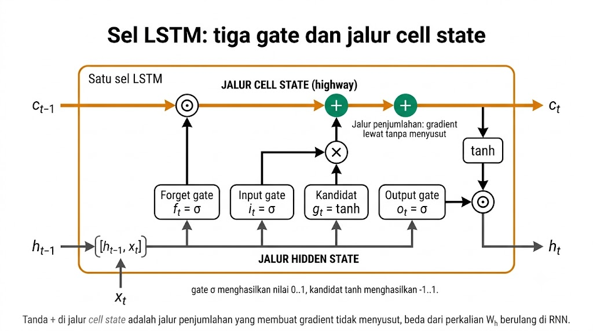
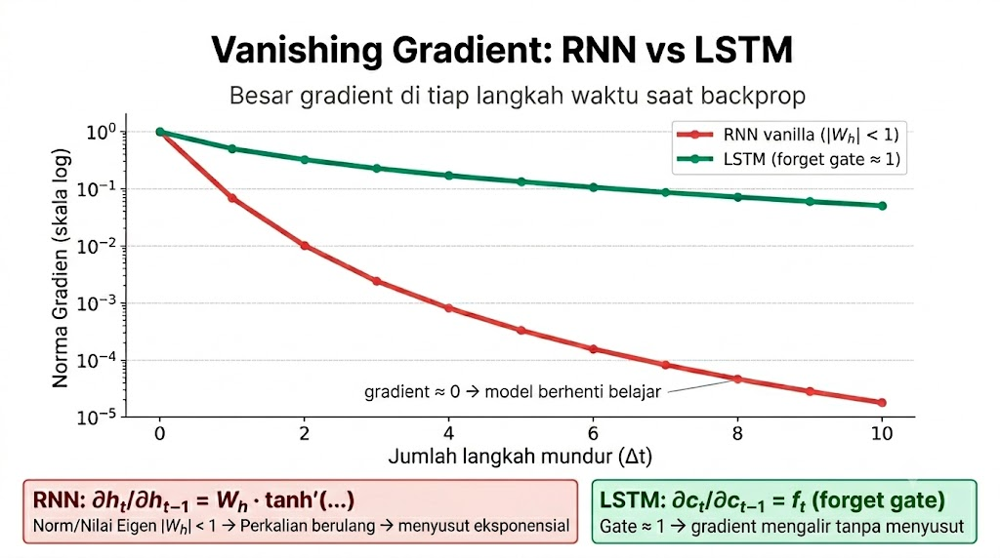
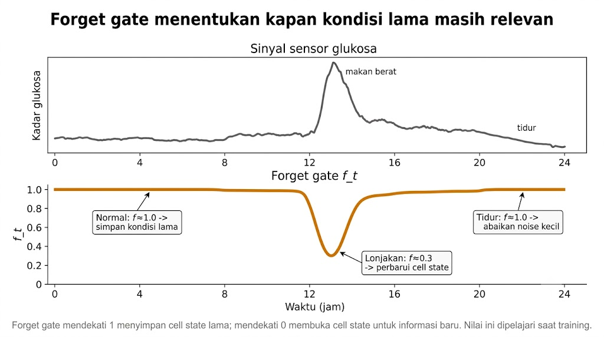

<details>
<summary>📂 Navigasi Modul (klik untuk buka)</summary>

| # | Modul | Minggu |
|---|-------|--------|
| 00 | [Pendahuluan](00_Pendahuluan.md) | 1 |
| 00a | [Prasyarat Modul](00a_Prasyarat.md) | – |
| 01 | [W1 - Tabular & Output Heads](01_W1_Tabular_Output_Heads.md) | 1 |
| 02 | [W2 - Images, CNN & Smoke Test](02_W2_Images_CNN_Smoke_Test.md) | 2 |
| 03 | [W3 - Loss, Optimizer & Evaluasi](03_W3_Loss_Optimizer_Evaluasi.md) | 3 |
| 04 | [W4 - Reproducibility & Matriks Eksperimen](04_W4_Reproducibility_Experiment_Matrix.md) | 4 |
| ▶ 05 | W5 - Sequences: RNN & LSTM | 5 |
| 06 | [W6 - Representations & Temporal Leakage](06_W6_Representations_Temporal_Leakage.md) | 6 |
| 07 | [W7 - Text, Transformers & Repo Adoption](07_W7_Text_Transformers_Repo_Adoption.md) | 7 |
| 08 | [W8 - Foundation Models](08_W8_Foundation_Models.md) | 8 |
| 09 | [W9 - Multimodal Reasoning](09_W9_Multimodal_Reasoning.md) | 9 |
| 10 | [W10 - Paper Reading & Implementation](10_W10_Paper_Reading.md) | 10 |
| 11 | [W11 - Research Framing](11_W11_Research_Framing.md) | 11 |
| 12 | [Capstone - Proyek Riset](12_Capstone.md) | 12-15 |
| 13 | [Rubrik Penilaian](13_Rubrik_Penilaian.md) | – |
| 14 | [Lampiran](14_Lampiran.md) | – |
| 15 | [Panduan Instruktur](15_Panduan_Instruktur.md) | – |

</details>

---

# 05 · W5 - Sequences: RNN & LSTM

Kali ini kita akan membahas:

1. **Output Head untuk Sequence** - memetakan bentuk input `(T, F)` ke bentuk output yang diinginkan beserta loss-nya.
2. **RNN Vanilla dan BPTT (Backpropagation Through Time)** - memproses urutan satu langkah waktu demi satu, dan menghitung gradient sepanjang waktu.
3. **Vanishing Gradient** - gejala gradient yang menyusut di sequence panjang, dan prinsip aditif yang mengatasinya.
4. **LSTM: Gate dan Cell State** - cara gate dan cell state memutus rantai perkalian penyebab vanishing, plus GRU sebagai alternatif ringan.
5. **Memilih dan Mendiagnosis Arsitektur Sequence** - menulis alasan pemilihan arsitektur dan mendiagnosis training sequence yang gagal.

Di pertemuan sebelumnya (W4) kita sudah belajar menulis protokol sebelum kode, menjalankan training terkontrol satu variabel, dan merekam tiap run supaya bisa direproduksi. Disiplin itu dipakai utuh minggu ini: tiap perbandingan RNN, LSTM, dan GRU dijalankan sebagai eksperimen terkontrol dengan seed dikunci. Tiga keluarga output head dari [W1 §2](01_W1_Tabular_Output_Heads.md) juga muncul lagi, kali ini pada input berbentuk sequence.

W5 adalah bab paling padat secara teknis sejauh ini. Materi disusun bottom-up: kita pilih dulu bentuk output, bangun RNN dan lihat kenapa ia gagal di sequence panjang, ukur kegagalan itu dengan angka, baru perbaiki dengan LSTM.

---

## 1. Output Head untuk Sequence

Saat menangani tugas sequence, hal pertama yang perlu kita tentukan adalah bentuk output yang ingin dihasilkan. Bentuk output inilah yang menentukan arsitektur head dan loss. Input tugas sequence umumnya berbentuk `(T, F)`: ada T langkah waktu, dan setiap langkah membawa F fitur.



Diagram di atas memperjelas dari mana F berasal. Pada data univariat, tiap langkah waktu hanya membawa satu angka, sehingga inputnya berbentuk `(B, T, 1)`. Pada data multivariat, tiap langkah membawa beberapa fitur sekaligus, sehingga inputnya berbentuk `(B, T, F)`. Data spasio-temporal dan format hibrida menambah dimensi lain, tetapi semuanya diringkas menjadi `(B, T, F)` sebelum masuk ke RNN. Di W5 kita fokus pada dua kasus pertama, yaitu univariat dan multivariat.

Empat formulasi berikut mencakup hampir semua tugas yang akan dijumpai.

| Tugas | Input shape | Output shape | Head | Loss | Contoh |
|---|---|---|---|---|---|
| Regression scalar akhir | `(T, F)` | `(1,)` | `Linear(hidden, 1)` pada `h_T` | MSE/MAE | Prediksi nilai berikutnya time series |
| Klasifikasi akhir | `(T, F)` | `(N,)` | `Linear(hidden, N)` pada `h_T` | CrossEntropy | Klasifikasi aktivitas dari sensor IMU |
| Forecast sequence | `(T, F)` | `(T'', 1)` | `Linear(hidden, 1)` pada tiap `h_t` | MSE/MAE | Prediksi 12 jam ke depan sinyal CGM |
| Token classification | `(T,)` | `(T, N)` | `Linear(hidden, N)` pada tiap `h_t` | CrossEntropy per token | NER, POS tagging |



Diagram di atas menggambarkan keempat formulasi itu. Pada kelompok seq-to-1, seluruh sequence diringkas menjadi satu jawaban, baik satu angka untuk regresi maupun satu kelas untuk klasifikasi. Pada kelompok seq-to-seq, tiap langkah menghasilkan jawabannya sendiri, baik berupa peramalan langkah ke depan maupun label untuk tiap langkah. Pelabelan sekuens pada contoh tersebut (B-PER, I-PER) adalah token classification yang dibahas di W7.

Di W5 kita fokus pada tiga formulasi pertama; token classification dibahas di W7. Pemilihan loss mengikuti head, persis seperti [W1 §2](01_W1_Tabular_Output_Heads.md): regression memakai MSE/MAE, klasifikasi memakai CrossEntropy. Yang baru pada sequence hanya satu hal, yaitu dari mana hidden state diambil. Tugas akhir memakai hidden state langkah terakhir (`h_T`), sedangkan tugas per-langkah memakai hidden state di setiap langkah (`h_t`).

Berikut contoh implementasi minimal untuk kasus tugas akhir tadi. Sequence classifier ini mengambil hidden state langkah terakhir, lalu meneruskannya ke head:

```python
class SequenceClassifier(nn.Module):
    def __init__(self, input_size, hidden_size, num_classes):
        super().__init__()
        self.lstm = nn.LSTM(input_size, hidden_size, batch_first=True)
        self.head = nn.Linear(hidden_size, num_classes)

    def forward(self, x):  # x: (B, T, F)
        out, (h_n, _) = self.lstm(x)
        return self.head(h_n[-1])  # hidden state layer terakhir, timestep terakhir
```

`batch_first=True` membuat dimensi pertama adalah batch, sehingga input berbentuk `(B, T, F)`.

Argumen `num_layers` pada `nn.LSTM` menumpuk beberapa LSTM menjadi satu. Hidden state tiap langkah dari satu layer menjadi input layer di atasnya, dan setiap layer memproses seluruh sequence. Dengan `num_layers=2` ada dua tingkat seperti ini. Karena itu `h_n` menyimpan hidden state akhir untuk tiap layer, dan `h_n[-1]` mengambil hidden state dari layer teratas.





Diagram di atas membandingkan dua pola pengambilan output. Tugas dengan satu jawaban di akhir cukup memakai `h_T`, persis seperti `h_n[-1]` di kode tadi. Tugas dengan jawaban di tiap langkah memakai seluruh `h_t`.

Sebelum memilih head, jawab tiga pertanyaan untuk dataset sequence apa pun. Pertama, seberapa jauh jarak ketergantungannya: prediksi berikutnya butuh konteks 5 langkah atau 500 langkah. Kedua, output apa yang dibutuhkan: satu angka, satu kelas, atau seluruh sequence masa depan. Ketiga, apakah urutannya memang bermakna, atau data cuma tersusun padahal bisa diacak tanpa kehilangan makna. Jawaban pertama menentukan apakah RNN vanilla cukup. Jawaban kedua menentukan head. Jawaban ketiga menentukan apakah model recurrent memang perlu dipakai.

---

## 2. RNN Vanilla dan BPTT

RNN vanilla memproses sequence satu langkah waktu demi satu. Di setiap timestep `t`, ia menggabungkan input baru `x_t` dengan hidden state sebelumnya `h_{t-1}`:

```
h_t = tanh(W_x x_t + W_h h_{t-1} + b)
```



Diagram di atas membandingkan RNN vanilla yang dibentangkan sepanjang timestep (atas) dengan detail satu sel LSTM (bawah). Untuk RNN vanilla, persamaannya menggabungkan tiga bagian. `W_x x_t` mengubah input baru jadi ukuran hidden state, dengan `W_x` berukuran `(d_h, F)` dan `x_t` berbentuk `(F,)`. `W_h h_{t-1}` membawa hidden state dari langkah sebelumnya lewat perkalian matriks, dengan `W_h` berukuran `(d_h, d_h)`. `tanh` menahan `h_t` di rentang (-1, 1) supaya hidden state tidak membesar tak terkendali. Hidden size `d_h` ditentukan oleh perancang.

Hidden state `h_t` menyimpan nilai internal yang diperbarui setiap langkah. Inisialisasi `h_0 = 0` (default) atau learned. Untuk sequence classification, output diambil dari `h_T` (langkah terakhir). Untuk forecasting, output `y_t = W_o h_t` dihitung di setiap langkah.

### Backpropagation Through Time

Di [W1 §2.3](01_W1_Tabular_Output_Heads.md) dan [Prasyarat Modul §4](00a_Prasyarat.md#4-kalkulus-mini-turunan-dan-chain-rule), chain rule sudah dibahas: kalau `y = f(g(x))`, maka `dy/dx = f'(g(x)) · g'(x)`. Backpropagation di MLP adalah chain rule yang dirantai mundur lewat layer. Pada RNN, chain rule berjalan ke dua arah sekaligus. Arah pertama mundur ke layer dalam, sama seperti MLP, dari output ke hidden ke input pada satu timestep. Arah kedua mundur ke timestep sebelumnya, dari `h_t` ke `h_{t-1}`, lalu ke `h_{t-2}`, dan seterusnya. Arah inilah yang baru di model sequence.



Diagram di atas menunjukkan kedua arah itu pada RNN yang dibentangkan. Arah 1 mundur dalam satu timestep, sama seperti MLP. Arah 2 mundur antar timestep dan mengalikan `W_h` berulang, dan inilah sumber vanishing gradient.

Chain rule yang dirantai sepanjang T timestep disebut **Backpropagation Through Time (BPTT)**. Untuk sequence 3 timestep dengan loss `L = (y_3 - h_3)²`, gradient terhadap `W_h` adalah jumlah tiga jalur:

```
∂L/∂W_h = ∂L/∂h_3 · ∂h_3/∂W_h
        + ∂L/∂h_3 · ∂h_3/∂h_2 · ∂h_2/∂W_h
        + ∂L/∂h_3 · ∂h_3/∂h_2 · ∂h_2/∂h_1 · ∂h_1/∂W_h
```

Tiap suku adalah satu jalur. Makin panjang jalur, makin banyak timestep yang harus dilewati gradient sebelum mencapai `W_h`. Jalur terpanjang (suku ketiga) melewati T-1 timestep. Inilah arah tempat vanishing gradient muncul, dan materi berikutnya mengukurnya dengan angka.

---

## 3. Vanishing Gradient

Saat gradient mundur satu langkah waktu, nilainya dikalikan dengan turunan `∂h_t/∂h_{t-1}`. Untuk RNN vanilla, turunan ini kira-kira sebanding dengan `W_h` (dikoreksi turunan tanh yang ≤ 1). Anggap `W_h` cuma satu angka `w_h`. Mundur satu langkah, gradient dikali `w_h`. Mundur dua langkah, dikali `w_h` dua kali. Mundur T langkah, gradient awal dikali `w_h^T`. Tabel berikut menunjukkan nilai `w_h^T` untuk tiga `w_h`:

| T (langkah mundur) | w_h^T (w_h = 0.5) | w_h^T (w_h = 0.9) | w_h^T (w_h = 1.1) |
|---|---|---|---|
| 1 | 0.5 | 0.9 | 1.1 |
| 5 | 0.031 | 0.59 | 1.61 |
| 10 | 0.001 | 0.35 | 2.59 |
| 50 | ~ 9e-16 | 0.005 | 117 |
| 100 | ~ 8e-31 | 2.6e-5 | 13780 |

Besar kecilnya `w_h` menentukan nasib gradient saat sequence memanjang. Saat `|w_h| < 1`, gradient menyusut (*vanishing*). Setelah 50-100 langkah nilainya praktis nol, jadi model tidak bisa belajar ketergantungan yang jauh. Saat `|w_h| > 1`, gradient membengkak (*exploding*). Loss bisa tiba-tiba jadi NaN, dan solusi praktisnya gradient clipping (§5). Saat `|w_h| ≈ 1`, gradient relatif stabil, tapi kondisi ini sempit dan sulit dijaga tanpa bantuan seperti gate LSTM, residual connection, atau normalization.

Vanishing gradient adalah konsekuensi langsung dari perkalian berulang di chain rule. Lab W5 memvisualisasikan gejala ini dengan plot log-scale gradient norm per timestep: penurunan eksponensial terlihat jelas pada RNN vanilla.

> [!NOTE]
> Untuk `W_h` berbentuk matriks, ukuran yang relevan adalah **eigenvalue terbesar** (spectral radius). Kalau spectral radius < 1, gradient vanish; kalau > 1, explode. Rumus T-langkah memakai matrix power, bukan skalar power, tetapi prinsipnya sama.

### Prinsip Aditif: Satu Pola yang Berulang

LSTM (§4) mengatasi rantai perkalian ini dengan satu ide sederhana: ganti perkalian berulang dengan penjumlahan. *Cell state* LSTM memakai `c_t = f_t ⊙ c_{t-1} + i_t ⊙ g_t`. Tanda `+` di tengah itu adalah jalur penjumlahan yang tidak ikut menyusut. Turunannya `∂c_t/∂c_{t-1} = f_t` cuma perkalian element-wise dengan forget gate, bukan perkalian dengan matriks `W_h` penuh. Jadi gradient di timestep awal tetap bisa dihitung tanpa cepat teredam.



Ide yang sama dipakai **residual connection** yang akan dijumpai di W7 dan W8. Daripada mempelajari `H(x)` langsung, blok residual mempelajari `F(x) = H(x) - x`, lalu menghasilkan `F(x) + x`. Penambahan `x` itu memberi gradient jalur langsung ke layer sebelumnya, tanpa lewat transformasi di dalam blok. Jadi *cell state* LSTM, residual connection di ResNet, dan skip connection di Transformer memakai prinsip yang sama: **menambah jalur penjumlahan untuk mengurangi perkalian berulang pada gradient**. Cukup paham prinsip ini sekali, dan polanya mudah dikenali lagi di W7 dan W8.

Simbol `⊙` di atas adalah **element-wise multiplication**, bukan perkalian matriks: `[1, 2, 3] ⊙ [4, 5, 6] = [4, 10, 18]`. Tiap posisi dikali pasangannya, jadi bentuknya tetap: dua vektor `(d,)` menghasilkan `(d,)`, dua matriks `(B, d)` menghasilkan `(B, d)`. Beda dari `@` (perkalian matriks) yang mengubah bentuk.

---

## 4. LSTM: Gate dan Cell State

Long Short-Term Memory (LSTM) menambah satu jalur baru, **cell state** `c_t`, terpisah dari hidden state. Ia juga punya tiga **gate** yang menentukan informasi mana yang disimpan dan mana yang ditulis. Sebuah gate adalah vektor berisi angka 0 sampai 1 (hasil dari `σ` = sigmoid). Gate ini dikalikan element-wise (`⊙`) ke vektor lain, jadi tiap komponen diatur sendiri-sendiri.

```
forget gate:  f_t = σ(W_f [h_{t-1}, x_t] + b_f)         # shape (d_h,) di [0, 1]
input gate:   i_t = σ(W_i [h_{t-1}, x_t] + b_i)         # shape (d_h,) di [0, 1]
cell update:  g_t = tanh(W_g [h_{t-1}, x_t] + b_g)      # shape (d_h,) di (-1, 1)
cell state:   c_t = f_t ⊙ c_{t-1} + i_t ⊙ g_t          # shape (d_h,)
output gate:  o_t = σ(W_o [h_{t-1}, x_t] + b_o)         # shape (d_h,) di [0, 1]
hidden state: h_t = o_t ⊙ tanh(c_t)                     # shape (d_h,)
```

Ketiga gate mengatur tiga hal berbeda. Forget gate `f_t` mengatur berapa banyak cell state lama yang disimpan: `f_t[i] = 0.9` artinya simpan 90% komponen ke-i, `f_t[i] = 0.1` artinya hampir semua dibuang. Input gate `i_t` mengatur berapa banyak informasi baru `g_t` yang ditulis ke cell state. Output gate `o_t` mengatur berapa banyak isi cell state yang dikeluarkan jadi hidden state. Di antara ketiganya, cell update `g_t` adalah calon informasi baru dari `tanh`. Cell state baru `c_t` lalu menggabungkan bagian lama yang disimpan (`f_t ⊙ c_{t-1}`) dengan bagian baru yang ditulis (`i_t ⊙ g_t`).



Diagram di atas menyatukan keenam persamaan jadi satu alur. Jalur cell state membentang di atas dengan operasi penjumlahan di tengahnya, sedangkan ketiga gate di bawah menyuplai operasi tersebut lewat konkatenasi `[h_{t-1}, x_t]`.

Notasi `[h_{t-1}, x_t]` adalah konkatenasi vektor: kalau `h_{t-1}` berbentuk `(d_h,)` dan `x_t` berbentuk `(F,)`, hasil konkatenasi `(d_h + F,)`, sehingga `W_f` berukuran `(d_h, d_h + F)`.

### Kenapa Cell State Memutus Vanishing Gradient

Kuncinya ada di baris cell state. Saat backprop, turunannya `∂c_t/∂c_{t-1} = f_t`, cuma forget gate, bukan perkalian matriks `W_h` yang berulang. Kalau forget gate `f_t ≈ 1` sepanjang sequence, gradient di cell state tetap stabil dan tidak cepat menyusut. Bandingkan dengan RNN vanilla yang mengalikan gradient dengan `W_h` tiap langkah mundur, sehingga setelah 100 langkah gradient mendekati nol. LSTM tidak punya rantai perkalian matriks ini di cell state, hanya rantai gate. Dan gate bisa belajar mendekati 1 untuk menyimpan informasi lama yang masih penting.



Diagram di atas menunjukkan norma gradient per timestep saat backpropagation. Kurva RNN turun eksponensial sehingga gradient di timestep awal nyaris hilang, sedangkan kurva LSTM tetap relatif datar.

### Forget Gate: Gambaran Konkret

Ambil contoh sequence sensor pasien: glukosa setiap 5 menit selama 24 jam (288 timestep). Cell state `c_t` menyimpan kondisi pasien terakhir kali stabil. Forget gate `f_t` adalah keputusan model di tiap timestep, apakah kondisi sebelumnya masih relevan. Saat data tetap normal, `f_t ≈ 1.0`. Cell state hampir tidak berubah, jadi gambaran kondisi stabil tetap tersimpan. Saat ada anomali, misalnya lonjakan glukosa sehabis makan berat, `f_t` turun ke ~0.3 untuk komponen yang terkait kondisi sebelum makan, dan cell state diperbarui dengan informasi baru. Saat pasien tidur dan sinyal berubah lambat, `f_t ≈ 1.0` lagi, jadi noise kecil tidak mengganggu kondisi yang tersimpan. Forget gate belajar *kapan* informasi lama harus dilupakan lewat training, bukan diatur manual.



Diagram di atas menyandingkan sinyal glukosa dengan nilai forget gate sepanjang 24 jam. Saat sinyal stabil `f_t` mendekati 1, saat ada lonjakan `f_t` turun ke sekitar 0.3, lalu naik lagi saat sinyal kembali tenang.

### Cell State vs Hidden State

Dua nilai internal di LSTM sering membingungkan pemula. Keduanya berbentuk `(d_h,)` per timestep, tetapi perannya berbeda.

| Aspek | Cell state `c_t` | Hidden state `h_t` |
|---|---|---|
| Peran | Nilai internal jangka panjang berbasis update aditif | Output, sekaligus input ke timestep berikut |
| Update | Lewat dua gate (forget + input) dengan jalur aditif | Lewat satu gate (output) dari `tanh(c_t)` |
| Perilaku gradient | Lebih stabil karena update aditif | Dipengaruhi perkalian matriks, riskan vanish |
| Diekspos ke layer berikut? | Tidak (internal LSTM) | Ya (jadi input ke `Linear` head atau LSTM layer berikut) |
| Inisialisasi | `c_0 = 0` (default) | `h_0 = 0` (default) |

Dalam kode, `nn.LSTM` mengembalikan `out, (h_n, c_n)`: `out` adalah `h_t` di seluruh timestep berbentuk `(B, T, d_h)`, `h_n` adalah `h_t` di timestep terakhir, `c_n` adalah `c_T` di timestep terakhir.

### GRU: Alternatif Lebih Ringan

**GRU (Gated Recurrent Unit, Cho et al. 2014)** adalah varian LSTM yang lebih sederhana. Ia menggabungkan forget gate dan input gate menjadi satu *update gate*, dan menghilangkan cell state terpisah:

```
update gate:  z_t = σ(W_z [h_{t-1}, x_t] + b_z)
reset gate:   r_t = σ(W_r [h_{t-1}, x_t] + b_r)
candidate:    h̃_t = tanh(W_h [r_t ⊙ h_{t-1}, x_t] + b_h)
hidden state: h_t = (1 - z_t) ⊙ h_{t-1} + z_t ⊙ h̃_t
```

GRU memangkas tiga hal dari LSTM. GRU hanya punya 2 gate, bukan 3, karena fungsi forget gate diserap oleh `z_t`. GRU tidak punya cell state terpisah; hanya `h_t` yang dipertahankan. Jumlah parameter GRU sekitar 25% lebih sedikit karena satu gate dihapus. Pemilihan GRU vs LSTM bergantung pada ukuran data dan panjang sequence:

| Situasi | Pilih | Alasan |
|---|---|---|
| Dataset kecil (<10k sampel) | GRU | Lebih sedikit parameter, overfitting lebih rendah |
| Sequence pendek-sedang (<200 timestep) | GRU | Performa sering sebanding dengan LSTM |
| Sequence sangat panjang (>200 timestep) | LSTM | Gating terpisah membantu dependensi jauh |
| Anggaran parameter ketat | GRU | ~25% lebih ringan |
| Tidak yakin | Coba keduanya | Sebanding di banyak benchmark; bedanya sering <2% |

Aturan praktisnya: coba LSTM dulu sebagai default, GRU sebagai alternatif kalau training time atau anggaran parameter jadi pertimbangan. Di lab minggu ini, bandingkan RNN, LSTM, dan GRU pada sequence sintetis.

---

## 5. Memilih dan Mendiagnosis Arsitektur Sequence

Setiap pilihan arsitektur harus bisa dijelaskan dalam satu kalimat yang konkret. Pola minimalnya menyebut tiga hal: arsitektur yang dipilih beserta sifat tugas yang menuntutnya, panjang sequence yang sebenarnya, dan bukti dari percobaan terhadap alternatif.

> "Saya memilih [LSTM/GRU/RNN/Transformer] karena task ini [butuh memori jangka panjang / sequence singkat / butuh paralelisasi / konteks bilateral]. Dataset punya panjang sequence [T], dan [LSTM] secara empirik lebih baik pada [tugas dengan dependensi > 20 langkah] dibandingkan [RNN vanilla yang cenderung gagal akibat vanishing gradient]."

Pola ini mengikat pilihan pada sifat data, bukan kebiasaan, dan dipakai lagi di W7 (Transformer) dan W9 (multimodal). Satu kalimat alasan inilah yang dikirim ke dosen pembimbing saat memilih arsitektur capstone. Kalimat itu memberi kesempatan menolak asumsi yang lemah sebelum training berjalan lama.

Saat model sequence tidak belajar dengan baik, periksa lima hipotesis berikut secara berurutan, dari yang termurah ke yang termahal.

1. **Vanishing gradient.** Cek gradient norm per layer atau timestep; kalau turun eksponensial, beralih ke LSTM/GRU.
2. **Sequence terlalu panjang.** Potong sequence menjadi lebih pendek; kalau performa membaik, dependensi lokal sudah cukup.
3. **Shuffle yang salah.** Pada time series, jangan shuffle antar timestep; hanya *urutan sequence* di DataLoader yang boleh diacak, bukan urutan timestep di dalam sequence.
4. **Leakage temporal.** Fitur yang dibuat dari masa depan bocor ke training. Dibahas mendalam di [W6](06_W6_Representations_Temporal_Leakage.md).
5. **Gradient clipping terlalu ketat.** RNN/LSTM sering butuh gradient clipping; terlalu ketat menghambat pembelajaran.

Hipotesis kelima perlu satu catatan teknis, karena dua fungsi clipping bekerja beda jauh. RNN/LSTM tanpa gradient clipping sering kena exploding gradient. `clip_grad_norm_` tidak memotong tiap gradient sendiri-sendiri. Ia mengukur besar total seluruh gradient model, lalu mengecilkannya dengan proporsi yang sama kalau besar itu melewati `max_norm`. Arah update tidak berubah, hanya besarnya yang disesuaikan. Tambahkan sebelum `optimizer.step()`:

```python
torch.nn.utils.clip_grad_norm_(model.parameters(), max_norm=1.0)
optimizer.step()
```

`max_norm=1.0` bukan angka yang "benar", hanya titik awal yang aman. Kalau loss masih goyang, naikkan ke 5.0 sebelum menurunkan learning rate. Kalau gradient sudah kecil (besarnya rutin < 0.1), clipping tidak aktif dan tidak berpengaruh. Sebaliknya, `clip_grad_value_` memotong tiap elemen gradient sendiri-sendiri ke rentang `[-v, v]`, tanpa melihat arah keseluruhan. Arah update jadi bisa berubah, dan ini jarang diinginkan. Untuk RNN/LSTM, `clip_grad_norm_` hampir selalu lebih tepat.

Beberapa keyakinan terdengar masuk akal tetapi menyesatkan, dan tiap diagnosis di atas mengandaikan kebalikannya. "Sequence selalu butuh RNN/LSTM" keliru: kalau ketergantungan cuma 5-10 langkah, CNN 1D atau MLP dengan fitur jendela kadang lebih hemat. "LSTM selalu lebih baik dari GRU" tidak benar, karena GRU lebih cepat dilatih dan sering setara. "Hidden state terakhir mewakili seluruh sequence" gagal di sequence sangat panjang; solusinya bidirectional LSTM atau attention pada hidden state semua timestep. Angka evaluasi yang terlalu bagus juga perlu dicurigai: shuffle bebas pada time series menyebabkan leakage yang dibahas di [W6](06_W6_Representations_Temporal_Leakage.md).

---

## Lab

Buka [lab_w5_lstm_sequence.ipynb](https://colab.research.google.com/github/muhammad-zainal-muttaqin/Module-DS/blob/master/template/notebooks/lab_w5_lstm_sequence.ipynb). Lab memakai `sine_sequence` dataset: tiap sampel adalah sequence sinusoidal dengan noise, targetnya nilai berikutnya, sehingga panjang sequence dan level noise bisa diatur bebas. Tugas mengikuti urutan materi di atas.

1. Jalankan smoke test untuk RNN dan LSTM: import, dummy forward, dan overfit-one-batch.
2. Latih `SimpleRNN` vs `SimpleLSTM` pada `seq_len=50`, lalu plot perbandingan val MAE.
3. Ulangi pada `seq_len=200`, dan amati selisih performa membesar saat sequence memanjang.
4. Plot gradient norm per timestep untuk keduanya; simpan gambar ke `experiments/lab3b/`.
5. Tulis pernyataan justifikasi arsitektur memakai template di §5.
6. Coba GRU sebagai alternatif ketiga, lalu bandingkan training time terhadap LSTM.

Konfigurasi default ada di `configs/lstm_timeseries.yaml` (`seq_len: 50`, `noise_std: 0.1`, `hidden_size: 32`, `num_layers: 2`, `readout: last`). Pada `seq_len=50` selisih RNN vs LSTM mungkin kecil; pada `seq_len=200` LSTM jauh lebih baik karena gradient RNN sudah vanish sebelum mencapai awal sequence.

Checklist:

- [ ] Smoke test untuk RNN dan LSTM lulus.
- [ ] Plot gradient flow menunjukkan vanishing pada RNN.
- [ ] Tabel perbandingan MAE (RNN vs LSTM vs GRU) untuk `seq_len=50` dan `seq_len=200`.
- [ ] Pernyataan justifikasi arsitektur tertulis di notebook.
- [ ] Gradient clipping aktif di semua model.

Lab ini sekaligus memenuhi **Breadth Check** keluarga RNN/LSTM, salah satu dari lima keluarga arsitektur yang harus ditunjukkan forward pass-nya sebelum Capstone.

---

## Komponen Mandiri

Pilih satu pertanyaan dari materi W5 yang ingin dijelajahi lebih dalam. Boleh memakai dataset lab minggu ini (sine sequence) atau dataset sequence lain. Beberapa pertanyaan pemantik, tidak wajib salah satunya:

- Apakah bidirectional LSTM memberi keuntungan yang berarti pada `seq_len=200` dibanding unidirectional?
- Pada hidden size berapa LSTM mulai cukup, dan apakah ada titik seimbang antara kapasitas dan efisiensi?
- Bagaimana temporal CNN (1D Conv + MaxPool) bersaing dengan LSTM untuk forecasting jangka pendek vs panjang?
- Kalau nanti merancang eksperimen LSTM vs Transformer, hipotesis apa yang perlu diuji lebih dulu?

Kerjakan, dokumentasikan di [`notebooks/portofolio_mandiri.ipynb`](https://github.com/muhammad-zainal-muttaqin/Module-DS/blob/master/template/notebooks/portofolio_mandiri.ipynb), dan presentasikan 10 menit di awal Pekan 6. Format: [Lampiran C.9](14_Lampiran.md#c9-template-komponen-mandiri).

---

## Refleksi

1. **Domain baru.** Anda mendapat dataset EKG: 5000 titik per sampel pada sampling rate 500 Hz, target klasifikasi 4 kelas aritmia. Apakah LSTM arsitektur pertama yang Anda coba? Sebut dua alternatif yang akan dipertimbangkan beserta trade-off masing-masing.
2. **Gradient flow.** Setelah melihat plot gradient flow di lab: pada panjang berapa RNN vanilla mulai kehilangan sinyal? Bagaimana angka ini mengubah keputusan Anda tentang kapan harus pakai LSTM vs pendekatan lain?
3. **Representasi sequence.** Di W1 Anda belajar engineered vs extracted vs learned features. Bagaimana ketiga strategi ini muncul dalam konteks sequence? Beri satu contoh konkret untuk masing-masing pada domain time series sensor.

---

## Lanjut ke W6

W6 menggabungkan dua tema: representasi fitur (engineered vs extracted vs learned) dalam konteks sequence, dan temporal leakage, salah satu bug paling berbahaya karena menghasilkan angka bagus tetapi hasil yang tidak valid. Diagnosis sequence dan kecurigaan terhadap angka yang terlalu bagus dari minggu ini menjadi bekal langsung untuk menelusuri dari mana angka evaluasi sebenarnya berasal.

Untuk bacaan tambahan tentang mekanisme gate, Christopher Olah, *Understanding LSTM Networks* (blog, 2015) memberi penjelasan visual paling jelas. Paper asli LSTM, Hochreiter & Schmidhuber, *Long Short-Term Memory* (Neural Computation, 1997), memuat eksperimen kegagalan RNN vanilla pada long-range dependency. GRU diperkenalkan di Cho et al., *Learning Phrase Representations using RNN Encoder-Decoder* (2014); bagian 2 membandingkannya dengan LSTM.

Buka [W6 - Representations & Temporal Leakage](06_W6_Representations_Temporal_Leakage.md) ketika siap.
