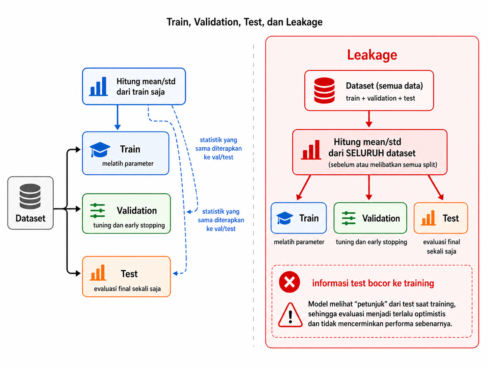
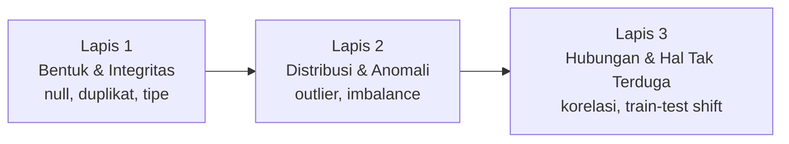
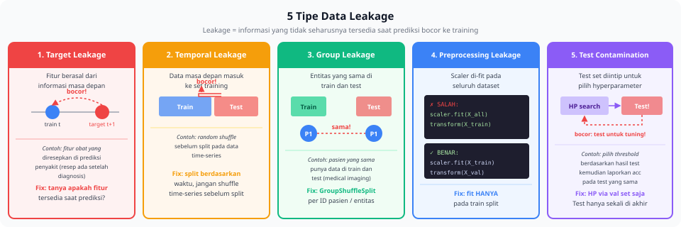

<details>
<summary>📂 Navigasi Modul (klik untuk buka)</summary>

| # | Modul | Minggu |
|---|-------|--------|
| 00 | [Pendahuluan](00_Pendahuluan.md) | 1 |
| 00a | [Prasyarat Modul](00a_Prasyarat.md) | – |
| 01 | [W1 - Tabular & Output Heads](01_W1_Tabular_Output_Heads.md) | 1 |
| 02 | [W2 - Images, CNN & Smoke Test](02_W2_Images_CNN_Smoke_Test.md) | 2 |
| 03 | [W3 - Loss, Optimizer & Evaluasi](03_W3_Loss_Optimizer_Evaluasi.md) | 3 |
| 04 | [W4 - Reproducibility & Matriks Eksperimen](04_W4_Reproducibility_Experiment_Matrix.md) | 4 |
| 05 | [W5 - Sequences: RNN & LSTM](05_W5_Sequences_RNN_LSTM.md) | 5 |
| ▶ 06 | W6 - Representations & Temporal Leakage | 6 |
| 07 | [W7 - Text, Transformers & Repo Adoption](07_W7_Text_Transformers_Repo_Adoption.md) | 7 |
| 08 | [W8 - Foundation Models](08_W8_Foundation_Models.md) | 8 |
| 09 | [W9 - Multimodal Reasoning](09_W9_Multimodal_Reasoning.md) | 9 |
| 10 | [W10 - Paper Reading & Implementation](10_W10_Paper_Reading.md) | 10 |
| 11 | [W11 - Research Framing](11_W11_Research_Framing.md) | 11 |
| 12 | [Capstone - Proyek Riset](12_Capstone.md) | 12-15 |
| 13 | [Rubrik Penilaian](13_Rubrik_Penilaian.md) | – |
| 14 | [Lampiran](14_Lampiran.md) | – |
| 15 | [Panduan Instruktur](15_Panduan_Instruktur.md) | – |

</details>

---

# 06 · W6 - Representations & Temporal Leakage

Kali ini kita akan membahas:

1. **Representasi Fitur untuk Sequence dan Sensor** - tiga strategi dari W3 dengan dimensi temporal yang harus dijaga.
2. **Temporal Leakage** - satu pipeline yang tampak wajar tetapi membocorkan informasi masa depan.
3. **EDA sebagai Investigasi** - tiga lapis pertanyaan untuk memeriksa data sebelum training.
4. **Lima Jenis Data Leakage** - tanda awal dan tes cepat tiap jenis.
5. **Pipeline Pra-pemrosesan yang Aman** - fit hanya pada train, dan tiga bentuk domain shift.
6. **Audit Dataset dan Pelaporan** - mengaudit PathMNIST lalu menulis laporan yang berisi keputusan.

Di pertemuan sebelumnya (W5) kita membangun dan mendiagnosis arsitektur recurrent (RNN, LSTM) untuk data sequence `(T, F)`. W5 sudah menyebut leakage temporal sebagai salah satu bug diagnosis di [W5 §5](05_W5_Sequences_RNN_LSTM.md). Minggu ini bug itu dibahas penuh. Output W5 yang dipakai minggu ini adalah satu kebiasaan: mencurigai angka evaluasi yang terlalu bagus dan menelusuri dari mana angka itu berasal. Disiplin trace result dari [W4 §3](04_W4_Reproducibility_Experiment_Matrix.md) tetap dipakai: tiap audit dan tiap eksperimen leakage ditulis ke folder dengan catatan yang bisa dicek ulang.

Setelah W6, setiap pipeline preprocessing diperiksa dengan satu pertanyaan: apakah ada informasi masa depan atau informasi test yang bocor ke training?

---

## 1. Representasi Fitur untuk Sequence dan Sensor

Di [W3 §2.4](03_W3_Loss_Optimizer_Evaluasi.md) kita membahas tiga strategi representasi fitur: *engineered*, *extracted*, dan *learned*. Ketiganya muncul lagi di domain sensor dan time series, tetapi sekarang pilihannya menentukan satu hal baru: apakah hasil valid secara temporal. Representasi yang sama bisa membawa informasi dari masa depan tanpa disadari.

| Strategi | Contoh di sensor/time-series | Kekuatan | Risiko leakage |
|---|---|---|---|
| **Engineered** | Mean, variance, spektrum FFT dari window | Mudah diinterpretasi, ringan | Tinggi jika window melampaui batas temporal |
| **Extracted** | Hidden states dari Chronos/TimesFM yang di-freeze | Tidak butuh label | Sedang; cek apakah model pretrained dilatih pada data yang overlap |
| **Learned** | LSTM end-to-end dari sinyal mentah | Paling fleksibel | Rendah jika split temporal benar |

Definisi lengkap ketiga strategi ada di [W3 §2.4](03_W3_Loss_Optimizer_Evaluasi.md) dan tidak diulang di sini. Yang baru di sensor adalah kolom terakhir. Fitur *engineered* seperti rolling mean dihitung dari window yang membentang ke belakang dalam waktu. Kalau window itu melewati batas antara train dan test, fitur train ikut memuat nilai dari test. Inilah yang dibahas di materi berikutnya.

---

## 2. Temporal Leakage

Tugas jembatan di akhir W5 sudah memberi gejalanya: saat LSTM dilatih pada Air Passengers, random split menghasilkan MAE yang lebih kecil daripada chronological split, padahal di praktiknya kita selalu meramal masa depan. Section ini menjelaskan kenapa angka yang lebih kecil itu justru menyesatkan.

Temporal leakage terjadi ketika informasi dari masa depan masuk ke prediksi masa lalu. Berikut satu pipeline yang sering ditulis dan tampak wajar. Datanya sensor suhu mesin industri dengan label failure. Kita membuat fitur rolling mean 24 jam, lalu membagi data secara acak.

```python
df['rolling_mean_24h'] = df['temperature'].rolling(window=24).mean()

# SALAH - split acak, bukan temporal
from sklearn.model_selection import train_test_split
X_train, X_test = train_test_split(df, test_size=0.2, shuffle=True)
```

Pipeline ini punya dua sumber kebocoran sekaligus:

1. **Random split.** Sampel jam 14:00 bisa masuk train, sementara sampel jam 13:00 dari hari yang sama masuk test. Saat training, model melihat data yang waktunya setelah titik test.
2. **Rolling feature melampaui batas.** Nilai `rolling_mean_24h` pada titik ke-T dihitung dari T-23 hingga T. Kalau salah satu titik T-23..T-1 ada di test set tetapi T ada di train set, fitur training memuat nilai dari test.

Saat evaluasi, model mencapai F1 = 0.92. Saat dipakai di produksi, model hanya mencapai F1 = 0.63. Selisih 0.29 inilah harga temporal leakage, dan baru terlihat setelah model dipakai.

Pipeline yang benar membagi data berdasarkan waktu dan menghitung rolling feature secara causal:

```python
# BENAR - temporal split
cutoff = df['timestamp'].quantile(0.8)  # 80% data awal untuk training
train = df[df['timestamp'] <= cutoff]
test = df[df['timestamp'] > cutoff]

# Rolling feature dihitung causal:
# - tidak ada data dari masa depan dalam window
# - window tidak melampaui batas cutoff
```



> [!WARNING]
> Leakage temporal jarang menghasilkan F1 = 1.0 yang jelas mencurigakan. Ia menghasilkan angka "bagus" seperti 0.88 yang masuk akal, cukup untuk meyakinkan Anda dan peninjau bahwa modelnya valid. Yang salah bukan angkanya, tetapi cara mendapatkannya.

Skeptisisme terhadap angka sendiri adalah kebiasaan riset minggu ini. Lab 6 menampilkan selisih ini secara eksplisit: F1 dengan leakage dibandingkan F1 tanpa leakage pada dataset yang sama. Angka bocor akan terlihat lebih menarik, dan itulah persis bahayanya.

---

## 3. EDA sebagai Investigasi

*Exploratory Data Analysis* sering diajarkan sebagai daftar langkah: jalankan `df.describe()`, plot histogram, hitung korelasi, selesai. Praktik yang benar dipandu pertanyaan, bukan daftar. Setiap angka atau plot yang muncul memicu pertanyaan baru, bukan tanda centang.

Kerangka yang produktif menyusun pertanyaan dalam tiga lapis berurutan, dari integritas dasar ke distribusi ke hubungan tersembunyi.



**Lapis 1 - Bentuk dan integritas.**
- Berapa banyak baris dan kolom?
- Apakah ada nilai hilang? Di kolom mana, berapa proporsinya?
- Apakah tipe data tiap kolom sesuai ekspektasi?
- Apakah ada duplikasi baris? Duplikasi itu sah atau mencurigakan?
- Untuk data gambar/audio: apakah semua file terbaca? Apakah dimensinya seragam?

**Lapis 2 - Distribusi dan anomali.**
- Bagaimana distribusi tiap kolom numerik (histogram, box plot)? Adakah outlier ekstrem?
- Bagaimana distribusi kolom kategorikal (value counts)? Adakah kelas dengan frekuensi terlalu rendah?
- Apakah target imbalanced? Kalau ya, seberapa parah?
- Adakah nilai yang tidak masuk akal (umur negatif, suhu 999, tanggal di masa depan)?

**Lapis 3 - Hubungan dan hal tak terduga.**
- Bagaimana korelasi antar fitur numerik?
- Adakah fitur dengan korelasi sangat tinggi (>0.95) terhadap target? Korelasi sebesar itu patut diselidiki, sering tanda leakage.
- Apakah distribusi fitur sama antara train dan test? Kalau berbeda, mengapa?
- Adakah pola temporal yang tidak diharapkan?

Alat pembantu EDA mengikuti tiga lapis di atas:

```python
import pandas as pd
import matplotlib.pyplot as plt
import seaborn as sns

df = pd.read_csv('data/train.csv')

# Lapis 1
print(df.shape)
print(df.info())
print(df.isna().sum())
print(df.duplicated().sum())

# Lapis 2
df.describe()
df['target'].value_counts(normalize=True)  # proporsi kelas

# Lapis 3
corr = df.select_dtypes('number').corr()
sns.heatmap(corr, annot=True, fmt='.2f')
plt.show()
```

Untuk dataset besar, `pandas-profiling` (sekarang `ydata-profiling`) menghasilkan laporan otomatis yang mencakup lapis 1 dan 2:

```python
from ydata_profiling import ProfileReport
ProfileReport(df, title='EDA Report').to_file('eda.html')
```

Laporan otomatis adalah titik awal, bukan akhir. Ia menunjukkan *apa*; Anda yang bertanya *mengapa*.

---

## 4. Lima Jenis Data Leakage

*Data leakage* adalah masuknya informasi ke training yang seharusnya tidak tersedia pada waktu prediksi. Lima jenis berikut mencakup hampir semua kasus.

1. **Target leakage** terjadi ketika fitur dihitung *setelah* atau *dari* target. Contoh: `total_payments` pada prediksi default kredit hanya tersedia setelah pinjaman berakhir, jadi tidak bisa ada di data training model prediksi awal.
2. **Train-test contamination** terjadi ketika baris yang sama ada di train dan test. Ini sering muncul saat split dilakukan setelah proses yang menciptakan duplikasi, misalnya agregasi yang meniru baris.
3. **Temporal leakage** terjadi ketika data masa depan masuk ke prediksi masa lalu. Jenis ini sudah dibahas di materi 2; solusinya split berdasarkan waktu, bukan acak.
4. **Group leakage** terjadi ketika data dari subjek yang sama ada di train dan test. Contoh: pasien yang sama punya beberapa rontgen, satu masuk train dan satu masuk test, sehingga model bisa mengenali pasien, bukan penyakit. Solusinya split berdasarkan grup (pasien, pengguna, sesi).
5. **Preprocessing leakage** terjadi ketika statistik normalisasi (mean, std) dihitung dari seluruh dataset termasuk test. Ini memberi model informasi agregat test. Solusinya dibahas di materi 5: fit hanya pada train, transform train+test dengan parameter yang sudah di-fit.



Tiap jenis punya tanda awal dan tes cepat yang berbeda:

| Jenis | Tanda awal | Tes cepat |
|---|---|---|
| Target leakage | Satu fitur punya korelasi ekstrem dengan target | Latih model dengan fitur ini saja; kalau akurasi sudah tinggi, curigai |
| Train-test contamination | Akurasi validasi dekat atau melebihi train | Hitung overlap ID/hash antar split |
| Temporal leakage | Performa turun drastis di data masa depan | Pisah berdasarkan waktu dan bandingkan |
| Group leakage | Val acc tinggi tetapi performa di subjek baru rendah | Group split, lalu retrain |
| Preprocessing leakage | Efek kecil tetapi konsisten | Refactor: fit hanya pada train |

---

## 5. Pipeline Pra-pemrosesan yang Aman

Pipeline pra-pemrosesan harus *fit pada training set saja*, lalu *transform train, val, dan test* dengan parameter yang sudah di-fit. Aturan ini menutup preprocessing leakage.

> [!IMPORTANT]
> Kalau `mean` dan `std` dihitung dari **semua data** (train + val + test) sebelum split, statistik itu sudah memuat informasi val/test. Misalnya distribusi outlier di test akan menggeser mean. Saat training, model menerima input yang dinormalisasi memakai informasi agregat test. Label test memang tidak bocor, tetapi **distribusi fitur test sudah bocor**. Efeknya kecil di dataset besar yang distribusinya stabil, tetapi nyata di dataset kecil atau heterogen.

Salah:

```python
# JANGAN LAKUKAN INI
scaler = StandardScaler()
X_all_scaled = scaler.fit_transform(X_all)  # fit pakai seluruh data
X_train, X_test = train_test_split(X_all_scaled, ...)
```

Benar:

```python
X_train, X_test = train_test_split(X_all, ...)
scaler = StandardScaler()
X_train = scaler.fit_transform(X_train)     # fit HANYA train
X_test = scaler.transform(X_test)            # transform test
```

Untuk pipeline multi-langkah, `sklearn.pipeline.Pipeline` menjaga urutan fit/transform secara otomatis:

```python
from sklearn.pipeline import Pipeline
from sklearn.impute import SimpleImputer
from sklearn.preprocessing import StandardScaler
from sklearn.compose import ColumnTransformer

num_cols = ['age', 'salary']
cat_cols = ['city', 'role']

num_pipe = Pipeline([
    ('impute', SimpleImputer(strategy='median')),
    ('scale', StandardScaler()),
])
cat_pipe = Pipeline([
    ('impute', SimpleImputer(strategy='most_frequent')),
    ('encode', OneHotEncoder(handle_unknown='ignore')),
])
preprocess = ColumnTransformer([
    ('num', num_pipe, num_cols),
    ('cat', cat_pipe, cat_cols),
])

preprocess.fit(X_train)
X_train_t = preprocess.transform(X_train)
X_test_t = preprocess.transform(X_test)

# Simpan untuk reproduksibilitas
import joblib
joblib.dump(preprocess, 'experiments/lab4/preprocess.pkl')
```

Untuk model PyTorch yang memakai augmentasi, prinsipnya sama: augmentasi hanya di training `Dataset`, tidak di validation/test.

### Domain Shift

Pipeline yang bersih pun bisa gagal kalau data produksi berbeda dari data training. Ada tiga bentuk perubahan distribusi, dan masing-masing menuntut solusi berbeda.

**Covariate shift** terjadi ketika distribusi fitur `P(x)` berubah, tetapi hubungan fitur→target `P(y|x)` tetap. Model masih bisa di-deploy kalau fitur baru tidak terlalu jauh dari yang dilihat saat training. Contoh: model klasifikasi daun penyakit dilatih di musim kemarau (warna lebih kekuningan), lalu dipakai di musim hujan (warna lebih gelap). Pola visual penyakit sama, tetapi distribusi warna pixel bergeser. Untuk mendeteksinya, bandingkan histogram per-channel train dan deploy, lalu jalankan uji KS pada distribusi fitur.

**Label shift** terjadi ketika distribusi target `P(y)` berubah, tetapi `P(x|y)` tetap. Contoh: model deteksi spam dilatih saat spam = 5% dari email, lalu dipakai saat campaign besar membuat spam = 30%. Tampilan spam tetap sama, hanya proporsinya berubah, dan threshold default akan menghasilkan banyak false negative. Untuk mendeteksinya, bandingkan `value_counts` label di sampel produksi dan train.

**Concept drift** terjadi ketika `P(y|x)` itu sendiri berubah. Hubungan fitur→target tidak lagi sama. Contoh: model prediksi churn dilatih sebelum app rilis fitur baru, lalu pengguna yang sebelumnya churn karena fitur kurang sekarang loyal. Dengan fitur input identik, labelnya berubah. Jenis ini paling sulit ditangani dan biasanya butuh re-training periodik. Untuk mendeteksinya, perhatikan metrik produksi yang turun walau distribusi fitur stabil, lalu bandingkan akurasi pada window sliding bulanan.

Diagnosis awal ketiganya sama: bandingkan histogram tiap fitur antara train dan test/produksi. Kalau histogram berbeda signifikan, ada shift. Uji statistik seperti Kolmogorov-Smirnov membuatnya lebih formal. Di proyek kuliah, shift sering sengaja diperkenalkan: Lab memindahkan model yang dilatih di CIFAR-10 ke PathMNIST, sebuah domain shift yang membuat akurasi turun drastis.

---

## 6. Audit Dataset dan Pelaporan

Audit dataset menjalankan EDA tiga lapis dan cek leakage pada satu dataset nyata, lalu menutupnya dengan laporan yang berisi keputusan eksperimen. Worked example ini memakai PathMNIST: dataset histopatologi kolon dari koleksi MedMNIST, sembilan kelas jaringan, resolusi 28×28.

**Muat dan periksa struktur.**

```python
from medmnist import PathMNIST

train_ds = PathMNIST(split='train', download=True)
val_ds   = PathMNIST(split='val',   download=True)
test_ds  = PathMNIST(split='test',  download=True)

print(len(train_ds), len(val_ds), len(test_ds))
# output: 89996 10004 7180

img, label = train_ds[0]
print(type(img), img.size, label)
# output: <class 'PIL.Image.Image'> (28, 28) [0]
```

Ukuran 90k train, 10k val, 7k test masuk akal. Resolusi 28×28 kecil (mirip MNIST), sesuai untuk proyek edukasi. Label berupa array panjang 1 (konvensi MedMNIST).

**Distribusi kelas.** Hitung `Counter` label per split, lalu nilai rasio kelas terbanyak terhadap terkecil. Kalau > 5×, imbalance moderat; > 10×, imbalance ekstrem.

```python
import numpy as np
from collections import Counter

train_labels = np.array([train_ds[i][1][0] for i in range(len(train_ds))])
print('Train:', Counter(train_labels))
```

**Visualisasi sampel.** Tampilkan beberapa gambar per kelas. Inspeksi visual menilai kewajaran tugas dan menangkap anomali (gambar hitam, gambar kosong, gambar dengan artefak) yang tidak terlihat dari statistik ringkas.

**Cek leakage antar split.** Hitung hash MD5 tiap gambar, lalu cari irisan antar split:

```python
import hashlib

def image_hash(img):
    return hashlib.md5(np.array(img).tobytes()).hexdigest()

train_hashes = set(image_hash(train_ds[i][0]) for i in range(len(train_ds)))
val_hashes   = set(image_hash(val_ds[i][0])   for i in range(len(val_ds)))
test_hashes  = set(image_hash(test_ds[i][0])  for i in range(len(test_ds)))

print('Train-val overlap:', len(train_hashes & val_hashes))
print('Train-test overlap:', len(train_hashes & test_hashes))
print('Val-test overlap:', len(val_hashes & test_hashes))
```

Kalau ada overlap > 0, catat, laporkan, dan pertimbangkan memfilter sebelum training. Untuk dataset publik matang seperti PathMNIST overlap biasanya 0, tetapi periksa selalu, jangan percaya begitu saja.

**Cek konsistensi label.** Pada dataset kecil, inspeksi manual 20 sampel acak per kelas. Pada dataset besar, pakai strategi proxy: cari *near-duplicate* (cosine similarity embedding > 0.99) dengan label berbeda, atau latih baseline pendek lalu ambil sampel dengan disagreement maksimal antara prediksi dan label.

```python
from sklearn.neighbors import NearestNeighbors

embeddings = extract_embeddings(train_ds)  # misal pakai ResNet pre-trained
nn = NearestNeighbors(n_neighbors=2).fit(embeddings)
distances, indices = nn.kneighbors(embeddings)
for i, (d, j) in enumerate(zip(distances[:, 1], indices[:, 1])):
    if train_labels[i] != train_labels[j] and d < 0.05:
        print(f"Suspect: sample {i} (label {train_labels[i]}) vs "
              f"sample {j} (label {train_labels[j]}), dist {d:.3f}")
```

### Laporan Audit Berisi Keputusan

Audit yang berhenti di temuan belum selesai. Laporan yang berguna menerjemahkan tiap temuan menjadi keputusan eksperimen yang konkret:

```markdown
## Audit Dataset: PathMNIST

**Ukuran:** train 89996, val 10004, test 7180 - cukup besar.
**Kelas:** 9. Distribusi agak imbalance (max/min ~ 4×).
**Resolusi:** 28×28×3. Kecil, tidak perlu augmentasi berat.
**Overlap split:** train-val 0, train-test 0, val-test 0.
**Anomali visual:** tidak ditemukan (inspeksi 10 sampel per kelas).
**Ketidakkonsistenan label:** 12 pasangan suspek dari strategi proxy,
dari 89996 sampel (0.013%). Diabaikan untuk eksperimen kuliah.
**Domain shift dari CIFAR-10:** drastis (fotografi natural vs
histopatologi medis). Model pre-trained di CIFAR-10 diperkirakan
tidak transfer langsung.

**Keputusan untuk eksperimen:**
- Normalisasi per channel dengan statistik training set.
- Augmentasi ringan: random rotation ±15°, horizontal flip.
- Metrik utama: F1 macro (karena imbalance moderat).
```

Laporan ini masuk ke `experiments/lab4/audit.md`, dibaca bersama protokol eksperimen dari [W4 §1](04_W4_Reproducibility_Experiment_Matrix.md).

### Catat Juga yang Gagal

Audit dan eksperimen yang gagal tetap ditulis. [W4 §4](04_W4_Reproducibility_Experiment_Matrix.md) sudah membahas cara menangani hipotesis yang meleset; di sini sudut pandangnya etika riset. Krisis reproduksibilitas di ML sebagian dipicu *publication bias*: hasil positif dilaporkan, hasil negatif tidak. Akibatnya banyak tim membuang waktu di arah yang sama karena tidak ada yang melaporkan bahwa arah itu buntu.

Dalam lingkup lab sendiri, praktiknya sederhana:

- Setiap folder eksperimen punya `README.md` atau `notes.md`, bahkan ketika eksperimennya gagal.
- Hasil seperti "focal loss tidak membantu" tetap bernilai sebagai satu titik data tentang batas efektivitas teknik.
- Di akhir semester, portofolio Anda berisi campuran hasil positif dan negatif. Kalau semuanya positif, kemungkinan Anda hanya melaporkan yang berhasil.

PI lebih percaya pada asisten yang berkata "saya mencoba tiga arah, dua gagal, satu berhasil" daripada asisten yang hanya menampilkan keberhasilan.

> [!NOTE]
> Bias dataset (selection, measurement, label, historical bias), fairness awareness, dan tanggung jawab etis asisten riset adalah pendalaman opsional W6. Materinya ada di [Lampiran](14_Lampiran.md); baca sebelum capstone kalau dataset Anda melibatkan data manusia. Yang wajib minggu ini adalah mencatat hasil negatif, karena terkait langsung dengan reproducibility W4.

---

## Lab

W6 punya dua lab. Lab EDA mengaudit dataset gambar; lab temporal leakage mengukur dampak leakage pada data sequence.

### Lab 6a - Audit PathMNIST dan Pipeline ([lab_w6_eda_leakage.ipynb](https://colab.research.google.com/github/muhammad-zainal-muttaqin/Module-DS/blob/master/template/notebooks/lab_w6_eda_leakage.ipynb))

1. Unduh PathMNIST dan jalankan EDA tiga lapis (materi 3). Hasilkan minimal 4 figur: distribusi kelas per split, sampel per kelas, statistik per channel, confusion matrix awal.
2. Jalankan cek overlap antar split dengan image hashing (materi 6). Catat hasilnya di `audit.md`.
3. Deteksi ketidakkonsistenan label (near-duplicate label berbeda, atau disagreement baseline). Inspeksi 10 pasangan suspek secara manual.
4. Buat pipeline pra-pemrosesan yang fit-only-on-train (materi 5). Verifikasi: statistik normalisasi val memakai mean/std dari train, bukan dari val.
5. Jalankan baseline pendek (5 epoch) dengan dan tanpa augmentasi, lalu bandingkan train/val gap.
6. Tulis `audit.md` satu halaman yang berisi temuan dan keputusan eksperimen.

### Lab 6b - Temporal Leakage ([lab_w6_temporal_leakage.ipynb](https://colab.research.google.com/github/muhammad-zainal-muttaqin/Module-DS/blob/master/template/notebooks/lab_w6_temporal_leakage.ipynb))

1. Muat dataset sensor/time-series sintetis yang disediakan.
2. Bangun pipeline fitur causal: rolling feature hanya dari timestep sebelum t, pemisahan temporal (80% train, 20% test kronologis).
3. Rusak kausalitas secara sengaja: random split + rolling feature tanpa pengaman temporal.
4. Latih model pada kedua pipeline, lalu bandingkan F1.
5. Hitung leakage inflation = F1_leaky - F1_causal. Ambang modul ini: inflation ≥ 0.05 absolut **atau** ≥ 10% relatif terhadap F1_causal dianggap signifikan dan wajib dilaporkan eksplisit; inflation < 0.02 absolut bisa noise dari seed.
6. Tulis satu paragraf: apa yang membuat angka bocor terlihat meyakinkan, dan mengapa tetap salah.

Checklist:

- [ ] Minimal 4 figur EDA dan `audit.md` tersimpan di `experiments/lab4/`.
- [ ] Tidak ada overlap antar split, atau overlap terdokumentasi.
- [ ] Minimal 10 pasangan suspek dari proxy check diinspeksi manual.
- [ ] Kode pra-pemrosesan jelas: `fit` hanya pada `train_ds`.
- [ ] `audit.md` berisi keputusan eksperimen (metrik utama, strategi augmentasi, alasan).
- [ ] Pipeline causal vs leaky terdokumentasi, dengan tabel F1 causal vs leaky vs delta.
- [ ] Satu paragraf menjelaskan mengapa angka bocor terlihat meyakinkan.

---

## Komponen Mandiri

Pilih satu pertanyaan dari materi W6 yang ingin dijelajahi lebih dalam. Tema minggu ini: memeriksa data sebelum mempercayai hasil.

Beberapa pertanyaan pemantik (tidak wajib salah satunya):

- Apa yang berubah dalam cara Anda memakai dataset tertentu setelah menjalankan EDA menyeluruh?
- Skenario leakage seperti apa yang paling sulit terdeteksi pada pipeline yang sudah ada?
- Bagaimana merancang protokol split yang benar untuk dataset dengan ID entitas berulang (mis. ID pasien, ID pembicara)?
- Seberapa besar dampak leakage pada metrik, dan apakah selalu terlihat dari kurva training?

Kerjakan, dokumentasikan di `notebooks/portofolio_mandiri.ipynb`, dan presentasikan 10 menit di awal W7. Format dan kriteria: [Lampiran C.9](14_Lampiran.md#c9-template-komponen-mandiri).

---

## Refleksi

1. Anda mewarisi proyek dari senior yang sudah pindah. Dataset siap, kode siap, akurasi test terlaporkan 91%. Apa tiga pemeriksaan pertama yang Anda lakukan sebelum memakai ulang angka 91% itu di laporan Anda sendiri?
2. Model Anda mencapai 99% akurasi pada val set di hari pertama. Apa lima hipotesis paling mungkin tentang penyebabnya, diurutkan dari yang paling membosankan ke yang paling tak terduga? Untuk tiga hipotesis teratas, bagaimana Anda menguji masing-masing dalam waktu satu jam?
3. Dataset PathMNIST di Lab 6a tidak memiliki informasi pasien; tiap sampel dianggap independen. Bagaimana penanganannya kalau dataset punya ID pasien dengan beberapa slide per pasien? Jelaskan protokol split yang benar dan mengapa random split biasa akan gagal.
4. **Koneksi ke Capstone.** Pada Capstone (W12-W15), Anda memilih dataset dari paper, Kaggle, atau repo lab. Tuliskan checklist EDA tiga lapis (materi 3) dalam format yang bisa dilampirkan ke draft proposal. Bagian mana yang paling mungkin Anda *skip* karena tekanan waktu, dan apa konsekuensi paling buruk dari skip itu di Capstone?

---

## Bacaan Lanjutan

- **Kaufman, Rosset, Perlich - *Leakage in Data Mining: Formulation, Detection, and Avoidance*** (KDD 2011). Makalah ini menyajikan taksonomi klasik leakage; bagian 2-3 sudah cukup untuk memahami konsepnya.
- **Northcutt et al. - *Pervasive Label Errors in Test Sets Destabilize Machine Learning Benchmarks*** (NeurIPS 2021). Makalah ini menghitung berapa banyak label salah di benchmark populer (ImageNet, CIFAR-10), bacaan yang membangun skeptisisme terhadap angka benchmark.
- **Geirhos et al. - *Shortcut Learning in Deep Neural Networks*** (Nature Machine Intelligence, 2020). Makalah ini menjelaskan mengapa model belajar dengan cara yang tidak diharapkan, dan bagaimana mendeteksinya.
- **Cleanlab documentation** (cleanlab.readthedocs.io). Library ini menyediakan alat praktis untuk deteksi label noise, alternatif dari implementasi manual di lab.

---

## Lanjut ke W7

W7 memperluas Big Map ke domain teks dan memperkenalkan pretrained Transformer sebagai alat, serta cara membaca dan memodifikasi repo riset yang belum dikenal. Disiplin validasi data dari minggu ini tetap dipakai: teks juga rawan leakage lewat duplikasi dokumen dan kontaminasi pretraining.

Buka [W7 - Text, Transformers & Repo Adoption](07_W7_Text_Transformers_Repo_Adoption.md) ketika siap.
