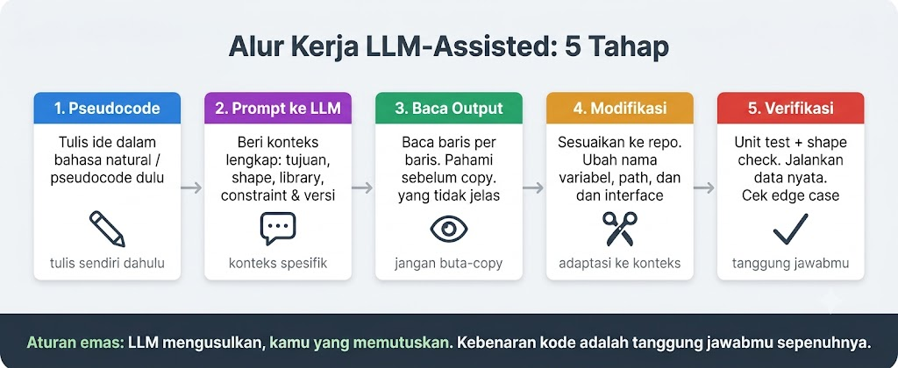
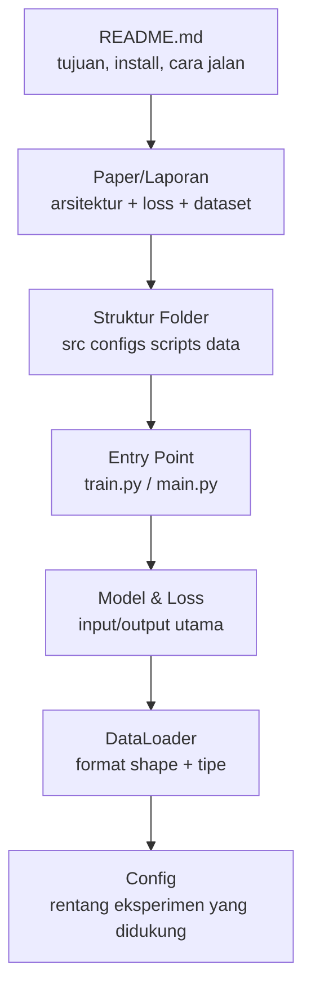
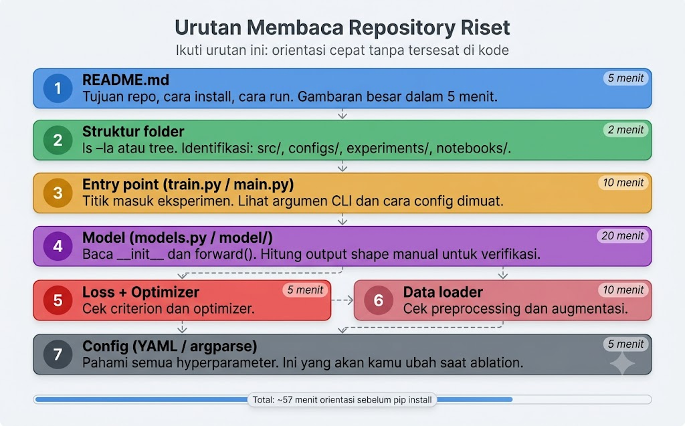
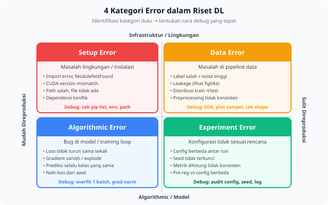

<details>
<summary>📂 Navigasi Modul (klik untuk buka)</summary>

| # | Modul | Minggu |
|---|-------|--------|
| 00 | [Pendahuluan](00_Pendahuluan.md) | 1 |
| 00a | [Prasyarat Modul](00a_Prasyarat.md) | – |
| 01 | [W1 - Tabular & Output Heads](01_W1_Tabular_Output_Heads.md) | 1 |
| 02 | [W2 - Images, CNN & Smoke Test](02_W2_Images_CNN_Smoke_Test.md) | 2 |
| 03 | [W3 - Loss, Optimizer & Evaluasi](03_W3_Loss_Optimizer_Evaluasi.md) | 3 |
| 04 | [W4 - Reproducibility & Matriks Eksperimen](04_W4_Reproducibility_Experiment_Matrix.md) | 4 |
| 05 | [W5 - Sequences: RNN & LSTM](05_W5_Sequences_RNN_LSTM.md) | 5 |
| 06 | [W6 - Representations & Temporal Leakage](06_W6_Representations_Temporal_Leakage.md) | 6 |
| ▶ 07 | W7 - Text, Transformers & Repo Adoption | 7 |
| 08 | [W8 - Foundation Models](08_W8_Foundation_Models.md) | 8 |
| 09 | [W9 - Multimodal Reasoning](09_W9_Multimodal_Reasoning.md) | 9 |
| 10 | [W10 - Paper Reading & Implementation](10_W10_Paper_Reading.md) | 10 |
| 11 | [W11 - Research Framing](11_W11_Research_Framing.md) | 11 |
| 12 | [Capstone - Proyek Riset](12_Capstone.md) | 12-15 |
| 13 | [Rubrik Penilaian](13_Rubrik_Penilaian.md) | – |
| 14 | [Lampiran](14_Lampiran.md) | – |
| 15 | [Panduan Instruktur](15_Panduan_Instruktur.md) | – |

</details>

---

# 07 · W7 - Text, Transformers & Repo Adoption

Kali ini kita akan membahas:

1. **Teks dengan Pretrained Transformer** - dari TF-IDF ke contextual embeddings, tokenization, cara kerja attention, dan pilihan freeze vs fine-tune.
2. **Alat AI untuk Riset** - protokol verifikasi kode AI dan sintesis dua sumber sebelum eksekusi.
3. **Adopsi Repo Eksternal** - membaca repo yang belum dikenal dari luar ke dalam, smoke test, dan modifikasi seminimal mungkin.

Di pertemuan sebelumnya (W6) kita sudah belajar membandingkan tiga strategi representasi dan mendeteksi temporal leakage lewat audit data. Tiga materi minggu ini punya satu benang merah: memakai hasil kerja yang sudah ada. Model teks tidak di-pretrain sendiri, kode tidak ditulis sendiri, dan repo riset tidak dibangun dari nol. Ketiganya bertemu dalam satu alur kerja: mengadopsi repo HuggingFace, memakai alat AI untuk memahami bagian yang belum dikenal, dan menulis `repo_map.md` untuk merekam pemahaman itu. Bottleneck RNN dan gradient flow dari [W5 §1.5](05_W5_Sequences_RNN_LSTM.md) dipakai lagi saat menjelaskan mengapa attention dibutuhkan.

---

## 1. Teks dengan Pretrained Transformer

### 1.1 Perkembangan Representasi Kata: Dari Angka Statis ke Vektor Dinamis

Sebelum kita masuk ke dalam model bahasa modern berbasis Transformer, kita harus menjawab satu pertanyaan mendasar: bagaimana cara komputer membaca bahasa manusia? Teks mentah berupa rangkaian huruf dan kata bersifat diskret, sedangkan Neural Network bekerja menggunakan operasi matematika kontinu berbasis matriks pecahan berdimensi tetap. Oleh karena itu, kita membutuhkan teknik representasi yang mampu mengubah teks menjadi struktur angka kontinu yang kaya akan makna semantik.


#### 1.1.1 Memahami Landasan: Struktur Diskret vs. Struktur Angka Kontinu

Bagi pemula yang baru memasuki dunia pemrosesan bahasa alami (NLP), sangat penting untuk membedakan dua cara komputer menyimpan informasi data:

1. **Struktur Diskret (Terputus-putus):** Representasi ini menggunakan angka biner atau bilangan bulat kaku yang terisolasi sepenuhnya satu sama lain. Sebagai contoh, jika kita mengurutkan kata-kata dalam kamus kosakata, kita mungkin menetapkan kata "kucing" pada indeks 1, "anjing" pada indeks 2, dan "meja" pada indeks 10.000. 
   - Di sini, tidak ada nilai "di antara" dua kata. 
   - Secara matematis, komputer tidak memiliki jembatan logika untuk mengetahui apakah kata indeks 1 memiliki kemiripan arti dengan kata indeks 2. Semuanya dianggap sebagai kategori terpisah yang berdiri sendiri.

2. **Struktur Angka Kontinu (Sinambung):** Representasi ini menggunakan bilangan desimal pecahan (*floating-point numbers*, seperti `0.254`, `-1.890`, `0.007`) dalam bentuk ruang vektor berdimensi tinggi yang padat (*dense vector* atau *embeddings*). 
   - Alih-alih diwakili oleh satu angka bulat kaku, sebuah kata seperti "kucing" dipetakan ke dalam deretan angka desimal panjang, misalnya:
     $$\text{Vektor("kucing")} = [0.25, -0.47, 0.81, \dots, -0.12]$$
    - Nilai angka desimal ini bisa bergeser secara halus dan sangat sensitif terhadap perubahan kecil, memungkinkan komputer memetakan nuansa makna bahasa yang sangat tipis dan bervariasi.


Terdapat tiga alasan mendasar mengapa model kecerdasan buatan modern sangat bergantung pada struktur angka kontinu ini:
- **Representasi Semantik Geometris:** Dalam ruang vektor kontinu, kata-kata dengan makna yang berdekatan atau sering berada dalam konteks yang serupa akan diposisikan saling berdekatan. Komputer dapat menghitung tingkat kemiripan makna menggunakan operasi jarak seperti *Cosine Similarity* (mengukur sudut antara dua vektor).
- **Operasi Aljabar Analogi:** Struktur angka kontinu memungkinkan kita melakukan perhitungan logika analogis murni menggunakan operasi tambah dan kurang pada koordinat vektor kata. Persamaan terkenal dalam NLP membuktikan fenomena menakjubkan ini:
  $$\vec{\text{Raja}} - \vec{\text{Pria}} + \vec{\text{Wanita}} \approx \vec{\text{Ratu}}$$
- **Kebutuhan Optimasi Kalkulus (Gradien):** Semua model *Deep Learning* dilatih menggunakan algoritma pembelajaran *backpropagation* yang berbasis pada kalkulus (turunan fungsi/gradien). Kalkulus hanya dapat bekerja pada fungsi matematika yang bersifat kontinu dan dapat diturunkan (*differentiable*). Angka diskret yang kaku tidak mendukung perhitungan gradien ini, sehingga semua input teks harus dikonversi menjadi angka kontinu agar model dapat belajar dari kesalahan prediksinya.

#### 1.1.2 Representasi Paling Sederhana: One-Hot Encoding
Pendekatan awal yang paling sederhana adalah memperlakukan setiap kata unik di dalam kamus kosakata (*vocabulary*) sebagai satu dimensi sumbu tersendiri yang ortogonal (saling tegak lurus). Jika kosa kata kita berisi kata "kucing", "anjing", dan "meja", maka representasinya adalah:
- "kucing" $\rightarrow [1, 0, 0]$
- "anjing" $\rightarrow [0, 1, 0]$
- "meja" $\rightarrow [0, 0, 1]$

Meskipun sangat sederhana, pendekatan One-Hot Encoding memiliki dua kelemahan fatal yang membatasi kegunaannya:
1. **Kehilangan Hubungan Semantik (Orthogonality):** Karena setiap sumbu saling tegak lurus, jarak Euclidean antara kata "kucing" dan "anjing" bernilai persis sama dengan jarak antara "kucing" dan "meja" ($\sqrt{2}$). Model komputer kehilangan kemampuan untuk mengetahui bahwa "kucing" secara makna jauh lebih dekat dengan "anjing" dibandingkan dengan "meja".
2. **Ledakan Dimensi (Scalability):** Jika sebuah korpus data riset memiliki 100.000 kata unik, maka setiap kata harus diwakili oleh vektor berukuran 100.000 dimensi yang isinya hampir seluruhnya berupa angka nol (*sparse vector*). Hal ini sangat tidak efisien untuk memori komputasi.

#### 1.1.3 Baseline Klasik: TF-IDF (Term Frequency - Inverse Document Frequency)
TF-IDF merupakan teknik statistik klasik yang mengukur seberapa pentingnya suatu kata di dalam sebuah dokumen tertentu dibandingkan dengan seluruh kumpulan dokumen (korpus). Bobot kepentingannya dihitung dengan memperkalikan frekuensi kata di dalam dokumen bersangkutan (TF) dengan tingkat kelangkaan kata tersebut di seluruh korpus dokumen (IDF).

$$\text{TF-IDF}(t, d, D) = \text{TF}(t, d) \times \text{IDF}(t, D)$$


Teknik ini sangat cepat dihitung, tidak menuntut kapasitas komputasi GPU, mudah ditafsirkan (*interpretable*), dan sangat mumpuni sebagai *baseline* klasifikasi teks berbasis kemunculan kata kunci. Namun, TF-IDF memiliki **dua kelemahan utama** karena ia mengabaikan urutan kata (*Bag-of-Words*):
1. **Gagal Mengatasi Polisemi:** Kata "bank" di dalam frasa "bank sungai" dan "bank uang" akan mendapatkan vektor representasi statis yang identik, sehingga komputer gagal membedakan dua makna yang sepenuhnya bertolak belakang tersebut.
2. **Ketiadaan Informasi Urutan:** Kalimat "tidak buruk" dan "tidak baik" diolah sebagai tumpukan kata lepas secara acak, sehingga komputer tidak mampu mencerna efek negasi dari kata "tidak" yang berpotensi membalikkan polaritas sentimen kalimat secara teratur.


#### 1.1.4 Static Word Embeddings: Word2Vec dan GloVe
Menjelang era Deep Learning modern, para peneliti merintis teknik *static word embeddings* seperti Word2Vec dan GloVe. Teknik ini memproyeksikan setiap kata ke dalam ruang vektor padat (*dense vector*) berdimensi rendah (misalnya 300 dimensi) menggunakan prinsip distribusi linguistik: kata-kata yang sering muncul di dalam konteks kalimat yang mirip cenderung diletakkan saling berdekatan di dalam ruang koordinat vektor.

Pendekatan kontinu ini melahirkan kemampuan hubungan kemiripan semantik yang sangat menawan melalui perhitungan aljabar vektor:

$$\text{vektor("raja")} - \text{vektor("pria")} + \text{vektor("wanita")} \approx \text{vektor("ratu")}$$


Kendati demikian, representasi Word2Vec masih memiliki satu batasan besar: ia bersifat **statis**. Setiap kata unik di dalam kamus hanya dikunci ke dalam satu vektor permanen yang tidak bisa berubah. Kata "bank" akan selalu memiliki vektor yang sama persis di mana pun ia berada, sehingga masalah makna ganda (polisemi) belum terpecahkan secara tuntas.

#### 1.1.5 Lompatan ke Contextual Embeddings
Contextual embeddings (seperti BERT, RoBERTa, dan IndoBERT) berhasil menyelesaikan seluruh rentetan keterbatasan di atas secara elegan dengan menghadirkan representasi **dinamis**. Di dalam arsitektur model ini, vektor angka untuk satu kata tidak lagi dikunci mati, melainkan akan dihitung ulang secara dinamis mengikuti seluruh rangkaian kata di sekelilingnya melalui bantuan mekanisme self-attention.


Model bahasa berskala besar yang telah dilatih pada miliaran token Wikipedia dan Common Crawl tetap sangat membantu tugas klasifikasi sentimen teks dalam bahasa Indonesia yang berukuran kecil. Manfaat luar biasa ini berasal dari struktur pembagian tugas belajarnya di setiap layer:
- **Layer awal model** mempelajari kaidah kebahasaan yang paling mendasar dan berlaku umum lintas domain, seperti batas semantik subkata (misalnya akhiran kata "##nya"), tata bahasa dasar, dan logika penolakan kalimat. Pola kebahasaan dasar ini bersifat universal di hampir seluruh teks buatan manusia.
- **Layer dalam model** baru mengasah kemampuannya pada pola yang lebih spesifik mengikuti domain target.

Saat Anda memuat bobot pretrained (*pretrained weights*), lapisan-lapisan awal model sebenarnya sudah menguasai aturan bahasa baku dengan sangat solid. Tugas Anda tinggal memandu pelatihan pada lapisan akhirnya saja agar memetakan tingkat pemahaman bahasa dasar tersebut ke dalam label kategori yang kita ingin targetkan. Pembagian fungsi ini juga melandasi keputusan penting kita saat harus menentukan antara metode freeze atau fine-tune di [§1.4](#14-frozen-vs-fine-tuned-eksperimen-2x2): seberapa banyak lapisan yang perlu beradaptasi ke domain Anda.


### 1.2 Tokenization: Sebelum Pelatihan Dimulai

Pretrained Transformer membaca urutan integer (token ID), bukan string mentah. **Tokenizer** adalah fungsi yang memetakan string ke urutan integer dan sebaliknya. Tiga gaya tokenisasi utama berbeda pada trade-off antara ukuran vocab dan panjang sequence:

- **Word-level** memetakan satu token per kata (whitespace-split). Skema ini sederhana, tetapi vocab menjadi besar dan rentan OOV (out-of-vocabulary) untuk kata baru.
- **Character-level** memetakan satu token per karakter, sehingga vocab kecil tetapi sequence menjadi sangat panjang.
- **Subword (BPE / WordPiece / SentencePiece)** mengambil jalan tengah: kata umum menjadi 1 token, kata jarang dipecah jadi sub-unit. Skema ini dipakai BERT, GPT, IndoBERT, dan hampir semua Transformer modern. Kata "tidak" mungkin menjadi 1 token, sedangkan "tertangkap" mungkin terpisah jadi `["ter", "tangkap"]`.


Setiap pretrained model punya tokenizer spesifik (vocab + algoritma). Bug paling umum saat memakai pretrained model adalah perbedaan antara tokenizer model dan cara Anda memproses teks. Tokenizer yang salah menghasilkan input yang tidak cocok dengan apa yang dilihat model saat pretraining.

```python
from transformers import AutoTokenizer

tokenizer = AutoTokenizer.from_pretrained("indobenchmark/indobert-base-p1")

# Inspeksi: lihat apa yang tokenizer lakukan pada teks
text = "Produk ini sangat bagus!"
tokens = tokenizer(text, return_tensors="pt")
print(tokenizer.convert_ids_to_tokens(tokens['input_ids'][0]))
# ['[CLS]', 'produk', 'ini', 'sangat', 'bagus', '!', '[SEP]']
```

Inspeksi tokenizer pada 5-10 sampel dari dataset Anda sebelum pelatihan menjawab tiga pertanyaan:

1. Apakah kata domain-spesifik ditokenisasi dengan benar dan tidak terpecah berlebihan menjadi banyak sub-unit?
2. Apakah panjang sequence setelah tokenisasi masih masuk dalam batas `max_length` model?
3. Apakah ada subword splits yang berpotensi menghilangkan makna?

### 1.3 Cara Kerja Attention

Pada [W5 §1.5](05_W5_Sequences_RNN_LSTM.md), Anda sudah melihat mengapa RNN kesulitan menangani sequence yang panjang. Masalah utamanya adalah **bottleneck informasi**: seluruh makna dari token-token sebelumnya harus dipadatkan ke satu *hidden state* berukuran tetap sebelum memproses langkah berikutnya. LSTM menambahkan *gate* untuk mengelola ini, tetapi *bottleneck* itu sendiri tidak hilang. Informasi tetap harus melewati setiap langkah perantara untuk mencapai akhir.

Attention menghilangkan bottleneck tersebut sepenuhnya. Pertimbangkan kalimat **"Buku itu tidak muat di dalam tas karena ukurannya terlalu besar."** Untuk mengetahui benda apa yang dirujuk oleh "ukurannya" (yakni buku, bukan tas), Anda tidak membaca ulang dari awal, tetapi langsung mencari kandidat yang relevan. Attention melakukan hal yang sama: setiap token dapat membaca dari semua token lain dalam satu langkah, dibobot berdasarkan relevansinya. Tidak ada informasi yang harus diteruskan langkah demi langkah.


Untuk menghitung bobot relevansi ini, setiap token diproyeksikan menjadi tiga vektor dengan peran berbeda: **Query** ("apa yang saya cari?"), **Key** ("apa yang saya miliki?"), dan **Value** ("apa yang sebenarnya saya berikan?"). Skor relevansi antara dua posisi adalah *dot product* dari Query suatu token dengan Key token lainnya. *Dot product* yang besar berarti kecocokan yang kuat. Proyeksi ini dihasilkan tiga matriks bobot yang dipelajari, yaitu $W_Q$, $W_K$, dan $W_V$. Ketiga matriks ini adalah parameter permanen di dalam layer, dan parameter inilah yang disimpan ke *checkpoint* Anda.

Jika digabungkan:

$$\text{Attention}(Q, K, V) = \text{softmax}\!\left(\frac{Q K^T}{\sqrt{d_k}}\right) V$$


Diagram di atas memetakan tiga operasi yang berurutan. $QK^T$ menghasilkan matriks $(T \times T)$ yang berisi semua skor berpasangan untuk sequence sepanjang $T$ token. Pembagian dengan $\sqrt{d_k}$ bersifat wajib: tanpa pembagian ini, *dot product* membesar seiring bertambahnya dimensi, mendorong *softmax* ke titik jenuh dan mematikan *gradient*. Ini bentuk baru dari masalah *vanishing gradient* yang dibahas di [W5 §1.5.2](05_W5_Sequences_RNN_LSTM.md). *Softmax* mengubah setiap baris menjadi distribusi probabilitas atas posisi (bobot attention), dan perkalian dengan $V$ menghasilkan *output* berupa rata-rata berbobot dari semua vektor Value, satu untuk setiap token.

Dalam kode, tanpa abstraksi *library*:

```python
import torch
import torch.nn.functional as F

X   = torch.randn(5, 16)       # 5 token, 16-dim embeddings
W_Q = torch.randn(16, 16)
W_K = torch.randn(16, 16)
W_V = torch.randn(16, 16)

Q, K, V = X @ W_Q, X @ W_K, X @ W_V

scores  = Q @ K.T / Q.shape[-1] ** 0.5  # (5, 5)
weights = F.softmax(scores, dim=-1)      # (5, 5) - jumlah tiap baris adalah 1
output  = weights @ V                   # (5, 16) - dimensi sama seperti input
```

Cetak `weights`. Baris *i* adalah distribusi probabilitas yang menunjukkan seberapa besar perhatian token *i* ke setiap posisi saat membentuk *output*-nya.

Attention adalah satu komponen di dalam blok Transformer:

```
Input (T, d_model)
      |
 [ LayerNorm ]
      |
 [ Self-Attention ]   <- satu-satunya tempat token berinteraksi satu sama lain
      |
 [ Residual Add ]     <- skip connection, perannya sama seperti di ResNet (W2)
      |
 [ LayerNorm ]
      |
 [ Feed-Forward ]     <- dua linear layer, diterapkan secara mandiri per token
      |
 [ Residual Add ]
      |
Output (T, d_model)
```


Dimensi input dan *output* selalu sama, itulah sebabnya blok ini dapat ditumpuk hingga 12 atau 24 lapis tanpa perubahan di antaranya. Layer *feed-forward* tidak mencampur token; hanya layer attention yang melakukannya. Dalam praktiknya, model menjalankan operasi attention paralel sebanyak $h$ kali (*multi-head attention*). Masing-masing berjalan pada subruang representasi berdimensi lebih rendah, kemudian menggabungkan dan memproyeksikan hasilnya. Setiap *head* dapat menangkap pola struktural yang berbeda, meskipun spesialisasi yang rapi tidak dijamin oleh rancangannya. Saat satu sequence memperhatikan sequence lain (misalnya Q dari satu sequence, lalu K dan V dari sequence lain), proses ini disebut *cross-attention*. Penerapannya muncul lagi di [W9](09_W9_Multimodal_Reasoning.md) untuk fusi multimodal.

Attention tidak memiliki konsep urutan. Skor antara token *i* dan token *j* hanya bergantung pada vektor Q and K keduanya, bukan pada posisi mereka dalam sequence. Artinya, "anjing menggigit orang" dan "orang menggigit anjing" menghasilkan input attention yang identik: himpunan token yang sama, tanpa urutan. RNN tidak pernah menghadapi masalah ini karena memproses token satu langkah demi satu langkah dan secara implisit mengetahui posisi. Karena Transformer memproses semua token secara paralel, informasi posisi harus disuntikkan secara eksplisit. *Positional encoding* menambahkan vektor yang bergantung pada posisi ke setiap *token embedding* sebelum masuk ke blok pertama, sehingga model mendapatkan informasi urutan yang tidak bisa diperoleh dari attention saja.


Pilihan freeze atau fine-tune sebenarnya adalah keputusan tentang apakah $W_Q, W_K, W_V$ boleh berubah. *Freeze* mengunci ketiga matriks ini (beserta parameter lain), sehingga kalkulasi attention tetap berjalan tetapi tidak bisa beradaptasi dengan domain Anda. *Fine-tune* memungkinkan matriks-matriks ini beradaptasi agar bobot attention menangkap hubungan yang dibutuhkan tugas Anda. Matematika di balik attention tidak berubah; hanya matriks proyeksinya yang berubah.

Lab 6b ([lab_w7_transformer_mini.ipynb](https://colab.research.google.com/github/muhammad-zainal-muttaqin/Module-DS/blob/master/template/notebooks/lab_w7_transformer_mini.ipynb)) menugaskan Anda menerapkan `scaled_dot_product_attention` dari awal dan memverifikasinya terhadap `nn.TransformerEncoderLayer`. *Notebook* tersebut praktik langsung yang mendampingi bagian ini.

### 1.4 Frozen vs Fine-tuned: Eksperimen 2x2

Dua keputusan perlu dibandingkan dalam satu grid. Keputusan pertama menyangkut backbone, keputusan kedua menyangkut cara meringkas embedding per token menjadi satu vektor untuk classification head.

**Frozen backbone** melatih hanya head kecil di atas embedding tetap. Pendekatan ini cepat, hemat komputasi, dan stabil, sehingga cocok untuk dataset kecil atau saat domain sangat mirip dengan pretraining. **Fine-tuned** melatih seluruh model (atau sebagian) bersama head. Pendekatan ini lebih lambat dan lebih fleksibel, dan sering menghasilkan performa lebih baik pada dataset yang cukup besar.


> [!TIP]
> Contoh waktu/biaya konkret (IndoBERT-base, ~110M parameter, dataset SmSA ~12k sampel, GPU T4):
> - **Frozen + Linear head** membutuhkan training ~2-3 menit (1 epoch) dengan val macro-F1 ~0.78-0.82. Inference ~5 ms/sample karena forward pass tetap full BERT, tetapi tidak perlu backward.
> - **Fine-tune full** membutuhkan training ~15-25 menit (3 epoch) dengan val macro-F1 ~0.85-0.89. Memori GPU ~3-4x lebih besar karena gradient untuk semua parameter perlu disimpan.
>
> Aturan praktisnya: kalau dataset < 5k sampel atau Anda butuh prototype cepat, pakai **frozen** dulu. Kalau dataset > 20k atau butuh 3-5% performa terakhir, **fine-tune**. Di antara keduanya, PEFT seperti LoRA ([W8](08_W8_Foundation_Models.md)) menjadi jalan tengah.

**[CLS] pooling** memakai token `[CLS]` untuk mewakili seluruh sequence. Token ini ditambahkan otomatis di awal setiap input oleh tokenizer keluarga BERT. Selama pretraining, model belajar menaruh ringkasan global di posisi ini lewat objective next-sentence prediction, sehingga `[CLS]` menjadi pilihan natural untuk classification head.

**Mean pooling** mengambil rata-rata embedding semua token kecuali padding. Pendekatan ini sering lebih robust untuk sentence similarity tasks karena representasi tidak berat sebelah ke satu posisi, tetapi bisa kehilangan ketegasan kalau hanya sebagian token yang relevan untuk tugas tersebut. Untuk classification, [CLS] dan mean pool biasanya berbeda 1-3 poin F1, dan mana yang menang bergantung dataset.


Lab 5b menjalankan 2×2 ini secara eksplisit supaya Anda melihat sendiri pada dataset Indonesia:

| | frozen | fine-tuned |
|---|---|---|
| [CLS] | kondisi A | kondisi B |
| mean pool | kondisi C | kondisi D |

### 1.5 Big Map untuk Teks

Tiga formulasi umum di domain teks berbeda pada bentuk output-nya:

| Tugas | Input | Output | Contoh |
|---|---|---|---|
| Sentence classification | `(T,)` tokens | `(N,)` | Sentimen, topik |
| Token classification | `(T,)` tokens | `(T, N)` | NER, POS tagging |
| Regression dari teks | `(T,)` tokens | `(1,)` | Scoring, rating |

---

## 2. Alat AI untuk Riset

Modul ini tidak melarang AI coding tools. Modul ini mewajibkan **protokol verifikasi** sebelum kode dipakai dan **sintesis dua sumber** sebelum eksekusi keputusan penting. Tujuannya mempercepat kerja tanpa kehilangan pemahaman atas kode sendiri.

### 2.1 Aturan Verifikasi

Setiap kode yang dihasilkan AI melewati tiga pemeriksaan sebelum dipakai:

1. **Verifikasi bentuk tensor.** Periksa apakah input/output shape yang diklaim cocok dengan kode.
2. **Uji kasus tepi.** Jalankan dengan satu sampel dan periksa hasilnya secara manual.
3. **Baca baris per baris.** Pastikan Anda bisa menjelaskan fungsi setiap baris.

Kalau Anda tidak bisa menjelaskan baris tertentu setelah membacanya dua kali, kode itu belum layak dikumpulkan dengan nama Anda.


### 2.2 Aturan Sintesis: Dua Sumber Sebelum Eksekusi

Sebelum mengeksekusi pendekatan penting (pemilihan model, arsitektur, strategi fine-tuning), kumpulkan setidaknya dua sumber berbeda:

- Dua respons AI dengan prompt berbeda, **atau**
- Satu respons AI ditambah satu sumber dokumentasi/paper, **atau**
- Satu respons AI ditambah satu peer review.

Lalu tulis satu paragraf sintesis: "Sumber A menyarankan X karena P. Sumber B menyarankan Y karena Q. Saya memilih Z karena R." Paragraf ini merekam alasan keputusan Anda sebelum eksekusi, dan menjadi catatan saat pilihan itu perlu dijelaskan.


### 2.3 AI untuk Tugas di Luar Kode

Alat AI berguna melampaui penulisan kode. Tiga prompt berikut produktif kalau Anda memberi konteks yang cukup:

- Saat **membaca paper**: "tolong rangkum bagian 3.2 dan identifikasi asumsi yang tidak diucapkan eksplisit."
- Saat **mendiskusikan hipotesis**: "diberikan bahwa distribusi kelas sangat tidak seimbang, apakah ada alasan untuk tidak memakai focal loss?"
- Saat **menavigasi repo**: "bagaimana alur data dari DataLoader ke model dalam repo ini?" sambil memberikan struktur folder sebagai konteks agar jawaban lebih akurat.



Diagram di atas menempatkan peneliti sebagai pemegang keputusan: LLM membantu pencarian, peringkasan, dan pengecekan awal, sedangkan verifikasi terhadap kode dan data tetap di tangan Anda, dan setiap keputusan dicatat beserta alasannya.

Untuk pengalaman langsung mengikuti protokol di atas, buka [lab_w7_llm_assisted.ipynb](https://colab.research.google.com/github/muhammad-zainal-muttaqin/Module-DS/blob/master/template/notebooks/lab_w7_llm_assisted.ipynb). Lab ini memandu implementasi mixup augmentation dengan bantuan AI pada classifier sentimen SmSA. Karena token bersifat diskret, mixup diterapkan di level embedding (lihat §1.2-§1.3), sekaligus melatih 4 sanity tests, comparison training, dan log interaksi LLM.

---

## 3. Adopsi Repo Eksternal

Riset jarang dimulai dari nol. Capstone (W12-W15) kemungkinan besar dimulai dari repo orang lain. Materi ini melatih cara membaca repo yang belum dikenal sebelum menjalankannya, lalu memodifikasinya seminimal mungkin. Kecepatan adopsi ditentukan oleh urutan membaca: empat jam membaca di awal sering memangkas berhari-hari debugging setup di tengah jalan.

### 3.1 Urutan Membaca: dari Luar ke Dalam

Saat membuka repo baru, baca dulu dengan urutan yang dipikirkan sebelum menjalankan apa pun:





Diagram di atas memecah pembacaan menjadi tujuh langkah:

1. **README.** Baca seluruhnya, bahkan jika pendek. Fokus pada tujuan proyek, cara install, cara jalan, format data, dan link ke paper. Catat apa yang tidak jelas.
2. **Paper atau laporan terkait.** Kalau repo hasil paper, baca abstrak dan bagian *method* untuk tahu apa yang harus ada di kode: arsitektur utama, loss utama, dan dataset utama.
3. **Struktur folder.** Buka file dan direktori satu level dari root. Konvensi umum: `src/` untuk kode inti, `configs/` untuk hyperparameter, `scripts/` untuk entry point, `data/` untuk dataset (sering hanya skrip download), `experiments/` atau `runs/` untuk hasil, `tests/` untuk unit test, dan `requirements.txt`/`environment.yml`/`pyproject.toml` untuk dependency.
4. **Entry point.** File yang dijalankan user pertama kali, biasanya `train.py`, `main.py`, atau `scripts/train.sh`. Baca dari atas ke bawah: parsing argumen, pembuatan model, pembuatan dataset, training loop. Catat panggilan ke file lain.
5. **File model dan loss.** Ikuti jejak dari entry point ke `models/` dan `losses/`. Baca definisi kelas utama, cukup tahu input dan output-nya, jangan dulu setiap fungsi helper.
6. **Data loader.** Biasanya file paling kompleks. Baca sampai Anda mengerti format input (shape, tipe) yang diharapkan model.
7. **Konfigurasi.** Buka satu file config dan pahami strukturnya. Ini memberi tahu rentang eksperimen yang didukung repo.

Alokasi waktu tipikal untuk repo ukuran sedang (10-30 file Python): 30-60 menit membaca sebelum `pip install`. Setelah langkah 1-3, Anda bisa menggambar peta singkat di kertas atau `notes.md`, lalu merangkumnya ke `repo_map.md` memakai template di [Lampiran C.12](14_Lampiran.md#c12-template-repo-map). Dokumen ini dibuat dua kali: satu di W7 (repo teks/transformer), satu di W9 (repo multimodal).

### 3.2 Smoke Test Sebelum Pelatihan Penuh

Setelah environment terpasang, jangan langsung training dengan dataset penuh. Jalankan *smoke test*, versi minimal yang memverifikasi seluruh pipeline jalan tanpa error. Smoke test tiga level dari [W2 §2.3](02_W2_Images_CNN_Smoke_Test.md) dipakai lagi di sini untuk repo eksternal.


**Level 1 - Import test** memastikan dependency dan path benar:

```bash
python -c "from src.models import ResNet18; from src.losses import FocalLoss"
```

Kalau error di sini, masalahnya dependency atau path, bukan logika.

**Level 2 - Forward pass dengan dummy data** menangkap bug dimensi atau mismatch input/output:

```python
import torch
from src.models import ResNet18

model = ResNet18(num_classes=10)
x = torch.randn(2, 3, 32, 32)   # batch 2 dummy
y = model(x)
assert y.shape == (2, 10)
```

**Level 3 - Satu iterasi training** menjalankan satu batch, satu backward pass, lalu exit. Banyak repo punya flag `--dry-run` atau `--overfit-one-batch`. Kalau tidak ada, tambahkan sendiri:

```python
# Di awal training loop:
if args.dry_run:
    xb, yb = next(iter(loader))
    out = model(xb)
    loss = criterion(out, yb)
    loss.backward()
    optimizer.step()
    print(f"Dry run OK. loss={loss.item():.4f}")
    sys.exit(0)
```

Teknik *overfit one batch* (Karpathy, 2019) lebih kuat: training loop biasa tetapi selalu pada satu batch kecil. Dalam beberapa epoch, loss harus turun ke nol (atau sangat kecil). Kalau tidak, ada bug fundamental di kode, bukan di tuning. Training penuh 8 jam yang gagal di menit ke-10 karena bug dimensi adalah delapan jam yang hilang, sedangkan smoke test level 3 butuh 30 detik dan menangkap sekitar 80% bug setup.

### 3.3 Empat Kategori Error

Ketika adopsi repo atau eksperimen gagal, respons "coba-coba sampai ketemu" tidak efisien. Lebih cepat mengidentifikasi *kategori* error dulu, karena tiap kategori punya diagnosis yang berbeda.

| Gejala | Kategori Paling Mungkin | Quick Test |
| --- | --- | --- |
| `ImportError` atau `ModuleNotFoundError` | Setup | `pip list` |
| Loss NaN dari epoch pertama | Data atau Algorithmic | Print nilai batch; cek loss_fn |
| Akurasi 99% tanpa training | Data (leakage) | Cek preprocessing |
| Hasil tidak bisa direproduksi | Experiment | Bandingkan config + seed |
| Loss tidak turun sama sekali | Algorithmic atau Setup | Overfit one batch |
| Error saat membaca dataset | Data atau Setup | Print path config |



Diagram di atas memisahkan empat kategori beserta tanda dan langkah ujinya:

- **Setup error** muncul di environment, dependency, path, atau konfigurasi. Tandanya `ModuleNotFoundError`, `FileNotFoundError`, atau CUDA version mismatch. Uji dengan membandingkan `pip freeze` dengan `requirements.txt` dan mengecek path dataset di config.
- **Data error** muncul di dataset: tidak ada, format tidak sesuai, leakage, atau preprocessing berbeda. Tandanya error di DataLoader, akurasi terlalu tinggi sejak awal, atau loss NaN langsung. Uji dengan mencetak shape dan range batch pertama lalu memvisualisasikan beberapa sampel. Akurasi 99% tanpa training hampir selalu leakage; deteksinya memakai audit data dari [W6 §0.6](06_W6_Representations_Temporal_Leakage.md).
- **Algorithmic error** muncul di forward pass, loss function, atau training loop. Tandanya loss tidak turun, NaN, atau prediksi selalu kelas yang sama. Uji dengan *overfit one batch* pada 4 sampel; kalau loss tidak mendekati nol, ada bug di model atau loss.
- **Experiment error** muncul saat konfigurasi tidak sesuai rancangan: seed tidak di-set, variabel yang harusnya dikontrol tidak terkontrol, atau metrik yang dilaporkan bukan yang direncanakan. Uji dengan membandingkan config YAML yang dipakai terhadap pre-registration dan mengecek commit hash di checkpoint, mengikuti disiplin trace result dari [W4 §3](04_W4_Reproducibility_Experiment_Matrix.md).

### 3.4 Modifikasi Seminimal Mungkin

Saat menambah fitur atau mengubah perilaku, pilih pola yang tidak mengganggu kode orang lain. Modifikasi minimal memudahkan *upstream merge* kalau repo berubah, membuat pekerjaan Anda bisa di-revert dengan bersih, dan membuat pull request lebih mudah di-review.

**Pola 1: Tambahkan opsi, jangan ubah default.** Tambah argumen dengan default yang mempertahankan perilaku lama, jangan ubah perilaku fungsi yang sudah ada:

```python
def train_one_epoch(model, loader, criterion, use_mixup: bool = False):
    for xb, yb in loader:
        if use_mixup:
            xb, yb = apply_mixup(xb, yb)
        ...
```

**Pola 2: Tambahkan file baru, jangan edit banyak file lama.** Kalau fitur Anda melibatkan 200 baris kode, buat `src/mixup.py` baru daripada menyebar perubahan di `train.py`, `data.py`, dan `utils.py`.

**Pola 3: Tambahkan argumen CLI, bukan hardcode.** Fitur yang ter-expose lewat CLI dapat dimatikan tanpa menyentuh kode lagi:

```python
parser.add_argument('--freeze-blocks', type=str, default='',
                    help='Comma-separated block names to freeze (e.g. "block1,block2")')
```

**Pola 4: Commit kecil dengan pesan jelas.** Satu commit per perubahan logis. "Add mixup augmentation support" adalah satu commit; "refactor data loader to accept mixup-aware sampler" adalah commit berbeda. Commit kecil memudahkan review dan bisection.


> [!TIP]
> Bagian pendalaman repo adoption ([D1-D7](#pendalaman-w7---repo-adoption-deep-dive) di bawah) memuat worked example tiga jam mengadopsi repo, teknik navigasi cepat dengan `grep`/`git log`, taktik saat dokumentasi minim, dan cara menyumbang balik. Baca saat W7 kalau ada waktu, atau tunda sebagai referensi saat Capstone.

---

## 4. Lab

### Lab 5b - Text Classification IndoNLU (lab utama W7)

Buka [lab_w7_text_classification.ipynb](https://colab.research.google.com/github/muhammad-zainal-muttaqin/Module-DS/blob/master/template/notebooks/lab_w7_text_classification.ipynb).

1. Muat dataset IndoNLU SmSA (sentimen Bahasa Indonesia).
2. Inspeksi tokenizer IndoBERT pada 10 sampel: screenshot atau print output.
3. Jalankan 2×2 experiment (frozen/fine-tune × [CLS]/mean-pool).
4. Bandingkan macro-F1 keempat kondisi dan jelaskan mana yang terbaik.
5. Tulis synthesis note: dua alasan memilih IndoBERT vs alternatif lain.

Checklist:

- [ ] Inspeksi tokenisasi dengan 10+ sampel.
- [ ] Empat kondisi trained, macro-F1 tersimpan.
- [ ] Tabel 2×2 ada di dalam notebook.
- [ ] Synthesis note (2 AI views atau 1 AI + 1 dokumentasi).
- [ ] Lab 6b (Transformer-mini, breadth) selesai dijalankan - **wajib** untuk Breadth Check Transformer (lihat Kontrak Belajar §6 di Pendahuluan dan [Lab 6b](#lab-6b-breadth---transformer-mini-dari-nol) di bawah).

### Lab 6 - Pengantar Adopsi Repo

Buka [lab_w7_repo_adoption.ipynb](https://colab.research.google.com/github/muhammad-zainal-muttaqin/Module-DS/blob/master/template/notebooks/lab_w7_repo_adoption.ipynb).

1. Clone `huggingface/transformers`, fokus ke reference `examples/pytorch/text-classification/`.
2. Tulis `repo_map.md`: entry point, model, loss, config, DataLoader.
3. Modifikasi minimal satu komponen (tambah opsi focal loss untuk klasifikasi teks).
4. Buat branch git, commit diff, inspeksi diff sebelum merge.

---

## 5. Komponen Mandiri

Pilih satu pertanyaan dari materi W7 yang ingin Anda jelajahi lebih dalam. Boleh memakai dataset teks Lab 5b atau dataset teks lain yang relevan. Beberapa pertanyaan pemantik (tidak wajib salah satunya):

- Token apa yang paling diperhatikan model saat memprediksi sentimen positif vs negatif, dan apakah ini masuk akal?
- Apakah IndoBERT, mBERT, atau XLM-R memberikan hasil berbeda yang bermakna untuk sentimen Indonesia?
- Bagaimana cara kerja attention dari nol (Lab 6b Transformer-mini), dan pada bagian mana implementasinya paling sering gagal pada toy task?
- Apa yang paling berbeda antara repo riset orang lain dan `template` yang Anda pakai?

Kerjakan, dokumentasikan di `notebooks/portofolio_mandiri.ipynb`, dan presentasikan 10 menit di awal W8. Format: [Lampiran C.9](14_Lampiran.md#c9-template-komponen-mandiri).

---

## 6. Refleksi

1. Anda mendapat dataset teks medis dalam Bahasa Indonesia (10.000 sampel, 5 kelas). IndoBERT atau BioBERT yang akan Anda coba pertama? Tulis justifikasi satu paragraf memakai framework dari W8 Foundation Models yang akan datang.
2. AI tool memberikan kode tokenisasi yang "terlihat benar". Setelah inspeksi, Anda menemukan ia menghilangkan token [CLS] sebelum pooling. Apakah ini selalu salah? Kapan bisa diterima?
3. `repo_map.md` yang Anda tulis di W7: seberapa berbeda dari yang akan Anda tulis di W9 (repo multimodal)? Apa yang berubah dalam cara Anda membaca repo saat ada lebih dari satu modalitas?

---

## 7. Bacaan Lanjutan

- **Devlin et al. - *BERT: Pre-training of Deep Bidirectional Transformers*** (2018). Baca Abstract + bagian 3 (pretraining) + bagian 4.1 (fine-tuning); lewati appendix.
- **HuggingFace - *Course Chapter 2: Using Transformers***. Kursus ini menyediakan tutorial interaktif untuk tokenizer dan pipeline HuggingFace.
- **Khoirunisa et al. - *IndoNLU: Benchmark and Resources for Evaluating Indonesian NLP*** (2020). Makalah ini memberikan konteks untuk dataset Lab 5b.

---

## Lanjut ke W8

W8 memperluas pemahaman ke lanskap foundation model: bukan hanya text, tetapi vision, audio, time series, dan multimodal, serta cara memilih strategi adaptasi yang tepat. Pilihan freeze vs fine-tune dari minggu ini menjadi satu cabang dari pohon keputusan adaptasi yang lebih lengkap di sana, dan kebiasaan adopsi repo dipakai di setiap minggu sisanya.

Buka [W8 - Foundation Models](08_W8_Foundation_Models.md) ketika siap.

---

# Pendalaman W7 - Repo Adoption Deep Dive

Bagian utama memperkenalkan adopsi repo secara ringkas di [§3](#3-adopsi-repo-eksternal). Pendalaman berikut khusus untuk tema ini, tema dengan kurva belajar paling curam dan dampak paling besar pada produktivitas riset di semester berikutnya. Baca bagian ini di W7 kalau ada waktu, atau tunda sebagai referensi saat Capstone (W12-W15) ketika harus mengadopsi repo orang lain.

---

## D1. Dua Kecepatan Adopsi Repo

Dua asisten menerima tugas yang sama: "reproduksi hasil paper X, lalu coba ganti encoder-nya dengan ViT." Link repo dilampirkan.

Asisten pertama langsung meng-clone dan menjalankan `pip install -r requirements.txt`, lalu error. Ia melacak error, menemukan versi CUDA tidak cocok, dan reinstall PyTorch. Error lagi karena library `mmcv` minta versi spesifik. Setelah tiga hari mengatasi setup, `python train.py` jalan, tetapi dataset tidak terunduh otomatis dan dokumentasi lokasi data tidak ada, sehingga ia harus membaca 400 baris data loader untuk menemukan path yang diharapkan. Dua minggu berlalu sebelum modifikasi pertama bisa dicoba.

Asisten kedua meluangkan empat jam pertama tanpa menjalankan apa pun: membaca README, memeriksa struktur folder, menelusuri `train.py` dari entry point, mencari bagian konfigurasi, dan memetakan cara data dimuat. Ia mencatat pertanyaan terbuka. Setelah peta terbentuk, ia setup environment secara sistematis, menjalankan smoke test dengan dummy data, lalu mengunduh dataset penuh. Dua hari berikutnya, modifikasi encoder sudah bisa dicoba.

Perbedaan kecepatan tujuh kali lipat berasal dari strategi membaca sebelum menjalankan, bukan dari bakat.

---

## D2. Teknik Navigasi dan Diagnosis

> [!NOTE]
> Di Pendalaman ini, semua config file (mis. `configs/cifar10.yaml`, `configs/focal.yaml`, `configs/vit.yaml`) dan package (`vision_baseline`) adalah contoh dari **repo eksternal fiktif**, bukan dari `template/`. Contoh-contoh ini menunjukkan cara membaca dan mengadopsi kode orang lain; jangan dicari di `template/configs/`.

### D2.1 Contoh Peta Repo

Setelah membaca README, struktur folder, dan entry point, Anda bisa menggambar peta singkat. Contoh untuk repo hipotetis:

```
repo/
├── src/
│   ├── data.py          (CIFAR10Dataset, load_cifar)
│   ├── models/
│   │   ├── resnet.py    (ResNet18, dari torchvision)
│   │   └── vit.py       (ViTCustom, kontribusi paper)
│   ├── losses.py        (FocalLoss, SupConLoss)
│   ├── train.py         (ENTRY POINT)
│   └── utils.py         (set_seed, logging helper)
├── configs/
│   ├── baseline.yaml    (ResNet18 + CE)
│   ├── focal.yaml       (ResNet18 + Focal)
│   └── vit.yaml         (ViTCustom + CE)
├── scripts/
│   └── download_data.sh
└── README.md
```

Peta ini memberi jawaban cepat untuk pertanyaan berulang: "Di mana saya mengubah loss?" mengarah ke `losses.py` dan `configs/*.yaml`. "Bagaimana ganti backbone jadi ViT?" mengarah ke `models/vit.py` yang sudah ada plus `configs/vit.yaml`. "Dataset apa yang dipakai?" mengarah ke `data.py` dan `scripts/download_data.sh`.

### D2.2 Menavigasi Kode dengan Cepat

Beberapa teknik memahami kode tanpa membaca semuanya.

`grep`/`rg` menemukan definisi dan pohon panggilan dengan cepat:

```bash
rg "class ResNet18" src/
rg "def forward" src/models/
rg "build_model\(" src/        # siapa yang memanggil build_model
```

Search simbol di IDE (VS Code: `Ctrl+T`) jauh lebih cepat daripada `grep` untuk menemukan simbol Python. Type checker (`pyright src/`) sering menunjukkan inkonsistensi yang memberi petunjuk tentang niat kode, bahkan saat kode tidak punya type hints.

Riwayat git menjelaskan *mengapa* kode menjadi bentuk sekarang:

```bash
git log --oneline src/models/vit.py
git blame src/train.py
```

Pesan commit dan author dari `git blame` sering memuat konteks yang menjawab "kenapa ada fungsi aneh ini".

### D2.3 Saat Dokumentasi Minim

Banyak repo riset hanya punya README satu paragraf. Beberapa taktik saat Anda harus memakainya:

- Baca `requirements.txt` sebagai petunjuk teknologi. Library yang dipakai menyiratkan struktur kode: `pytorch-lightning` berarti kode terbagi rapi per fase, `hydra-core` berarti config kompleks multi-file, dan `wandb` berarti logging di cloud.
- Periksa `tests/` bila ada. Satu test yang lulus mendokumentasikan setidaknya satu cara memanggil fungsi yang benar.
- Cari issue dan PR di GitHub. Pertanyaan user lain sering menjawab "bagaimana X dipakai" yang tidak ada di README.
- Coba `python train.py --help`. Banyak repo punya argparse yang mendokumentasikan dirinya sendiri.
- Hubungi penulis. Repo akademik biasanya punya email kontak, dan pesan singkat dengan konteks cukup ("saya mahasiswa, mencoba mereproduksi hasil pada dataset X, stuck di Y") sering dijawab.

---

## D3. Worked Example: Mengadopsi Repo Hipotetis `vision-baseline`

Misalkan Anda menerima tugas: *"Gunakan repo `vision-baseline` dari lab kita. Tambahkan opsi memakai focal loss. Hasilkan baseline + ablation pada CIFAR-10."*

> **Latihan paralel di repo yang sebenarnya:** contoh berikut memakai repo hipotetis agar fokus pada pola, bukan detail library. Untuk latihan di kode sebenarnya, clone salah satu berikut dan ikuti langkah yang sama (pemetaan, entry point, peta panggilan, titik injeksi modifikasi) secara paralel:
>
> - **`rwightman/pytorch-image-models` (timm)** - `github.com/huggingface/pytorch-image-models`. Ratusan model klasifikasi gambar; entry point `train.py` di root. Banyak dipakai di paper visi.
> - **`huggingface/transformers`** - `github.com/huggingface/transformers`. Skala jauh lebih besar; cocok bila Capstone Anda di domain teks. Mulai dari `examples/pytorch/text-classification/run_classification.py` sebagai skeleton yang paling mudah diadaptasi.
> - **`facebookresearch/moco`** - `github.com/facebookresearch/moco`. Self-supervised learning, lebih kecil dari timm, cocok bila ingin memahami pola "research code" yang ditulis author paper langsung.
>
> Tujuannya menerapkan kerangka 15-menit, 30-menit, dan 3-jam di bawah pada kode yang berbeda agar Anda melihat polanya berulang, tanpa harus mengerti keseluruhan repo.

### D3.1 Menit 0-15: Pemetaan

Clone repo, buka di editor, baca README:

> # vision-baseline
>
> Minimal PyTorch training pipeline for image classification.
> Supports CIFAR-10, CIFAR-100, ImageNet-100.
> Install: `pip install -e .`
> Run: `python -m vision_baseline.train --config configs/cifar10.yaml`

Periksa struktur:

```
vision-baseline/
├── vision_baseline/
│   ├── __init__.py
│   ├── data.py
│   ├── models/
│   │   ├── __init__.py
│   │   └── resnet.py
│   ├── train.py
│   └── utils.py
├── configs/
│   └── cifar10.yaml
├── pyproject.toml
└── README.md
```

Tidak ada `losses.py`, jadi loss mungkin di `train.py`. Tidak ada `tests/`. Sepuluh menit membaca cukup untuk memetakan repo sekecil ini.

### D3.2 Menit 15-30: Entry Point dan Peta Panggilan

Buka `vision_baseline/train.py`:

```python
def main(cfg):
    set_seed(cfg['seed'])
    model = build_model(cfg['model'])
    train_loader, val_loader = build_dataloaders(cfg['data'])
    criterion = nn.CrossEntropyLoss()       # <-- di sini loss
    optimizer = torch.optim.AdamW(model.parameters(), **cfg['optim'])

    for epoch in range(cfg['training']['epochs']):
        train_loss = train_one_epoch(model, train_loader, criterion, optimizer)
        val_acc = evaluate(model, val_loader)
        ...
```

Loss hardcoded sebagai `CrossEntropyLoss`. Ini titik modifikasi.

### D3.3 Menit 30-60: Persiapan dan Smoke Test

```bash
conda create -n visionbase python=3.10 -y
conda activate visionbase
pip install -e .
```

Test level 1 lulus:

```bash
python -c "from vision_baseline.models import build_model"
# OK
```

Flag `--dry-run` belum ada untuk test level 3, jadi tambahkan (pola 3 dari [§3.4](#34-modifikasi-seminimal-mungkin)):

```python
# Di argparse
parser.add_argument('--dry-run', action='store_true')

# Di training loop
if args.dry_run:
    xb, yb = next(iter(train_loader))
    loss = criterion(model(xb.to(device)), yb.to(device))
    loss.backward()
    print(f'Dry run OK. loss={loss.item():.4f}')
    return
```

Jalankan ulang dan output `Dry run OK. loss=2.31`. Pipeline jalan.

### D3.4 Menit 60-120: Modifikasi Seminimal Mungkin

Tambah file baru `vision_baseline/losses.py`:

```python
import torch
import torch.nn as nn
import torch.nn.functional as F

class FocalLoss(nn.Module):
    def __init__(self, gamma: float = 2.0):
        super().__init__()
        self.gamma = gamma

    def forward(self, logits, targets):
        ce = F.cross_entropy(logits, targets, reduction='none')
        pt = torch.exp(-ce)
        return ((1 - pt) ** self.gamma * ce).mean()

def build_loss(cfg):
    name = cfg.get('name', 'ce')
    if name == 'ce':
        return nn.CrossEntropyLoss()
    if name == 'focal':
        return FocalLoss(gamma=cfg.get('gamma', 2.0))
    raise ValueError(f'Unknown loss: {name}')
```

Ubah `train.py` minimal, dengan `cfg.get(...)` berdefault agar config lama tanpa key `loss` tetap jalan:

```python
# Lama:
criterion = nn.CrossEntropyLoss()

# Baru:
from vision_baseline.losses import build_loss
criterion = build_loss(cfg.get('loss', {'name': 'ce'}))
```

Tambah `configs/cifar10_focal.yaml`:

```yaml
# ... baris-baris lain sama seperti cifar10.yaml
loss:
  name: focal
  gamma: 2.0
```

### D3.5 Menit 120-180: Eksperimen dan Laporan

Jalankan baseline dan focal, masing-masing tiga seed via override CLI, lalu agregasi hasil dan tulis laporan:

```bash
python -m vision_baseline.train --config configs/cifar10.yaml
python -m vision_baseline.train --config configs/cifar10_focal.yaml
```

Total sekitar tiga jam dari clone sampai laporan pertama, dibandingkan dua minggu pada cerita asisten pertama di [D1](#d1-dua-kecepatan-adopsi-repo).

---

## D4. Catatan Miskonsepsi

Beberapa keyakinan yang sering memperlambat adopsi repo, dan koreksinya:

- **"Saya jalankan dulu, baru baca kalau error."** Strategi ini membuat Anda menghabiskan hari-hari mengatasi bentrok permukaan (versi library, path, typo) yang sebenarnya hilang dengan satu jam membaca.
- **"Mengedit `train.py` langsung paling cepat."** Cepat untuk eksperimen sekali, tetapi menambah utang teknis: dalam dua minggu Anda tidak akan ingat mana modifikasi Anda dan mana dari repo asli.
- **"PR ditolak berarti pekerjaan saya sia-sia."** Anda tetap belajar membaca dan memodifikasi kode. PR yang ditolak sering dipakai sebagai basis diskusi, dan maintainer kadang mengambil idenya lalu mengimplementasi ulang sesuai standar repo.
- **"Saya tidak perlu commit lokal sampai semua selesai."** Commit kecil sepanjang proses menjadi titik simpan: kalau modifikasi merusak sesuatu, `git diff HEAD~3` menunjukkan persis apa yang berubah.
- **"Bisa langsung training penuh tanpa smoke test."** Training penuh yang gagal di menit ke-10 membuang berjam-jam; smoke test level 3 butuh 30 detik dan menangkap 80% bug setup.
- **"Kode yang rumit pasti bagus."** Kadang kompleksitas hanyalah tumpukan patch atas bug lama. Sederhanakan kalau Anda memahami alasan aslinya.
- **"Versi library yang di-pin harus persis diikuti."** Kadang ya untuk reproduksi hasil, kadang tidak untuk proyek downstream. Periksa apakah angka eksperimen yang Anda cari bergantung pada pin tersebut.

---

## D5. Lab Pendalaman

### Lab 6 - Mengadopsi dan Memodifikasi Repo Eksternal

Buka [lab_w7_repo_adoption.ipynb](https://colab.research.google.com/github/muhammad-zainal-muttaqin/Module-DS/blob/master/template/notebooks/lab_w7_repo_adoption.ipynb).

1. Clone `huggingface/transformers` dan fokus ke reference `examples/pytorch/text-classification/run_classification.py` (skeleton text-classification yang paling mudah diadaptasi, sesuai [D3](#d3-worked-example-mengadopsi-repo-hipotetis-vision-baseline)).
2. Ikuti urutan pembacaan (README → struktur → entry point → model → data → config). Tulis peta satu halaman di `docs/repo_map.md`.
3. Jalankan smoke test tiga level pada model teks kecil: import, forward dummy (logits), satu iterasi training.
4. Tambahkan satu fitur seminimal mungkin: opsi focal loss untuk klasifikasi teks pincang kelas (file baru, default lama tetap), lalu bandingkan CrossEntropy vs focal pada SmSA.
5. Jalankan baseline + variasi Anda (2 kondisi × 2 seed). Laporkan hasil dalam `docs/report.md`.
6. Siapkan draft deskripsi PR (tidak perlu benar-benar dikirim) yang menjelaskan motivasi, perubahan, cara pakai, dan cara reproduksi hasil.

Checklist verifikasi:

- [ ] `repo_map.md` memuat 6 bagian (tujuan, struktur, entry point, model, data, config).
- [ ] Smoke test level 3 berjalan dan keluar tanpa training penuh.
- [ ] Modifikasi dibuat di file baru atau dengan argumen opsional (tidak mengubah default lama).
- [ ] Commit history kecil dan bermakna (minimal 4 commit terpisah).
- [ ] Draft deskripsi PR mencakup motivasi, perubahan, pemakaian, reproduksi.

### Lab 6b (breadth) - Transformer-Mini dari Nol

Buka [lab_w7_transformer_mini.ipynb](https://colab.research.google.com/github/muhammad-zainal-muttaqin/Module-DS/blob/master/template/notebooks/lab_w7_transformer_mini.ipynb). Setelah paham cara membaca repo eksternal, langkah berikutnya adalah menguasai arsitektur yang paling sering muncul di repo riset modern, yaitu **Transformer**. Lab ini menyuruh Anda menulis ulang komponen intinya dari nol.

1. Implementasikan *scaled dot-product attention* dengan tensor ops tanpa `nn.MultiheadAttention`.
2. Bangun satu **Transformer encoder block** dengan LayerNorm pre-norm, FFN GELU, dan *residual*.
3. Jalankan **parity check** terhadap `nn.TransformerEncoderLayer` PyTorch untuk memverifikasi shape dan skala output yang konsisten.
4. Latih model ringan pada tugas *toy sequence classification* agar block terbukti bisa belajar.

Lab ini menunjukkan fondasi Transformer dalam bentuk paling minimal kalau Anda pernah membaca kode Transformer di Hugging Face atau `fairseq` dan merasa terhalang abstraksi. Estimasi 4-5 jam.

### Lab 6c (pair) - Peer Code Review Repo Eksternal

Setelah lancar membaca repo orang lain, latihan berikutnya adalah membantu orang lain membaca repo dan dibantu balik. Bekerjalah berpasangan. Kalau jumlah mahasiswa ganjil, satu kelompok berisi 3 orang dengan aturan: tiap orang tetap meninjau satu repo masing-masing (total 3 repo), tahap *tukar* dilakukan melingkar (A→B, B→C, C→A), dan `peer_review_log.md` mencantumkan tiga pemetaan plus tiga set temuan. Waktu kerja bertambah ~10 menit untuk diskusi tiga arah.

Tugas per orang (30 menit):

1. Pilih satu repository publik yang belum pernah Anda baca, dari daftar rekomendasi di bawah atau repo riset yang Anda temukan sendiri.
2. Clone repository tersebut. Jangan membaca README lebih dari 5 menit; fokus pada kode.
3. Petakan empat komponen inti: entry point, model, loss, data loader. Catat path file dan line number untuk masing-masing.
4. Tulis satu "Issue" (tidak perlu benar-benar dikirim) yang mengidentifikasi satu area yang perlu dokumentasi tambahan, satu bug potensial, atau satu magic number yang tidak dijelaskan.

Tugas bersama (20 menit):

5. Tukar repository dengan pasangan, baca mapping pasangan Anda, dan periksa apakah Anda setuju atau ada yang terlewat.
6. Diskusikan pola paling umum yang Anda berdua temukan dan perbedaan paling mencolok antara kedua repo.
7. Tulis `peer_review_log.md` bersama dalam satu file yang berisi: repo yang ditinjau dan siapa meninjau apa, temuan utama per orang (minimal 3), satu hal yang dipelajari dari membaca kode orang lain, dan satu saran konkret untuk perbaikan repo masing-masing.

Daftar rekomendasi repo (pilih salah satu):

- `pytorch/examples` → `mnist/main.py`: CNN sederhana dengan banyak komentar, mudah dipetakan.
- `huggingface/transformers` → `src/transformers/models/bert/modeling_bert.py`: fokus pada `BertSelfAttention` saja, abaikan sisanya.
- Repo lab teman sendiri dari Lab 3 yang sudah direfaktor, kalau ingin latihan yang lebih relevan dengan konteks kelas.

Checklist verifikasi:

- [ ] Setiap orang selesai mapping 4 komponen dalam 30 menit.
- [ ] Satu Issue terdokumentasi di `peer_review_log.md`.
- [ ] Minimal 3 temuan konkret per orang (bukan "kode sudah rapi").
- [ ] `peer_review_log.md` di-commit ke repo masing-masing.

Di lab riset, diskusi kode dengan rekan lebih sering terjadi daripada menulis kode sendirian. Peer review sama pentingnya dengan menulis kode, dan latihan ini memberi satu praktik formal sebelum praktik informal sepanjang sisa semester.

---

## D6. Komponen Mandiri Pendalaman (Repo Adoption)

Pilih satu pertanyaan dari tema Repo Adoption yang ingin Anda jelajahi lebih dalam. Konsep intinya membaca kode orang lain dengan cepat, memetakan arsitektur repo riset, dan memodifikasi seminimal mungkin. Beberapa pertanyaan pemantik (tidak wajib salah satunya):

- Bisakah Anda mereproduksi satu angka dari paper arXiv dengan repo publik, dan kalau ada gap, apa penyebab paling mungkin?
- Apa perbedaan struktural antara repo Lab 6 dan `template`, dan mana yang lebih baik untuk tujuan apa?
- Bagaimana Anda menyiapkan repo eksternal agar bisa dipakai tim selama tiga bulan, dan perubahan apa yang paling mendesak?

Kerjakan, dokumentasikan di [`notebooks/portofolio_mandiri.ipynb`](https://github.com/muhammad-zainal-muttaqin/Module-DS/blob/master/template/notebooks/portofolio_mandiri.ipynb), dan presentasikan 10 menit pada sesi review berikutnya. Format dan kriteria: [Lampiran C.9](14_Lampiran.md#c9-template-komponen-mandiri).

---

## D7. Refleksi dan Bacaan Lanjutan Pendalaman

Refleksi:

1. Anda baru menerima akses ke repo lab dengan 150 file Python. Dari mana pembacaan dimulai, dan berapa batas waktu untuk fase membaca sebelum menjalankan?
2. Setelah setup environment, hasil reproduksi menyimpang 2% dari angka paper. Apa tiga hipotesis paling mungkin, dan bagaimana Anda menginvestigasinya tanpa menghubungi penulis paper?
3. Dosen pembimbing meminta Anda "pakai repo X untuk dataset kita", tetapi repo itu didesain untuk dataset berbeda. Bagaimana Anda mengevaluasi dalam satu hari apakah adaptasi lebih cepat daripada menulis ulang dari template?
4. Capstone (W12-W15) kemungkinan besar dimulai dari repo orang lain. Pilih satu repo kandidat (misalnya `rwightman/pytorch-image-models`, `huggingface/transformers`, atau repo khusus domain lab Anda) lalu tulis satu paragraf "laporan bacaan pertama": entrypoint training, cara config di-load, dan tempat modifikasi akan disisipkan. Latihan ini menghemat satu hari penuh Capstone.

Bacaan Lanjutan:

- **Peter Seibel - *Code is not literature*** (esai, 2014). Esai ini berargumen mengapa kode dibaca secara berbeda dari teks naratif, beserta implikasinya untuk strategi membaca.
- **Michael Feathers - *Working Effectively with Legacy Code*** (buku). Meskipun ditujukan untuk software engineering, Bab 1-3 relevan untuk siapa saja yang sering bekerja dengan kode warisan.
- **Greg Wilson et al. - *Good Enough Practices in Scientific Computing*** (PLOS Comp Biol, 2017). Makalah ini menetapkan standar minimal yang bisa Anda harapkan dari repo riset, atau ikuti saat menulis repo sendiri nanti.
- **GitHub - *About Pull Requests*** (docs.github.com). Dokumentasi ini menyediakan panduan teknis untuk memahami alur kerja kontribusi.
