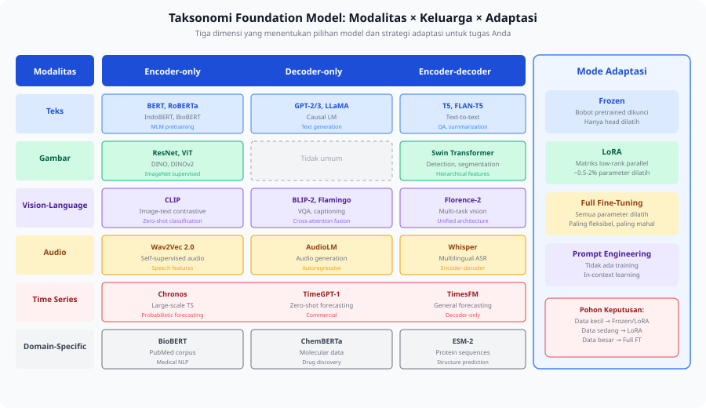

<details>
<summary>📂 Navigasi Modul (klik untuk buka)</summary>

| # | Modul | Minggu |
|---|-------|--------|
| 00 | [Pendahuluan](00_Pendahuluan.md) | 1 |
| 00a | [Prasyarat Modul](00a_Prasyarat.md) | – |
| 01 | [W1 - Tabular & Output Heads](01_W1_Tabular_Output_Heads.md) | 1 |
| 02 | [W2 - Images, CNN & Smoke Test](02_W2_Images_CNN_Smoke_Test.md) | 2 |
| 03 | [W3 - Loss, Optimizer & Evaluasi](03_W3_Loss_Optimizer_Evaluasi.md) | 3 |
| 04 | [W4 - Reproducibility & Matriks Eksperimen](04_W4_Reproducibility_Experiment_Matrix.md) | 4 |
| 05 | [W5 - Sequences: RNN & LSTM](05_W5_Sequences_RNN_LSTM.md) | 5 |
| 06 | [W6 - Representations & Temporal Leakage](06_W6_Representations_Temporal_Leakage.md) | 6 |
| 07 | [W7 - Text, Transformers & Repo Adoption](07_W7_Text_Transformers_Repo_Adoption.md) | 7 |
| ▶ 08 | W8 - Foundation Models | 8 |
| 09 | [W9 - Multimodal Reasoning](09_W9_Multimodal_Reasoning.md) | 9 |
| 10 | [W10 - Paper Reading & Implementation](10_W10_Paper_Reading.md) | 10 |
| 11 | [W11 - Research Framing](11_W11_Research_Framing.md) | 11 |
| 12 | [Capstone - Proyek Riset](12_Capstone.md) | 12-15 |
| 13 | [Rubrik Penilaian](13_Rubrik_Penilaian.md) | – |
| 14 | [Lampiran](14_Lampiran.md) | – |
| 15 | [Panduan Instruktur](15_Panduan_Instruktur.md) | – |

</details>

---

# 08 · W8 - Foundation Models

Kali ini kita akan membahas:

1. **Lanskap Foundation Model** - apa yang membuat sebuah model disebut foundation model, dan taksonomi modalitas x keluarga x adaptasi sebagai peta pilihan.
2. **Membaca Model Card** - tujuh pertanyaan untuk menilai satu kandidat model sebelum memakainya.
3. **Memilih Adaptasi** - pohon keputusan antara frozen, LoRA, dan full fine-tuning, dengan satu worked example di IndoBERT.
4. **Teacher Model saat Training** - foundation model yang hanya hadir di training lalu tidak ikut di-deploy.

Di pertemuan sebelumnya (W7) kita memakai satu pretrained Transformer untuk teks, dan memutuskan freeze atau fine-tune lewat [W7 §1.3](07_W7_Text_Transformers_Repo_Adoption.md). Output W7 yang dipakai minggu ini adalah pengalaman mengadaptasi satu model ke satu tugas. Minggu ini pilihan freeze vs fine-tune itu diperluas: dari satu model teks ke banyak modalitas, dan dari dua opsi ke pohon keputusan adaptasi yang lebih lengkap. Taksonomi representasi engineered/extracted/learned dari [W3 §2.4](03_W3_Loss_Optimizer_Evaluasi.md) tetap dipakai untuk menempatkan tiap mode adaptasi.

---

## 1. Lanskap Foundation Model

Foundation model adalah model yang dilatih pada data berskala besar dan bisa diadaptasi ke banyak tugas hilir tanpa training ulang dari nol. Istilah ini dipakai longgar di riset praktis, dan sebuah model masuk kategori ini kalau memenuhi tiga ciri:

1. Model **pretrained pada data besar**, yaitu dilatih pada teks, gambar, audio, atau multimodal dalam skala yang tidak praktis untuk dilatih sendiri.
2. Model menghasilkan **representasi yang dapat ditransfer**, sehingga hidden states atau embeddings-nya berguna untuk banyak tugas hilir, bukan hanya tugas pretraining-nya.
3. Model **dapat diadaptasi tanpa training penuh** lewat frozen extraction, adapter ringan seperti LoRA, atau fine-tuning sebagian, dan tetap memberi hasil yang kompetitif.

Konsekuensinya, saat mendapat tugas baru, pertanyaan pertama bergeser dari "arsitektur apa yang saya bangun dari nol?" menjadi "apakah ada foundation model yang sudah mempelajari representasi relevan?" Contohnya, untuk classifier teks medis Bahasa Indonesia dengan 5.000 sampel, melatih LSTM dari nol mungkin cukup untuk pola dasar, tetapi kosakata medis terlalu jarang untuk dipelajari dari data sekecil itu. IndoBERT sudah memahami tata bahasa Indonesia dari jutaan kalimat, sehingga fine-tune 3 epoch hampir pasti memberi hasil lebih baik dengan data dan waktu lebih sedikit.

Pergeseran ini terbentuk bertahap selama satu dekade:

| Fase | Periode | Pola | Penanda |
|---|---|---|---|
| 1 | sebelum 2012 | Tiap tugas dilatih dari bobot acak, tanpa berbagi representasi | Tidak ada transfer antar tugas |
| 2 | 2012-2017 | Fine-tune dari bobot ImageNet, karena representasi visual rendah bersifat universal | AlexNet, ImageNet |
| 3 | 2018-2020 | Pretraining self-supervised pada teks, lalu fine-tune ke puluhan tugas | BERT (MLM), GPT (causal LM) |
| 4 | 2020-sekarang | Pretraining multimodal, zero-shot lintas tugas | CLIP, Whisper |
| 5 | 2021 | Istilah "foundation model" diperkenalkan | Bommasani et al. (2021) |

Self-supervised pada fase 3 berarti model belajar dari teks tanpa label, cukup dengan memprediksi token yang disembunyikan (masked language modeling) atau token berikutnya (causal language modeling). Paper Bommasani et al. (2021) menyebut dua properti yang muncul dari skala ini: *emergence*, yaitu kemampuan yang muncul dari skala dan bukan dari desain eksplisit, dan *homogenization*, yaitu banyak aplikasi bertumpu pada beberapa model yang sama sehingga menciptakan efisiensi sekaligus risiko bersama.

### Taksonomi: Modalitas x Keluarga x Adaptasi

Memilih foundation model berarti memilih pada tiga sumbu sekaligus: modalitas data, keluarga arsitektur, dan mode adaptasi. Setiap pilihan model adalah satu titik dalam ruang tiga sumbu ini.



Sumbu adaptasi memakai tiga mode yang sama di hampir semua modalitas, jadi kita definisikan dulu sebelum membaca tabel di bawah. Detail pemilihannya ada di materi 3.

- **Frozen** mengunci bobot pretrained (`requires_grad = False`) sehingga hanya layer tambahan kecil (linear head, classifier) yang dilatih. Inference tetap melewati seluruh model, tetapi tidak ada backward pass ke backbone. Mode ini paling cepat dan stabil, dan kurang optimal kalau domain target jauh dari pretraining.
- **LoRA** (Low-Rank Adaptation) menyisipkan matriks low-rank `A B` (mis. `r=8`) paralel dengan `W_q` dan `W_v` di tiap attention layer, lalu mengunci `W` asli sehingga hanya `A B` yang dilatih. Sekitar 0,5-2% parameter dilatih, performanya biasanya 95-99% dari full fine-tuning, dan training 3-5x lebih cepat. Implementasinya memakai library `peft` dari HuggingFace.
- **Full FT** (full fine-tuning) membiarkan semua parameter `requires_grad = True`. Mode ini paling fleksibel, dengan biaya memori GPU dan waktu paling tinggi. Risiko overfitting tinggi pada dataset kecil, jadi biasanya butuh learning rate kecil (`1e-5`) dan early stopping.

Sumbu modalitas dan keluarga arsitektur menentukan model mana yang dipakai. Pada teks, keluarga arsitektur menentukan jenis tugas yang cocok:

| Model | Family | Pretraining | Best for | Adaptation modes |
|---|---|---|---|---|
| BERT / RoBERTa | Encoder-only | MLM | Classification, NER, similarity | Frozen, LoRA, full FT |
| IndoBERT | Encoder-only | Indonesian corpus | Indonesian NLP | Frozen, LoRA, full FT |
| GPT-2/3 | Decoder-only | Causal LM | Text generation, completion | Prompt, full FT |
| T5 / FLAN-T5 | Encoder-decoder | Text-to-text | QA, summarization, translation | Full FT |
| BioBERT / ClinicalBERT | Encoder-only | Biomedical text | Medical NLP | Full FT (domain matters) |

Aturan praktisnya: encoder-only untuk pemahaman, decoder-only untuk generasi, encoder-decoder untuk transformasi teks.

Modalitas di luar teks punya foundation model sendiri:

| Modalitas | Model | Best for |
|---|---|---|
| Vision | ResNet / EfficientNet (CNN), ViT / DeiT (Transformer) | Image classification |
| Vision | CLIP visual encoder, DINOv2 (self-supervised) | Zero-shot, similarity, linear probe, segmentasi |
| Vision-Language | CLIP, BLIP-2, Florence-2 | Zero-shot classification, VQA, captioning, detection |
| Audio | Whisper, Wav2Vec 2.0, AST | ASR, fitur suara, klasifikasi audio |
| Time Series | Chronos, TimeGPT-1, TimesFM | Forecasting skala besar, zero-shot |
| Domain-specific | BioBERT / ClinicalBERT, IndoBERT / XLM-R, ESM-2 | Teks biomedis, NLP Indonesia, sequence protein |

> [!WARNING]
> Time series foundation model (Chronos, TimeGPT, TimesFM) masih area riset aktif 2023-2024. Klaim "zero-shot SOTA" sering belum direplikasi independen di luar benchmark mereka. Untuk capstone (W12-W15), pakai model ini sebagai eksplorasi tambahan setelah baseline LSTM/Transformer dari W5-W7 berjalan dan punya catatan eksperimen. Jangan jadikan time-series FM sebagai baseline tunggal di proposal capstone.

---

## 2. Membaca Model Card

Model card adalah dokumen yang menemani sebuah model dan mencatat asal-usul, performa, lisensi, dan batasannya. Sebelum memakai satu kandidat, baca model card-nya dengan tujuh pertanyaan:

1. **Apa dataset pretraining-nya?** Periksa domain, bahasa, dan ukuran, lalu nilai relevansinya dengan tugas Anda.
2. **Apa benchmark evaluasi yang dilaporkan?** Periksa apakah benchmark itu representatif untuk tugas yang Anda hadapi.
3. **Apa batasan yang disebut eksplisit?** Catat bias, failure mode, dan penggunaan di luar cakupan.
4. **Berapa besar modelnya?** Parameter count menentukan biaya inference dan kelayakan fine-tuning di perangkat Anda.
5. **Apa lisensi penggunaannya?** Lisensi seperti Apache 2.0 atau restricted commercial menentukan apakah hasil boleh dipublikasikan.
6. **Apakah ada artefak reproduksibilitas?** Periksa apakah tersedia training code dan eval code, atau hanya bobot.
7. **Kapan model dirilis dan apa data cutoff-nya?** Cek apakah sudah ada model yang lebih baru.

> [!WARNING]
> "SOTA di benchmark X" tidak berarti "terbaik untuk tugas saya" kalau domainnya berbeda signifikan. Periksa apakah benchmark dataset punya overlap dengan domain Anda. Baca juga bagian "Limitations" dengan skeptis, karena bagian ini sering kurang detail dibanding bagian "Performance".

---

## 3. Memilih Adaptasi

Pilihan adaptasi bergantung pada tiga faktor: compute budget, jumlah labeled data, dan seberapa jauh domain target dari pretraining. Ketiganya menyusun satu pohon keputusan yang bisa disalin:

```text
Compute budget cukup untuk fine-tuning?
├── Tidak (CPU atau GPU kecil)
│   └── Frozen features + lightweight head
└── Ya
    Labeled data < 1000 sampel?
    ├── Ya
    │   └── Frozen atau LoRA (r=4-8)
    │       (full FT berisiko overfitting)
    └── Tidak (1000+ sampel)
        Domain jauh dari pretraining?
        ├── Ya (mis. medical dari general web)
        │   └── Full fine-tuning atau LoRA (r=16-32)
        └── Tidak (domain mirip)
            └── Frozen atau LoRA (r=4-8) sudah cukup
```

Tiga mode adaptasi yang dipilih pohon ini sudah didefinisikan di materi 1. Dalam taksonomi representasi [W3 §2.4](03_W3_Loss_Optimizer_Evaluasi.md), frozen features adalah strategi *extracted* (representasi diambil dari model frozen), full fine-tuning adalah strategi *learned* (representasi dipelajari ulang dari data), dan LoRA berada di antara keduanya karena melatih sebagian kecil parameter sambil membiarkan sebagian besar bobot tetap. Menyebut posisi tiap mode dalam taksonomi ini menjelaskan kenapa frozen lebih murah dan full FT lebih fleksibel.

Untuk melihat trade-off ini secara konkret, jalankan tiga strategi pada satu dataset yang sama, yaitu IndoNLU SmSA dari [Lab W7](07_W7_Text_Transformers_Repo_Adoption.md). Memakai satu dataset menjaga perbandingan tetap setara.

**Strategi A - Frozen + Linear Head:**

```python
# Freeze BERT, hanya train head
for param in model.bert.parameters():
    param.requires_grad = False
```

Strategi ini menyelesaikan training dalam menit tanpa GPU besar. Kelemahannya, representasi yang dikunci belum tentu optimal untuk domain sentimen.

**Strategi B - LoRA (r=8):**

```python
from peft import get_peft_model, LoraConfig, TaskType
config = LoraConfig(task_type=TaskType.SEQ_CLS, r=8, lora_alpha=16,
                    target_modules=["query", "value"])
model = get_peft_model(base_model, config)
```

Parameter yang dilatih 10-20x lebih sedikit dari full FT, dan training 5x lebih cepat. Kelemahannya, strategi ini bergantung pada library PEFT, bukan PyTorch bawaan.

**Strategi C - Full Fine-tuning:**

```python
model = AutoModelForSequenceClassification.from_pretrained(
    "indobenchmark/indobert-base-p1", num_labels=3)
# Semua parameter trainable by default
```

Strategi ini menawarkan fleksibilitas tertinggi dengan potensi performa terbaik. Biayanya, training paling lama, memerlukan GPU, dan risiko overfitting lebih tinggi pada dataset kecil.

Pada 5.000 sampel IndoNLU SmSA, ketiga strategi menempati titik berbeda pada trade-off kecepatan dan performa:

| Strategi | macro-F1 | Catatan |
|---|---|---|
| Frozen + Head | 68-73% | Cepat, tanpa GPU besar, sub-optimal untuk domain target |
| LoRA (r=8) | 76-81% | Trade-off efisiensi-performa terbaik |
| Full FT | 80-85% | Performa tertinggi, paling lambat, butuh GPU |

Tiga miskonsepsi yang sering muncul saat memilih adaptasi:

- Anggapan "foundation model selalu lebih baik" keliru pada dataset kecil dengan distribusi jauh dari pretraining, karena model kecil yang di-fine-tune khusus kadang mengungguli foundation model besar.
- Anggapan "frozen features cukup untuk domain shift besar" keliru, karena representasi frozen BERT pada teks klinik bisa jauh lebih buruk dari fine-tuned model kecil yang lebih relevan.
- Anggapan "LoRA rank besar lebih baik" keliru karena hubungannya tidak linier: `r=4` atau `r=8` sering sudah cukup untuk dataset rata-rata, dan rank lebih besar menambah parameter tanpa selalu menaikkan performa.

---

## 4. Teacher Model saat Training

Foundation model tidak selalu dipakai untuk inference. Satu pola penting memakai foundation model sebagai teacher saat training, lalu menghapusnya dari model yang di-deploy. Pola ini memberi manfaat foundation model tanpa menanggung biaya inference-nya, dan muncul dalam tiga bentuk:

1. **Knowledge distillation** memakai model besar (teacher) untuk melatih model kecil (student) dengan soft targets, bukan label keras.
2. **Auxiliary supervision** memakai embedding dari CLIP sebagai target latih untuk network visual yang lebih kecil.
3. **Pseudo-label generation** memanfaatkan foundation model untuk menghasilkan pseudo-label pada data yang tidak berlabel.

Knowledge distillation paling jelas dijelaskan dengan satu contoh numerik. Pada klasifikasi 3 kelas (anjing/kucing/kelinci), teacher menghasilkan logits `z_T = [4.0, 1.0, 0.5]` untuk satu sampel. Student dilatih untuk mereproduksi distribusi probabilitas teacher, bukan label keras `[1, 0, 0]`.

Hard target adalah one-hot label asli:

```text
y_hard = [1, 0, 0]
```

Soft target dengan temperature `T = 4` melembutkan distribusi:

```text
softmax(z_T / T)[i] = exp(z_T[i] / T) / Σ_j exp(z_T[j] / T)
softmax([4.0, 1.0, 0.5] / 4) = softmax([1.0, 0.25, 0.125])
                             ≈ [0.484, 0.229, 0.202]
```

Tanpa temperature (`T = 1`), distribusi hampir one-hot dan informasi kelas non-mayoritas hilang:

```text
softmax([4.0, 1.0, 0.5]) ≈ [0.939, 0.047, 0.014]
```

Temperature tinggi (`T > 1`) menyimpan informasi "kelas non-mayoritas yang masih masuk akal", sehingga student belajar bahwa anjing-vs-kucing lebih mirip daripada anjing-vs-kelinci. Loss distillation:

```text
L_KD = CE(softmax(z_S / T),  softmax(z_T / T)) * T²
```

Faktor `T²` mengompensasi gradient yang menyusut karena temperature. Total loss adalah `α * L_KD + (1 - α) * L_hard` dengan `α ≈ 0.7-0.9`. Pola ini memungkinkan student kecil (mis. DistilBERT, ~40% parameter BERT) mencapai 95%+ performa teacher di banyak benchmark.

---

## Lab

Tugas utama minggu ini adalah menyusun **Foundation Model Map** untuk 3-4 model yang relevan dengan domain riset Anda. Output disimpan sebagai `foundation_model_map.md` di folder eksperimen W8. Urutan tugas sejajar dengan materi di atas.

1. Petakan 3-4 model ke tabel berikut, satu baris per model.

   | Model | Modalitas | Pretraining | Downstream role | Adaptation | Teacher-only? | Pilihan karena |
   |---|---|---|---|---|---|---|
   | ... | ... | ... | ... | ... | ... | ... |

2. Untuk tiap model, baca model card-nya dengan tujuh pertanyaan dari materi 2, lalu catat dataset pretraining, batasan, dan lisensinya.
3. Pakai pohon keputusan materi 3 untuk menetapkan mode adaptasi tiap model, sesuaikan dengan compute, ukuran data, dan jarak domain.
4. Tulis memo pemilihan satu paragraf per model: mengapa model ini, asumsi apa yang dibawanya, dan apa batasannya.

Lab penunjang opsional [`lab_w8_remote_training.ipynb`](https://colab.research.google.com/github/muhammad-zainal-muttaqin/Module-DS/blob/master/template/notebooks/lab_w8_remote_training.ipynb) melatih menjalankan training di cloud GPU (RunPod), berguna kalau model yang Anda pilih butuh GPU besar.

Checklist:

- [ ] Foundation Model Map berisi 3-4 model dengan semua kolom terisi.
- [ ] Tiap model punya catatan dataset pretraining, batasan, dan lisensi dari model card-nya.
- [ ] Mode adaptasi tiap model ditetapkan lewat pohon keputusan, bukan tebakan.
- [ ] Tiap model punya memo pemilihan satu paragraf.
- [ ] File tersimpan sebagai `foundation_model_map.md` di folder eksperimen W8.

---

## Komponen Mandiri

Pilih satu pertanyaan dari materi W8 untuk dijelajahi lebih dalam. Boleh memakai dataset dari minggu sebelumnya atau dataset baru yang relevan. Pertanyaan pemantik (tidak wajib salah satunya):

- Seberapa besar perbedaan frozen CLIP vs fine-tuned ResNet sebagai feature extractor, dan dalam kondisi apa salah satu lebih unggul?
- Apa yang sebenarnya ada dan tidak ada dalam model card HuggingFace, dan apakah informasinya cukup untuk membuat keputusan adaptasi?
- Kapan domain-specific model lebih baik dari general model, dan bagaimana Anda merancang eksperimen yang setara untuk membuktikannya?
- Bagaimana LoRA bekerja secara mekanis, dan apakah implementasi dari nol menghasilkan parity dengan library PEFT?

Kerjakan, dokumentasikan di `notebooks/portofolio_mandiri.ipynb`, dan presentasikan 10 menit di awal W9. Format mengikuti [Lampiran C.9](14_Lampiran.md#c9-template-komponen-mandiri).

---

## Refleksi

1. Anda mendapat task baru: deteksi emosi dari rekaman suara Bahasa Indonesia. Dari taksonomi materi 1, identifikasi dua kandidat foundation model. Untuk masing-masing, tulis dua argumen mendukung dan satu risiko utama.
2. Seorang kolaborator mengklaim "model X mencapai SOTA di benchmark Y, jadi kita pakai ini". Tulis tiga pertanyaan yang akan Anda ajukan sebelum menyetujui.
3. Dalam taksonomi representasi [W3 §2.4](03_W3_Loss_Optimizer_Evaluasi.md), frozen features adalah *extracted* dan full FT adalah *learned*. LoRA masuk kategori mana, dan mengapa perbedaan ini penting untuk keputusan adaptasi?

---

## Bacaan Lanjutan

- **Bommasani et al. - *On the Opportunities and Risks of Foundation Models*** (2021). Paper yang memperkenalkan istilah. Baca bagian 1 (Introduction) dan 3 (Capabilities).
- **Hu et al. - *LoRA: Low-Rank Adaptation of Large Language Models*** (2021). Baca bagian 4 (main experiments).
- **Mitchell et al. - *Model Cards for Model Reporting*** (2019). Template model card yang dipakai industri.

---

## Lanjut ke W9

W8 membentuk pemahaman foundation model untuk satu modalitas. W9 memperluas ke wilayah yang lebih kompleks: menggabungkan dua modalitas atau lebih lewat strategi fusion, mendeteksi apakah model benar-benar memakai semua modalitas lewat ablation per modalitas, dan menangani situasi saat satu modalitas hilang. Taksonomi adaptasi dan literasi model card dari minggu ini tetap dipakai saat menggabungkan beberapa foundation model di W9.

Buka [W9 - Multimodal Reasoning](09_W9_Multimodal_Reasoning.md) ketika siap.
