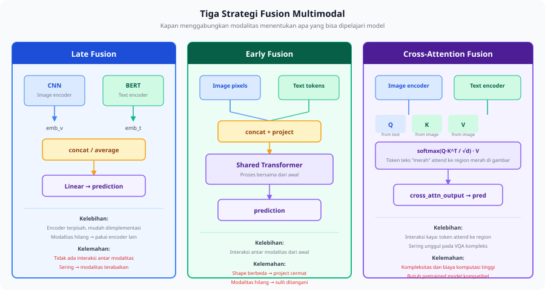
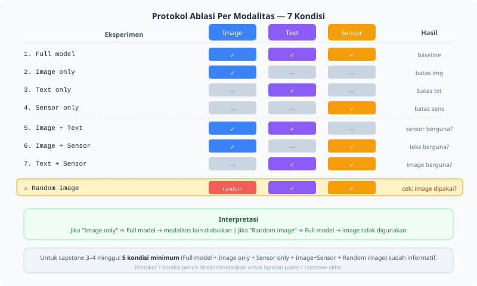

<details>
<summary>📂 Navigasi Modul (klik untuk buka)</summary>

| # | Modul | Minggu |
|---|-------|--------|
| 00 | [Pendahuluan](00_Pendahuluan.md) | 1 |
| 00a | [Prasyarat Modul](00a_Prasyarat.md) | – |
| 01 | [W1 - Tabular & Output Heads](01_W1_Tabular_Output_Heads.md) | 1 |
| 02 | [W2 - Images, CNN & Smoke Test](02_W2_Images_CNN_Smoke_Test.md) | 2 |
| 03 | [W3 - Loss, Optimizer & Evaluasi](03_W3_Loss_Optimizer_Evaluasi.md) | 3 |
| 04 | [W4 - Reproducibility & Matriks Eksperimen](04_W4_Reproducibility_Experiment_Matrix.md) | 4 |
| 05 | [W5 - Sequences: RNN & LSTM](05_W5_Sequences_RNN_LSTM.md) | 5 |
| 06 | [W6 - Representations & Temporal Leakage](06_W6_Representations_Temporal_Leakage.md) | 6 |
| 07 | [W7 - Text, Transformers & Repo Adoption](07_W7_Text_Transformers_Repo_Adoption.md) | 7 |
| 08 | [W8 - Foundation Models](08_W8_Foundation_Models.md) | 8 |
| ▶ 09 | W9 - Multimodal Reasoning | 9 |
| 10 | [W10 - Paper Reading & Implementation](10_W10_Paper_Reading.md) | 10 |
| 11 | [W11 - Research Framing](11_W11_Research_Framing.md) | 11 |
| 12 | [Capstone - Proyek Riset](12_Capstone.md) | 12-15 |
| 13 | [Rubrik Penilaian](13_Rubrik_Penilaian.md) | – |
| 14 | [Lampiran](14_Lampiran.md) | – |
| 15 | [Panduan Instruktur](15_Panduan_Instruktur.md) | – |

</details>

---

# 09 · W9 - Multimodal Reasoning

Kali ini kita akan membahas:

1. **Strategi Fusion** - tiga cara menggabungkan beberapa modalitas dan kapan masing-masing dipakai.
2. **Modalitas Terabaikan** - failure mode saat model diam-diam memakai satu modalitas saja, plus cara mendeteksi dan memperbaikinya.
3. **Modalitas Hilang** - tiga strategi saat satu modalitas tidak tersedia di inference.
4. **Temporal Alignment** - menyinkronkan aliran data dengan sampling rate dan clock berbeda.
5. **Protokol Ablation Per Modalitas** - matriks kondisi yang membuktikan tiap modalitas berkontribusi.
6. **Repo Adoption Multimodal** - membaca codebase dengan banyak encoder dan modul fusion.

Di pertemuan sebelumnya (W8) kita memilih dan mengadaptasi satu foundation model untuk satu modalitas, dengan keputusan frozen, LoRA, atau fine-tuning lewat [W8 §3](08_W8_Foundation_Models.md). Output W8 yang dipakai minggu ini adalah pengalaman mengambil encoder pretrained per modalitas. Minggu ini beberapa encoder itu digabung menjadi satu prediksi. Cross-attention dipakai lagi, tetapi sumber Query, Key, dan Value sekarang lintas modalitas; recap rumusnya ada di [W7 §1.3](07_W7_Text_Transformers_Repo_Adoption.md). Disiplin ablation satu variabel dari [W4 §2](04_W4_Reproducibility_Experiment_Matrix.md) menjadi alat utama minggu ini, dipakai untuk menguji kontribusi tiap modalitas.

Pertanyaan inti minggu ini sederhana tetapi sering luput: saat dua aliran data tersedia, apakah model benar-benar memakai keduanya? Anggap sebuah model memprediksi skala nyeri dari ekspresi wajah dan sensor accelerometer. Validation F1 = 0.79. Setelah seluruh input sensor dihapus dan hanya gambar yang masuk, F1 = 0.78. Selisihnya 0.01, yang berarti model pada dasarnya tidak memakai data sensor sama sekali. Dua minggu kerja membangun model fusion menghasilkan performa setara model satu modalitas. Sebelum melaporkan hasil multimodal apa pun, ablation per modalitas wajib dijalankan, dan minggu ini menjelaskan cara serta alasannya.

---

## 1. Strategi Fusion

Strategi fusion menentukan di titik mana embedding dari beberapa modalitas digabungkan. Titik penggabungan itu menentukan seberapa dalam interaksi antar modalitas bisa dipelajari. Ada tiga strategi: late, early, dan cross-attention.



Diagram di atas menyusun ketiga strategi dari titik penggabungan paling akhir ke paling awal.

**Late fusion** memproses tiap modalitas dengan encodernya sendiri, lalu menggabungkan output di ujung dengan concatenation atau averaging.

```text
Image -> CNN  -> embedding_v
Text  -> BERT -> embedding_t
                            -> concat([embedding_v, embedding_t]) -> Linear -> prediction
```

Late fusion mudah diimplementasikan dan tiap encoder bisa di-pretrain terpisah. Saat satu modalitas hilang di inference, prediksi tetap bisa dilakukan dari encoder modalitas lain. Kelemahannya, tidak ada interaksi antar modalitas sebelum penggabungan, sehingga model tidak bisa belajar bahwa sebuah kata relevan hanya ketika gambar menunjukkan kondisi tertentu. Pola ini juga paling sering menghasilkan modalitas terabaikan saat satu aliran data lebih mudah dioptimasi (lihat §2).

**Early fusion** menggabungkan input dari berbagai modalitas di level representasi awal, sebelum diproses model bersama.

```text
Image pixels + Text tokens -> concat/project -> Shared Transformer -> prediction
```

Early fusion bisa mempelajari interaksi antar modalitas sejak awal. Namun shape yang sangat berbeda antar modalitas menuntut projection yang cermat, training menjadi lebih kompleks, dan model pretrained lebih sulit dipakai. Penanganan modalitas yang hilang di inference juga lebih sulit karena input sudah menyatu sejak awal.

**Cross-attention fusion** memakai satu modalitas sebagai Query dan modalitas lain sebagai Key dan Value. Model belajar secara eksplisit bagian mana dari modalitas A yang relevan untuk tiap elemen modalitas B. Rumus dan notasi `Q`, `K`, `V` serta `softmax(QK^T/√d)V` sudah dibahas di [W7 §1.3](07_W7_Text_Transformers_Repo_Adoption.md) dan Lab [lab_w7_transformer_mini.ipynb](https://colab.research.google.com/github/muhammad-zainal-muttaqin/Module-DS/blob/master/template/notebooks/lab_w7_transformer_mini.ipynb); bedanya di sini Query berasal dari satu modalitas dan Key/Value dari modalitas lain.

```python
Q = W_q @ text_embedding                              # (B, T_text, d)
K = W_k @ image_features                              # (B, T_image, d)
V = W_v @ image_features                              # (B, T_image, d)
w = softmax(Q @ K.transpose(-2, -1) / sqrt(d), dim=-1)  # (B, T_text, T_image)
out = w @ V                                           # (B, T_text, d)
```

Matriks `w` shape `(B, T_text, T_image)` berisi skor seberapa relevan tiap elemen image untuk tiap token teks. Token "merah" bisa memberi perhatian besar pada region merah di gambar, lalu output `out` adalah rerata berbobot dari V. Cross-attention bisa mempelajari interaksi pada level halus dan sering mengungguli late dan early fusion pada tugas VQA yang kompleks, dengan biaya implementasi dan komputasi lebih tinggi serta kebutuhan pretrained model yang kompatibel di kedua modalitas. Pola ini dipakai BLIP-2, Flamingo, dan model vision-language modern.

---

## 2. Modalitas Terabaikan

Modalitas terabaikan adalah failure mode paling umum dan paling sering tidak terdeteksi dalam riset multimodal. Saat training, optimizer mengikuti jalur yang paling mudah. Jika satu modalitas lebih bersih atau lebih mudah dioptimasi, misalnya gambar yang bersih dibanding sensor yang *noisy*, model belajar mengabaikan modalitas lain. Loss tetap turun dan performa tampak bagus, padahal model sebenarnya memakai satu modalitas saja.

Failure mode ini tidak terlihat dari loss curve atau angka F1. Tiga uji berikut yang memunculkannya, dan ketiganya saling melengkapi:

1. **Ablation per modalitas** menghapus satu modalitas sekaligus. Jika F1 tidak turun signifikan, modalitas itu diabaikan.
2. **Modalitas acak** mengganti satu modalitas dengan noise acak. Jika performa tidak memburuk, modalitas itu memang tidak dipakai.
3. **Gradient magnitude check** menghitung gradient norm tiap encoder. Encoder yang konsisten punya gradient kecil tidak berkontribusi.

Uji ketiga bisa dijalankan dengan satu fungsi pendek:

```python
def check_gradient_flow(model, batch):
    loss = compute_loss(model, batch)
    loss.backward()

    grads = {}
    for name, param in model.named_parameters():
        if param.grad is not None:
            grads[name] = param.grad.norm().item()

    img_grads = {k: v for k, v in grads.items() if 'image_encoder' in k}
    txt_grads = {k: v for k, v in grads.items() if 'text_encoder' in k}
    print(f"Image encoder avg grad: {sum(img_grads.values())/len(img_grads):.6f}")
    print(f"Text encoder avg grad: {sum(txt_grads.values())/len(txt_grads):.6f}")
```

Hasil ablation dibaca dua arah. Selisih F1 nol saat satu modalitas dihapus menandakan modalitas itu diabaikan, dan ini temuan yang harus dilaporkan, bukan disembunyikan. Angka multimodal yang naik tipis di atas baseline single-modal juga belum membuktikan apa pun sebelum uji modalitas acak dijalankan.

Saat ablation memang menemukan modalitas terabaikan, tiga teknik memaksa model belajar dari setiap modalitas:

- **Modality dropout** mematikan tiap modalitas secara acak saat training, sehingga model dipaksa belajar dari masing-masing modalitas secara mandiri.
- **Separate loss terms** menambahkan auxiliary loss per modalitas agar setiap encoder mendapat gradient yang jelas.
- **Gradient balancing** menyesuaikan learning rate tiap modalitas berdasarkan gradient magnitude masing-masing.

---

## 3. Modalitas Hilang

Di produksi, satu atau lebih modalitas sering tidak tersedia: sensor rusak, gambar terlalu kabur untuk dipakai, atau teks tidak terisi. Sistem multimodal yang baik menangani kondisi ini secara rapi, bukan crash atau menebak. Ada tiga strategi.

**Strategi 1: modality dropout saat training.** Saat training, satu modalitas dikosongkan secara acak dengan probabilitas `p_drop`. Model terbiasa memprediksi bahkan ketika satu modalitas hilang. Teknik ini sekaligus menjadi solusi modalitas terabaikan dari §2.

```python
class MultimodalModel(nn.Module):
    def forward(self, image, text, modality_mask=None):
        if modality_mask is None and self.training:
            modality_mask = torch.bernoulli(
                torch.ones(2) * 0.15  # 15% chance tiap modalitas di-drop
            )

        img_feat = self.image_encoder(image) if modality_mask[0] > 0 else torch.zeros(...)
        txt_feat = self.text_encoder(text) if modality_mask[1] > 0 else torch.zeros(...)
        return self.fusion(img_feat, txt_feat)
```

> [!NOTE]
> **Kenapa `p_drop = 0.15`?** Angka ini aturan praktis dari literatur regularisasi, mirip dropout neuron 10-30% dan masking BERT 15%. Rentang yang masuk akal adalah `p_drop ∈ [0.10, 0.25]`. Nilai lebih kecil membuat dropout tidak cukup kuat untuk mencegah modalitas terabaikan, sedangkan nilai lebih besar membuat model jarang melihat sampel multimodal lengkap sehingga performa pada input lengkap menurun. Untuk dataset dengan satu modalitas yang jauh lebih dominan, naikkan `p_drop` modalitas dominan ke 0.30-0.40 agar model dipaksa belajar dari modalitas lain lebih sering. Nilai ini hyperparameter yang layak dieksplorasi sebagai pertanyaan Komponen Mandiri minggu ini.

**Strategi 2: learnable null token.** Modalitas yang hilang diganti dengan embedding yang dipelajari selama training untuk merepresentasikan "tidak ada modalitas ini".

```python
self.null_image_token = nn.Parameter(torch.randn(1, embed_dim))

def encode_image(self, image, available=True):
    if available:
        return self.image_encoder(image)
    else:
        return self.null_image_token.expand(batch_size, -1)
```

Null token lebih baik daripada zero padding karena ia belajar merepresentasikan distribusi "tidak ada", sementara nol bersifat ambigu: model tidak bisa membedakan "modalitas hilang" dari "nilai sebenarnya nol".

**Strategi 3: fallback single-modal.** Untuk sistem yang keandalannya lebih penting daripada performa maksimal, model dirancang sebagai ensemble. Secara default model memakai semua modalitas yang tersedia, lalu jatuh ke model unimodal saat satu modalitas hilang. Strategi ini sederhana dan andal untuk produksi.

---

## 4. Temporal Alignment

Banyak dataset multimodal dari dunia nyata punya masalah temporal alignment, yaitu aliran data dengan sampling rate atau clock yang berbeda. Video pada 25 fps dan audio pada 44100 Hz perlu disinkronkan; sensor IMU pada 100 Hz, kamera pada 30 fps, dan label pada 1 Hz punya resolusi waktu yang tidak seragam; event-based data seperti heartbeat spike berbeda sifat dari continuous time series. Tanpa sinkronisasi, model mengasosiasikan event dari waktu yang salah, dan cross-attention belajar korelasi yang semu.


Diagram di atas menunjukkan dua stream yang awalnya sejajar lalu bergeser karena clock drift yang menumpuk. Ada tiga pendekatan menyelaraskannya, dengan trade-off berbeda:

1. **Resampling atau interpolasi** menurunkan semua stream ke resolusi temporal terendah. Pendekatan ini mudah tetapi kehilangan detail.
2. **Event-to-window mapping** memetakan tiap event ke window dari stream kontinu terdekat, cocok untuk data berbasis event.
3. **Temporal position encoding** menyuntikkan waktu absolut sebagai feature eksplisit dan membiarkan model belajar alignment sendiri. Pendekatan ini paling fleksibel tetapi butuh data lebih banyak.

Anggap dataset pergerakan robot dengan IMU 100 Hz (satu sample tiap 10 ms) dan kamera 30 fps (satu frame tiap 33 ms), dengan label kejadian seperti "tabrakan" yang dianotasi manusia pada presisi sekitar 100 ms. Sistem logging memakai clock berbeda untuk kedua sensor. Setelah satu jam, clock IMU drift +250 ms dari clock kamera, sehingga frame kamera pada t=3600.000s sebenarnya berkorespondensi dengan data IMU pada t=3600.250s, atau sekitar 25 sample IMU. Tanpa koreksi, model cross-attention belajar mencocokkan visual "robot hampir tabrakan" dengan data IMU dari 250 ms sebelumnya, saat robot masih bergerak normal. Model bisa tetap akurat di training set karena drift-nya konsisten, tetapi gagal pada sensor baru dengan drift berbeda.

Drift bisa dideteksi dengan cross-correlation antara event di kedua stream, lalu dikoreksi dengan menggeser timestamp salah satu stream:

```python
import numpy as np

# Cross-correlation sinyal IMU dan estimasi motion dari kamera.
# Puncak korelasi di lag bukan nol menandakan drift.
lags = np.arange(-50, 51)             # ±500 ms dalam unit 10 ms
# Puncak di lag=25 -> drift 250 ms.

imu_timestamps = imu_timestamps - 0.250  # koreksi drift 250 ms
```

Catat timestamp dari sumber waktu yang sama, idealnya tersinkronisasi lewat NTP, untuk semua sensor. Jika drift sudah terlanjur ada, sertakan koreksinya sebagai bagian preprocessing yang terdokumentasi, bukan perbaikan diam-diam yang tidak tercatat.

---

## 5. Protokol Ablation Per Modalitas

Protokol ablation per modalitas adalah matriks kondisi yang menyalakan subset modalitas berbeda untuk mengukur kontribusi tiap modalitas secara terisolasi. Setiap laporan multimodal menjalankan ablation ini sebelum klaim apa pun. Protokol penuh memakai tujuh kondisi.



Diagram di atas memetakan modalitas yang aktif di tiap kondisi. Tabel berikut bisa disalin langsung sebagai protokol:

| Eksperimen | Input | Temuan yang diharapkan |
|---|---|---|
| Full model | image + text + sensor | Performa baseline |
| Image only | image (text+sensor dimasking) | Batas single-modal |
| Text only | text (image+sensor dimasking) | Batas single-modal |
| Sensor only | sensor (image+text dimasking) | Batas single-modal |
| Image + Text | image + text | Apakah sensor berkontribusi? |
| Image + Sensor | image + sensor | Apakah text berkontribusi? |
| Text + Sensor | text + sensor | Apakah image berkontribusi? |
| Random image | noise acak (text+sensor asli) | Pengecekan modalitas terabaikan |

Template protokol ini tersedia di [Lampiran C.14](14_Lampiran.md#c14-per-modalitas-ablation-protocol). Penyusunan kondisi mengikuti disiplin satu variabel berubah dari [W4 §2](04_W4_Reproducibility_Experiment_Matrix.md): tiap kondisi mematikan atau mengacak tepat satu modalitas dari baseline, sehingga selisih performa bisa diatribusikan ke satu perubahan.

> [!NOTE]
> **Kelayakan untuk capstone 3-4 minggu.** Tujuh kondisi di atas adalah protokol penuh untuk paper atau laporan akhir. Jika waktu terbatas, lima kondisi minimum sudah cukup untuk membaca pola kontribusi: full model, image only, sensor only, image + sensor, dan random image. Kondisi text-only dan text+sensor boleh menjadi stretch goal jika pipeline masih punya kapasitas. Yang tidak boleh dilewati adalah random image, karena tanpanya kontribusi nyata sebuah modalitas tidak bisa dibuktikan.

> [!IMPORTANT]
> Jika "Image only" performanya hampir sama dengan "Full model", ada masalah modalitas terabaikan. Selesaikan ini sebelum mengklaim bahwa sistem yang dibangun benar-benar multimodal.

Untuk melihat protokol ini berjalan pada kasus konkret, ambil tugas memprediksi skala nyeri (0-10) dari dua input: ekspresi wajah (gambar 64×64) dan sensor accelerometer tangan (sequence 30 timestep, 3 axis). Late fusion menggabungkan embedding kedua encoder, dengan flag ketersediaan tiap modalitas untuk menangani input yang tidak lengkap:

```python
class PainEstimator(nn.Module):
    def __init__(self):
        super().__init__()
        # Face encoder: CNN -> embedding (128-dim)
        self.face_encoder = nn.Sequential(
            nn.Conv2d(3, 32, 3, padding=1), nn.ReLU(), nn.MaxPool2d(2),
            nn.Conv2d(32, 64, 3, padding=1), nn.ReLU(), nn.MaxPool2d(2),
            nn.AdaptiveAvgPool2d(4), nn.Flatten(),
            nn.Linear(64*4*4, 128), nn.ReLU()
        )
        # Sensor encoder: LSTM -> last hidden (64-dim)
        self.sensor_encoder = nn.LSTM(3, 64, batch_first=True)
        # Fusion + prediction head
        self.head = nn.Sequential(
            nn.Linear(128 + 64, 64), nn.ReLU(),
            nn.Linear(64, 1)
        )

    def forward(self, face, sensor, face_available=True, sensor_available=True):
        if face_available:
            face_feat = self.face_encoder(face)
        else:
            face_feat = torch.zeros(face.shape[0], 128, device=face.device)

        if sensor_available:
            _, (h_n, _) = self.sensor_encoder(sensor)
            sensor_feat = h_n[-1]
        else:
            sensor_feat = torch.zeros(sensor.shape[0], 64, device=sensor.device)

        fused = torch.cat([face_feat, sensor_feat], dim=1)
        return self.head(fused).squeeze(-1)
```

Hasil ablation dibaca dengan membandingkan val MAE; nilai lebih rendah berarti lebih baik.

| Kondisi | Val MAE | Pembacaan |
|---|---|---|
| Face only | 1.82 | Batas performa wajah sendirian |
| Sensor only | 2.15 | Batas performa sensor sendirian |
| Late fusion (both) | 1.61 | Lebih baik dari keduanya, dua modalitas berkontribusi |
| Random face | 2.09 | Mendekati sensor only, sinyal wajah sedang diabaikan |
| Random sensor | 1.80 | Mendekati face only, sinyal sensor sedang diabaikan |

Late fusion (1.61) lebih baik daripada kedua single-modal, sehingga pada kasus ini kedua modalitas berkontribusi. Baris random membaca sebaliknya: kalau MAE saat satu modalitas diacak turun mendekati performa modalitas lain sendirian, modalitas yang diacak itu memang diabaikan. Tabel mean ± std multi-seed dari [W4 §4](04_W4_Reproducibility_Experiment_Matrix.md) tetap dipakai saat melaporkan angka ini ke dosen, lengkap dengan batasannya: berapa seed, dataset apa, dan kondisi mana yang belum diuji.

---

## 6. Repo Adoption Multimodal

Codebase multimodal sering lebih kompleks daripada codebase single-modal karena memuat banyak encoder, beberapa DataLoader, dan modul fusion yang abstrak. Repo map dari [W7 §3](07_W7_Text_Transformers_Repo_Adoption.md) tetap dipakai, dengan tiga langkah tambahan:

1. **Identifikasi titik fusion** dengan menemukan tempat embedding dari berbagai modalitas digabungkan. Titik ini menentukan arsitektur.
2. **Telusuri satu forward pass** dengan mengikuti satu batch dari tiap modalitas, dari DataLoader sampai prediction, sambil mencatat shape di tiap titik.
3. **Buat repo_map.md kedua** memakai template [Lampiran C.12](14_Lampiran.md#c12-template-repo-map), dengan tambahan kolom "modalitas" untuk menandai encoder mana menangani modalitas apa.

---

## Lab

Buka [lab_w9_multimodal_ablation.ipynb](https://colab.research.google.com/github/muhammad-zainal-muttaqin/Module-DS/blob/master/template/notebooks/lab_w9_multimodal_ablation.ipynb). Tugas mengikuti urutan enam materi di atas.

1. Muat dataset multimodal yang disediakan (synthetic sensor + image) atau adopsi repositori multimodal publik.
2. Implementasikan late fusion baseline dan jalankan smoke test sebelum training penuh.
3. Jalankan protokol ablation per modalitas §5 (tujuh kondisi plus uji modalitas acak).
4. Tulis diagnosis: apakah ada modalitas yang diabaikan?
5. Jika ada, implementasikan satu solusi dari §2 atau §3 (modality dropout atau learnable null token).
6. Kalau mengadopsi repo publik, buat `repo_map.md` kedua dengan kolom modalitas.

Checklist:

- [ ] Late fusion baseline lolos smoke test.
- [ ] Tujuh kondisi ablation tercatat dalam satu tabel hasil.
- [ ] Uji modalitas acak dijalankan untuk mendeteksi modalitas terabaikan.
- [ ] Diagnosis modalitas terabaikan ditulis eksplisit, ya atau tidak.
- [ ] Satu solusi diimplementasikan kalau masalah ditemukan.
- [ ] `repo_map.md` dengan kolom modalitas dibuat kalau mengadopsi repo.

---

## Komponen Mandiri

Pilih satu pertanyaan dari materi W9 untuk dijelajahi lebih dalam, memakai setup multimodal dari lab atau paper yang relevan. Beberapa pertanyaan pemantik, tidak wajib salah satunya:

1. Apakah cross-attention fusion lebih baik daripada late fusion, dan pada kondisi ablation per modalitas yang mana keunggulannya muncul?
2. Dari dua paper multimodal di arXiv, seberapa lengkap pelaporan ablation per modalitasnya, dan adakah tanda modalitas terabaikan?
3. Bagaimana merancang sistem yang bisa mendeteksi modalitas hilang secara otomatis saat inference?
4. Apakah modality dropout saat training meningkatkan robustness, dan seberapa besar perbedaannya di tujuh kondisi ablation?

Kerjakan, dokumentasikan di [`notebooks/portofolio_mandiri.ipynb`](https://github.com/muhammad-zainal-muttaqin/Module-DS/blob/master/template/notebooks/portofolio_mandiri.ipynb), lalu presentasikan 10 menit di awal W10. Format mengikuti [Lampiran C.9](14_Lampiran.md#c9-template-komponen-mandiri).

---

## Refleksi

1. Sebuah dataset multimodal berisi image, audio, dan text, dengan full fusion mencapai F1 = 0.81. Tulis urutan ablation yang akan dijalankan, dan apa yang harus terjadi agar ketiga modalitas terbukti berkontribusi.
2. Sensor di lab kadang hilang karena koneksi putus. Dari tiga strategi modalitas hilang (§3), mana yang paling sesuai untuk skenario ini, dan apa trade-off masing-masing?
3. Alur pilihan representasi sampai W9 bergerak dari engineered features (W6), extracted (W7-W8), ke cross-modal (W9). Bagaimana pilihan representasi untuk satu modalitas bisa dipengaruhi oleh ada atau tidaknya modalitas lain?

---

## Bacaan Lanjutan

- **Baltrusaitis et al. - *Multimodal Machine Learning: A Survey and Taxonomy*** (TPAMI, 2019) menyajikan survei strategi fusion. Baca bagian 3 (Fusion) dan bagian 5 (Co-learning) untuk konteks §1.
- **Wang et al. - *What Makes Training Multi-Modal Classification Networks Hard?*** (CVPR, 2020) membahas modalitas terabaikan dan solusinya, relevan langsung dengan §2.
- **Li et al. - *BLIP: Bootstrapping Language-Image Pre-training*** (2022) memberi contoh cross-attention fusion dalam praktik yang bisa dibaca sebagai studi kasus untuk §1.
- **Lampiran C.14** berisi template protokol ablation per modalitas yang bisa dipakai langsung di Lab W9.

---

## Lanjut ke W10

W10 mengikat seluruh lanskap Big Map, dari tabular sampai multimodal, lewat satu keterampilan: membaca paper secara terstruktur lalu menerjemahkannya menjadi kode yang bisa dijalankan. Disiplin ablation per modalitas dan kebiasaan mengaudit klaim dari minggu ini langsung berguna saat membaca paper multimodal di W10.

Buka [W10 - Paper Reading & Implementation](10_W10_Paper_Reading.md) ketika siap.
