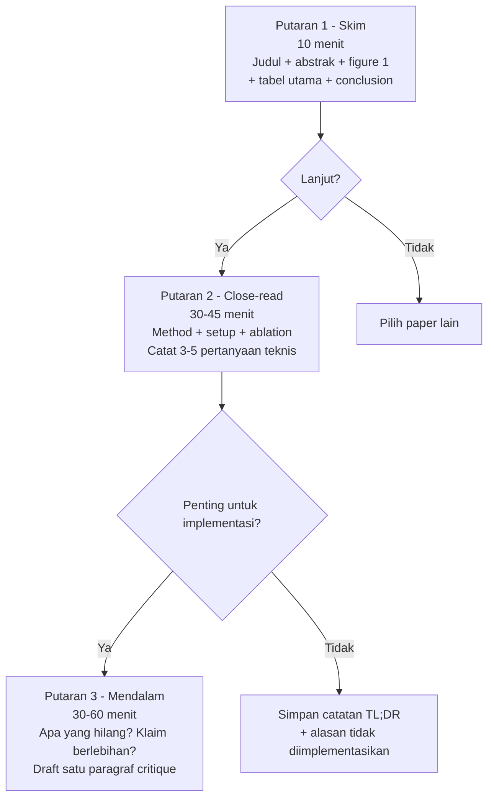

<details>
<summary>📂 Navigasi Modul (klik untuk buka)</summary>

| # | Modul | Minggu |
|---|-------|--------|
| 00 | [Pendahuluan](00_Pendahuluan.md) | 1 |
| 00a | [Prasyarat Modul](00a_Prasyarat.md) | – |
| 01 | [W1 - Tabular & Output Heads](01_W1_Tabular_Output_Heads.md) | 1 |
| 02 | [W2 - Images, CNN & Smoke Test](02_W2_Images_CNN_Smoke_Test.md) | 2 |
| 03 | [W3 - Loss, Optimizer & Evaluasi](03_W3_Loss_Optimizer_Evaluasi.md) | 3 |
| 04 | [W4 - Reproducibility & Matriks Eksperimen](04_W4_Reproducibility_Experiment_Matrix.md) | 4 |
| 05 | [W5 - Sequences: RNN & LSTM](05_W5_Sequences_RNN_LSTM.md) | 5 |
| 06 | [W6 - Representations & Temporal Leakage](06_W6_Representations_Temporal_Leakage.md) | 6 |
| 07 | [W7 - Text, Transformers & Repo Adoption](07_W7_Text_Transformers_Repo_Adoption.md) | 7 |
| 08 | [W8 - Foundation Models](08_W8_Foundation_Models.md) | 8 |
| 09 | [W9 - Multimodal Reasoning](09_W9_Multimodal_Reasoning.md) | 9 |
| ▶ 10 | W10 - Paper Reading & Implementation | 10 |
| 11 | [W11 - Research Framing](11_W11_Research_Framing.md) | 11 |
| 12 | [Capstone - Proyek Riset](12_Capstone.md) | 12-15 |
| 13 | [Rubrik Penilaian](13_Rubrik_Penilaian.md) | – |
| 14 | [Lampiran](14_Lampiran.md) | – |
| 15 | [Panduan Instruktur](15_Panduan_Instruktur.md) | – |

</details>

---

# 10 · W10 - Paper Reading & Implementasi Paper

Kali ini kita akan membahas:

1. **Kurasi Paper** - menyaring ratusan paper arXiv jadi satu sampai dua yang layak dibaca penuh.
2. **Membaca Tiga Putaran** - membaca paper dengan tiga lapis kedalaman, dari skim sampai kritik.
3. **Paper-to-Code** - mengekstrak satu kontribusi inti dan mengimplementasikannya jadi kode minimal yang bisa diuji.
4. **Ablation Kecil** - menjalankan satu perubahan terkontrol untuk menguji klaim paper.
5. **Peta Model Generatif** - kosakata untuk membaca paper VAE, GAN, Diffusion, dan Normalizing Flow.

Di pertemuan sebelumnya (W9) kita sudah belajar menggabungkan beberapa modalitas dengan strategi fusion, menjalankan ablation per modalitas, dan menangani modalitas hilang. Output W9 yang dipakai minggu ini adalah kebiasaan menguji satu komponen sambil mengunci sisanya. Minggu ini kebiasaan itu diarahkan ke paper orang lain: membaca klaimnya, mengisolasi satu komponen inti, lalu mengujinya dengan ablation. Disiplin eksperimen terkontrol dan trace result dari [W4 §2-§3](04_W4_Reproducibility_Experiment_Matrix.md) dipakai saat menjalankan ablation paper.

---

## 1. Kurasi Paper

arXiv menerbitkan ratusan paper ML per hari, sehingga membaca semuanya mustahil. Tujuan kurasi adalah menyaring jadi 5-10 paper per minggu yang layak 30 menit waktu Anda, lalu menyaringnya sekali lagi jadi satu sampai dua yang dibaca penuh.


Gambar di atas menunjukkan empat filter berurutan, dari yang paling murah waktunya ke yang paling mahal:

1. **Filter kategori dan kata kunci.** Berlangganan kategori arXiv yang spesifik: `cs.LG` (Machine Learning), `cs.CV` (Computer Vision), `cs.CL` (NLP/LLM), dan `eess.IV` untuk medical imaging. Tambahkan kata kunci dari minat Anda. Google Scholar Alerts dan Papers With Code RSS mempercepat langkah ini.
2. **Filter judul.** Sekitar 80% paper bisa ditolak dari judulnya saja karena bukan bidang Anda atau bukan tipe pertanyaan yang Anda cari. Proses 50 judul dalam 5 menit, sisanya kira-kira 10.
3. **Filter abstrak.** Baca 10 abstrak dan tanya apakah klaimnya menarik dan metodenya memberi sesuatu untuk dipelajari. Pilih 5 teratas.
4. **Filter baca cepat.** Baca introduction, figure pertama, dan tabel hasil dari 5 paper. Sekarang Anda tahu mana yang layak dibaca mendalam dan mana yang cukup diingat keberadaannya.

Rasio akhirnya sekitar 1 banding 250. Awalnya terasa membuang, tetapi penyaringan inilah yang membuat waktu baca terpakai pada paper yang tepat.

Saat menyimpan paper arXiv, catat status publikasinya. arXiv adalah alat akses, bukan sumber otoritas: banyak paper penting muncul di sini sebelum atau bersamaan dengan versi konferensi, tetapi tidak ada peer-review di titik unggah, sehingga paper lemah dan klaim yang terlalu besar juga masuk. Catat keraguan Anda secara eksplisit supaya otoritas paper tidak dilebih-lebihkan:

```markdown
Status publikasi: arXiv preprint v2; belum menemukan versi peer-reviewed.
Catatan skeptis: klaim utama bergantung pada satu dataset; belum ada ablation untuk komponen X.
```

Simpan ID paper seperti `2312.01234`, bukan judulnya, karena ID lebih stabil untuk dirujuk ulang. Saat mengutip, sebut versi yang Anda baca (`v1`, `v2`) karena dua versi bisa berbeda substansial. Tabel lengkap kanal publikasi (preprint, workshop, conference, journal) beserta kekuatan dan keterbatasan masing-masing ada di [Lampiran D.9](14_Lampiran.md#d9-peta-kanal-publikasi-ml).

---

## 2. Membaca Tiga Putaran

Paper akademik tidak dirancang untuk dibaca linear dari depan ke belakang. Metode tiga putaran (Keshav 2007) membagi pembacaan jadi tiga lapis kedalaman, dan di akhir tiap putaran Anda memutuskan lanjut atau berhenti.



Diagram di atas memetakan tiga putaran dengan tujuan dan target waktu masing-masing:

- **Putaran 1 - Peta (10 menit).** Baca judul, abstrak, paragraf pertama introduction, headings, figure 1, tabel hasil utama, dan conclusion. Targetnya menjawab tiga hal: apa yang paper klaim mereka lakukan, apa yang mereka ukur, dan apakah hasilnya meyakinkan dari tabel saja. Kalau setelah 10 menit Anda tidak bisa menjawab ketiganya, paper itu mungkin ditulis kurang baik atau bidangnya terlalu jauh, dan Anda boleh berhenti.
- **Putaran 2 - Detail (30-45 menit).** Baca method dan experimental setup secara aktif: catat pertanyaan di margin, fokus pada cara mereka melakukannya dan setup eksperimennya (dataset, baseline, metrik, ablation). Lewati related work kecuali bidangnya baru bagi Anda. Hasil putaran ini adalah 3-5 pertanyaan teknis yang langsung mengarahkan implementasi: detail yang tidak jelas, baseline yang kurang, atau asumsi yang tidak diuji.
- **Putaran 3 - Mendalam (30-60 menit, opsional).** Hanya untuk paper yang penting. Cari apa yang paper tidak bahas, apakah klaimnya melampaui data, dan apa yang Anda minta untuk rebuttal andai mereview paper ini. Hasilnya satu paragraf critique yang bisa dikirim ke rekan satu grup riset.

Catatan paper yang tidak pernah dibuka lagi tidak ada gunanya. Empat bagian berikut cukup untuk setiap paper yang Anda baca sampai putaran dua, dan bentuknya bisa disalin langsung:

```markdown
# <judul ringkas> (authors, venue, year)

## TL;DR (1-2 kalimat)
Apa yang paper ini klaim, dalam kalimat Anda sendiri.

## Metode (3-5 kalimat)
Bagaimana mereka melakukannya. Sisipkan sketsa atau rumus penting.

## Bukti (2-3 kalimat)
Dataset + metrik + hasil utama. Sebut angka konkret.

## Pertanyaan / Kritik Teknis (3-5 poin)
Detail implementasi yang tidak jelas, baseline yang kurang, ablation yang hilang, atau klaim yang perlu dicek ulang.

## Rencana Implementasi Minimal
Komponen mana yang akan diimplementasikan, input/output tensor-nya, dan ablation kecil yang akan dijalankan.
```

Simpan di `docs/papers/<short_title>.md`. Setelah 20 paper, Anda punya literatur pribadi yang bisa dicari dengan `grep` atau `rg`.

---

## 3. Paper-to-Code

Menerjemahkan paper jadi kode berarti mengisolasi satu kontribusi inti lalu mengimplementasikannya, tidak menyalin seluruh arsitektur. Enam langkah membawa Anda dari abstrak ke kode minimal yang bisa dijalankan:

1. **Identifikasi kontribusi inti.** Tentukan satu inovasi terpenting paper, tulis dalam satu kalimat. Targetnya satu komponen kunci, bukan seluruh arsitektur.
2. **Cari input/output shape.** Tentukan tensor yang masuk ke metode baru dan yang keluar. Kalau tidak eksplisit di paper, cek pseudocode atau codebase resmi.
3. **Pisahkan inti dari detail rekayasa.** Banyak paper punya banyak trik tambahan. Tentukan mana yang inti untuk kontribusi utama dan mana yang optimisasi sekunder.
4. **Buat versi minimal yang bisa dijalankan.** Implementasikan hanya kontribusi inti pada dataset kecil, lalu smoke test dulu.
5. **Verifikasi kecocokan angka.** Reproduksi satu angka paper pada konfigurasi yang sama. Kalau paper punya kode resmi, bandingkan.
6. **Jalankan satu ablation.** Hapus atau modifikasi satu komponen kontribusi inti, lalu lihat apakah performa turun seperti yang diklaim paper.

Kalau Anda belum bisa menjelaskan satu kontribusi inti dalam satu kalimat, jangan mulai menulis kode. Smoke test tiga level dari [W2 §2.3](02_W2_Images_CNN_Smoke_Test.md) tetap dipakai sebelum run penuh, dan detail penting sering tersembunyi di appendix atau code repository, jadi cek keduanya.

Sebagai patokan apakah pipeline Anda terlalu lambat, berikut estimasi waktu training beberapa arsitektur yang dipakai di modul ini:

| Arsitektur | Dataset | GPU (RTX 3060) | CPU (laptop) |
|---|---|---|---|
| ResNet-18 / SimpleCNN | CIFAR-10, 50 epoch | ~20-30 menit | ~3-4 jam |
| MLP 3-layer | MNIST / Tabular | ~5 menit | ~15-30 menit |
| SimpleLSTM, 100 epoch | sine sequence (10k) | ~5-10 menit | ~20-40 menit |
| BERT-tiny fine-tune | SST-2, 3 epoch | ~15-25 menit | tidak praktis |
| IndoBERT-base fine-tune | SmSA, 3 epoch | ~30-45 menit | tidak praktis |
| Autoencoder CIFAR-10 | 30 epoch | ~15-20 menit | ~1-2 jam |

Kalau training Anda 10x lebih lambat dari tabel, periksa bottleneck data loading, batch size yang terlalu kecil, atau model yang tidak sengaja jalan di CPU. Pakai `nvidia-smi` untuk memastikan GPU benar-benar dipakai.

Alur enam langkah ini terlihat utuh pada satu contoh. Rani ingin belajar focal loss dari paper Lin et al. (2017) dan menjalankan seluruh alur dalam satu minggu:

- **Kurasi.** Rani mencari paper dengan kata kunci "class imbalance", "dense detection", dan "loss function". Ia menemukan Focal Loss di arXiv, mengecek statusnya, dan melihat ada versi ICCV 2017, jadi arXiv dipakai sebagai akses PDF saja.
- **Tiga putaran.** Putaran 1 menemukan klaim utamanya: cross-entropy terlalu didominasi contoh mudah pada deteksi objek yang sangat imbalanced. Putaran 2 mengambil bentuk inti loss-nya, `FL(p_t) = -(1 - p_t)^γ log(p_t)`. Putaran 3 fokus ke ablation `γ` saja, tidak ke seluruh RetinaNet.
- **Paper-to-code.** Rani mencatat input/output: input loss adalah logits dan target class, output adalah scalar loss. Ia memisahkan inti dari detail rekayasa, jadi tidak perlu implement RetinaNet, anchor matching, atau FPN. Cukup focal loss pada classifier kecil dengan dataset imbalanced.
- **Implementasi.** Rani menambahkan `FocalLoss` di [`src/losses.py`](https://github.com/muhammad-zainal-muttaqin/Module-DS/blob/master/template/src/losses.py) lalu membuat smoke test:

```python
gamma = 0.0  # should match cross-entropy
gamma = 2.0  # focal loss setting from the paper
```

Kalau `gamma=0` tidak identik dengan cross-entropy dalam toleransi numerik, implementasinya belum boleh dipakai untuk training.

---

## 4. Ablation Kecil

Ablation untuk W10 bukan eksperimen besar. Ablation berarti satu perubahan terkontrol yang menjawab satu pertanyaan: apakah komponen yang diklaim penting memang berdampak. Aturan satu variabel berubah dan trace result mengikuti [W4 §2-§3](04_W4_Reproducibility_Experiment_Matrix.md).

Beberapa ablation kecil yang realistis, masing-masing dengan satu variabel berubah:

| Paper/metode | Kontribusi inti | Ablation kecil |
| --- | --- | --- |
| Focal Loss | Faktor `(1 - p_t)^γ` menurunkan bobot contoh mudah | Bandingkan `γ=0` (cross-entropy) dengan `γ=2` pada dataset kecil |
| DropBlock | Dropout blok spasial untuk CNN | Bandingkan dropout biasa dengan DropBlock pada keep_prob sama |
| Mixup | Interpolasi input dan label | Bandingkan `alpha=0` dengan `alpha=0.2` pada seed sama |
| Label smoothing | Target tidak one-hot penuh | Bandingkan smoothing `0.0` dengan `0.1` |

Ablation yang baik punya baseline jelas, satu variabel berubah, metrik sama, dan log yang cukup untuk diulang orang lain. Kalau hasil ablation tidak cocok dengan klaim paper, itu belum tentu kegagalan. Catat gap-nya: dataset berbeda, skala model berbeda, hyperparameter belum sama, atau implementasi belum parity dengan kode resmi.

Inilah yang Rani lakukan di akhir minggunya. Ia menjalankan baseline `γ=0` dan focal loss `γ=2` pada dataset kecil yang sengaja dibuat imbalanced, dengan seed, model, augmentasi, dan metrik yang sama. Hasil focal loss sedikit lebih baik pada kelas minoritas, tetapi akurasi total turun tipis. Saat melapor ke dosen, Rani menyebut gap-nya secara eksplisit: paper asli mengevaluasi object detection dengan extreme foreground/background imbalance, sedangkan labnya memakai klasifikasi kecil. Laporannya menyebut batas klaim itu, bukan menyajikan satu angka tanpa konteks. Hasil ini cukup untuk memahami mekanisme loss dan batas transfer klaimnya, meski bukan reproduksi penuh.

---

## 5. Peta Model Generatif

Modul ini membahas arsitektur diskriminatif secara hands-on: MLP, CNN, RNN/LSTM, Transformer encoder, dan Autoencoder. Satu keluarga besar yang tidak masuk jadwal hands-on adalah model generatif, yaitu model yang belajar menghasilkan sampel baru dari distribusi data. Alasannya praktis: model generatif yang stabil butuh compute, dataset, dan keterampilan diagnostik yang melebihi cakupan satu semester. Padahal sekitar sepertiga paper ML modern melibatkan komponen generatif, jadi bagian ini memberi peta mental supaya Anda bisa membaca paper generatif dengan struktur.

| Keluarga | Ide inti | Training signal | Kapan dipakai | Failure mode khas | Paper pembuka |
| --- | --- | --- | --- | --- | --- |
| VAE | Encoder ke distribusi Gaussian, decoder dari sampel | Rekonstruksi + KL terhadap prior | Saat butuh representasi kontinu yang bisa di-sampel; *conditional generation* | *Posterior collapse*: decoder mengabaikan z saat KL term terlalu mendominasi loss, sehingga latent tidak membawa informasi berguna | Kingma & Welling 2013 (*Auto-Encoding Variational Bayes*) |
| GAN | Generator melawan discriminator, permainan minimax | Discriminator mengklasifikasi real/fake | Generasi gambar tajam, *style transfer*, *image-to-image* | *Mode collapse*: generator hanya menghasilkan subset kecil distribusi data meski training loss terlihat stabil | Goodfellow et al. 2014 (*Generative Adversarial Nets*) |
| Diffusion | Tambah noise bertahap, belajar membaliknya | Prediksi noise di setiap langkah | State-of-the-art image/video generation, kontrol *conditioning* | Inference lambat karena banyak step, butuh compute besar | Ho et al. 2020 (*Denoising Diffusion Probabilistic Models*) |
| Normalizing Flow | Transformasi bijeksi yang dibalik dari noise ke data | Likelihood eksak | Saat butuh likelihood eksak (deteksi anomali, kompresi) | Arsitektur terbatas karena harus invertible, kapasitasnya lebih kecil | Rezende & Mohamed 2015 (*Variational Inference with Normalizing Flows*) |

Autoencoder di [`lab_breadth_autoencoder`](https://colab.research.google.com/github/muhammad-zainal-muttaqin/Module-DS/blob/master/template/notebooks/lab_breadth_autoencoder.ipynb) adalah langkah pertama menuju VAE: encoder, decoder, bottleneck, dan reconstruction loss sudah ada. VAE hanya menambah tiga hal, yaitu encoder mengeluarkan `(μ, σ)` bukan `z` langsung, sampling dengan *reparameterization trick*, dan loss KL terhadap prior. Jalur fork lab autoencoder lalu menambah tiga modifikasi itu cocok untuk Komponen Mandiri Jalur 4 (Arsitektur Baru). Empat paper pembuka di tabel juga kandidat kuat untuk slot bacaan paper di rutinitas mingguan Anda.

---

## Lab

Buka [lab_w10_paper_to_code.ipynb](https://colab.research.google.com/github/muhammad-zainal-muttaqin/Module-DS/blob/master/template/notebooks/lab_w10_paper_to_code.ipynb). Pilih satu paper dari menu: Focal Loss (Lin et al., 2017), DropBlock (Ghiasi et al., 2018), atau satu paper dari area riset Anda sendiri setelah konsultasi dengan dosen. Tugas mengikuti urutan lima materi di atas.

1. Kurasi paper, lalu baca tiga putaran dan tulis catatan empat bagian dengan template §2.
2. Jalankan langkah paper-to-code 1-6 dari §3.
3. Implementasikan metode inti di `src/` atau notebook, lalu smoke test pada dataset kecil.
4. Lakukan parity check: reproduksi satu angka utama paper, atau jelaskan selisihnya.
5. Jalankan satu ablation yang menghapus atau memodifikasi satu komponen inti.
6. Tulis `experiment_report.md` yang mencatat apa yang lebih sulit dari yang tampak di paper, plus batas klaim hasilnya.

Checklist:

- [ ] Catatan tiga putaran tersimpan di `docs/papers/`.
- [ ] Metode inti terimplementasi dan smoke test lulus.
- [ ] Satu angka dari paper terproduksi, atau selisih < 2% disertai penjelasan.
- [ ] Ablation menunjukkan dampak satu komponen inti.
- [ ] `experiment_report.md` mencatat apa yang lebih sulit dari yang tampak dan batas klaim hasil.

Target waktu: 6-8 jam.

---

## Komponen Mandiri

Pilih satu pertanyaan dari materi W10 yang ingin Anda dalami. Ini entri portofolio terakhir sebelum capstone. Setelah mengisinya, kerjakan sel "Refleksi Portofolio" di notebook: lihat kembali semua entri dan tulis satu paragraf perjalanan belajar.

Beberapa pertanyaan pemantik (tidak wajib salah satunya):

- Bisakah Anda mengimplementasikan satu teknik dari paper Lab W10 yang belum ada di `template`, dan apakah hasilnya sesuai klaim?
- Dari satu paper yang klaimnya terasa terlalu bagus, apa yang ditunjukkan dan apa yang tidak ditunjukkan?
- Berapa besar gap reproduksi saat menjalankan konfigurasi terkecil paper dengan kode resmi, dan apa penyebab paling mungkin?
- Ada arsitektur dari paper yang belum dibahas di modul yang menarik untuk diimplementasikan forward pass-nya?

Kerjakan, dokumentasikan di [`notebooks/portofolio_mandiri.ipynb`](https://github.com/muhammad-zainal-muttaqin/Module-DS/blob/master/template/notebooks/portofolio_mandiri.ipynb), dan presentasikan sorotan portofolio 10 menit di awal W11. Format dan kriteria: [Lampiran C.9](14_Lampiran.md#c9-template-komponen-mandiri).

---

## Lanjut ke W11

Semua keterampilan teknis bootcamp sudah dibangun. W11 menggabungkannya untuk satu tujuan: menyusun framing riset yang siap dipertahankan di W12, lewat kerangka Input → Middle → Output, menu framing, dan triage literatur. Keterampilan membaca tiga putaran dan kurasi paper dari minggu ini langsung dipakai untuk triage literatur W11.

Buka [W11 - Research Framing](11_W11_Research_Framing.md) ketika siap.
