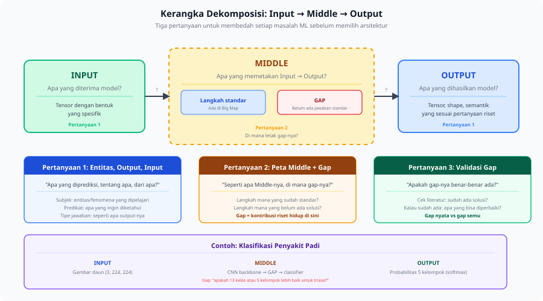

<details>
<summary>📂 Navigasi Modul (klik untuk buka)</summary>

| # | Modul | Minggu |
|---|-------|--------|
| 00 | [Pendahuluan](00_Pendahuluan.md) | 1 |
| 00a | [Prasyarat Modul](00a_Prasyarat.md) | – |
| 01 | [W1 - Tabular & Output Heads](01_W1_Tabular_Output_Heads.md) | 1 |
| 02 | [W2 - Images, CNN & Smoke Test](02_W2_Images_CNN_Smoke_Test.md) | 2 |
| 03 | [W3 - Loss, Optimizer & Evaluasi](03_W3_Loss_Optimizer_Evaluasi.md) | 3 |
| 04 | [W4 - Reproducibility & Matriks Eksperimen](04_W4_Reproducibility_Experiment_Matrix.md) | 4 |
| 05 | [W5 - Sequences: RNN & LSTM](05_W5_Sequences_RNN_LSTM.md) | 5 |
| 06 | [W6 - Representations & Temporal Leakage](06_W6_Representations_Temporal_Leakage.md) | 6 |
| 07 | [W7 - Text, Transformers & Repo Adoption](07_W7_Text_Transformers_Repo_Adoption.md) | 7 |
| 08 | [W8 - Foundation Models](08_W8_Foundation_Models.md) | 8 |
| 09 | [W9 - Multimodal Reasoning](09_W9_Multimodal_Reasoning.md) | 9 |
| 10 | [W10 - Paper Reading & Implementation](10_W10_Paper_Reading.md) | 10 |
| ▶ 11 | W11 - Research Framing | 11 |
| 12 | [Capstone - Proyek Riset](12_Capstone.md) | 12-15 |
| 13 | [Rubrik Penilaian](13_Rubrik_Penilaian.md) | – |
| 14 | [Lampiran](14_Lampiran.md) | – |
| 15 | [Panduan Instruktur](15_Panduan_Instruktur.md) | – |

</details>

---

# 11 · W11 - Research Framing

Kali ini kita akan membahas:

1. **Paruh Depan Riset** - mengubah situasi terbuka jadi pertanyaan riset yang bisa dipertahankan.
2. **Kerangka Input → Middle → Output** - membedah satu masalah ML lewat tiga pertanyaan: entitas, Output, dan Input; letak gap di Middle; dan apakah gap itu benar-benar ada.
3. **Menu Framing dan Filter Literatur** - menghasilkan 3-5 framing kandidat, lalu menyaringnya ke literatur untuk menilai kebaruan.
4. **Dua Fase dan Luaran W11** - memisahkan curah gagasan dari filter, lalu menyiapkan dokumen yang dibawa ke W12.

Di pertemuan sebelumnya (W10) kita sudah belajar membaca paper dengan metode tiga putaran dan menerjemahkan satu metode paper jadi kode kecil yang bisa dijalankan. Output W10 yang dipakai minggu ini adalah kemampuan membaca abstrak dengan cepat dan menilai apa kontribusi sebuah paper. Kemampuan itu menjadi inti filter literatur di [§3](#3-menu-framing-dan-filter-literatur). Big Map lima keluarga arsitektur dari W1-W9 juga dipakai untuk memetakan langkah-langkah Middle. W11 adalah minggu terakhir bootcamp sebelum capstone: tiba di W12, Anda sudah memegang menu 3-5 framing kandidat dan satu framing utama yang siap dipertahankan.

---

## 1. Paruh Depan Riset

W1-W10 melatih paruh belakang riset: diberi masalah, dataset, dan tugas yang sudah ditentukan, bagaimana membangun model, melatihnya dengan benar, mengevaluasinya tanpa menutupi kelemahan model, dan melaporkan hasilnya supaya bisa direproduksi. W11 memulai paruh depan: diberi situasi terbuka, baik berupa domain yang menarik maupun dataset yang bisa diakses, bagaimana sampai pada pertanyaan riset yang layak ditanyakan?

Banyak program studi berhenti di paruh belakang dan mengasumsikan paruh depan terserap sendiri lewat mengamati dosen dan membaca banyak paper. Sebagian mahasiswa berhasil begitu, sebagian lain menghabiskan bertahun-tahun mengeksekusi dengan kompeten pertanyaan yang sejak awal salah framing. Minggu ini paruh depan dibuat eksplisit: kerangka dekomposisi, menu framing, dan filter literatur adalah proses yang dipakai saat sebuah proyek riset dimulai.

Metodologi ini dirancang untuk lab kecil dengan sumber daya terbatas. Saat akses ke kluster GPU besar dan dataset berlabel besar terbatas, aktivitas berdampak tertinggi adalah memilih pertanyaan yang tepat sebelum menghabiskan waktu untuk eksekusi. Pertanyaan dengan framing baik pada dataset kecil bisa menghasilkan riset yang layak dipublikasikan. Pertanyaan dengan framing buruk pada dataset besar tidak menghasilkan apa pun yang layak dipublikasikan, sehati-hati apa pun training loop-nya ditulis.

Konteks lokal membuka peluang yang gap literaturnya memang ada: data bahasa lokal seperti Banjar dan dialek Indonesia lainnya, masalah pertanian dan kesehatan yang relevan secara lokal, dan domain yang belum banyak dieksplorasi. Lab berdana besar di Jakarta atau Singapura tidak mengejar masalah ini karena tidak terlihat dari sana. Metodologi minggu ini adalah cara menemukan dan mengklaim peluang itu secara sistematis.

---

## 2. Kerangka Input → Middle → Output

Setiap masalah ML supervised bisa digambarkan sebagai transformasi dari Input ke Output lewat Middle. Input adalah tensor yang diterima model saat prediksi. Output adalah tensor yang dihasilkan model, dengan bentuk dan semantik yang sesuai dengan pertanyaan riset. Middle adalah komponen yang memetakan Input ke Output: sebagian langkahnya sudah punya implementasi standar (baris-baris di Big Map), sebagian lagi tidak punya jawaban standar. Langkah tanpa jawaban standar itulah **gap**, dan gap adalah tempat kontribusi riset berada.



Gambar di atas memecah satu masalah jadi tiga komponen yang masing-masing adalah keputusan desain, bukan properti tetap dataset. Kerangka ini membedah masalah lewat tiga pertanyaan: apa yang diprediksi dan dari apa, seperti apa Middle-nya dan di mana gap-nya, dan apakah gap itu benar-benar ada dan layak diisi.

Sebelum masuk ke tiga pertanyaan, ada satu cek awal. Banyak mahasiswa memulai proyek tanpa pertanyaan riset: mereka punya dataset dan ingin "melakukan machine learning pada dataset itu". Itu prasyarat untuk satu pertanyaan, belum pertanyaannya. Pertanyaan riset punya tiga bagian:

| Bagian | Apa yang ditentukan |
|---|---|
| **Subjek** | Entitas atau fenomena apa yang dipelajari? |
| **Predikat** | Apa yang ingin diketahui atau diprediksi tentangnya? |
| **Tipe jawaban** | Seperti apa jawaban yang memuaskan itu? |

Yang sering dipegang mahasiswa di awal adalah "saya punya gambar penyakit padi dan ingin mengklasifikasikannya". Kalimat itu menyebut dataset dan tugas generik, tanpa pertanyaan spesifik atau letak kontribusi. Topik yang sama bisa dipertajam jadi tiga pertanyaan riset berbeda:

- **Framing A (mengubah Output):** pada gambar daun padi di lapangan, apakah prediksi kelompok penyakit kasar `(jamur / bakteri / virus / hama / sehat)` lebih andal daripada klasifikasi 13 kelas untuk triase awal di lapangan?
- **Framing B (mengubah Input):** apakah menambahkan input inframerah mengurangi kebingungan antara kelas penyakit yang tampak serupa dibanding RGB saja?
- **Framing C (mengubah Middle):** bisakah pengetahuan dari model besar ditransfer ke model ringan yang bisa di-deploy di lapangan tanpa kehilangan terlalu banyak performa di bawah variasi pencahayaan?

Ketiganya adalah tiga pertanyaan riset berbeda dengan output, Middle, baseline, dan kontrol yang berbeda. **Satu dataset tidak berarti satu paper.** Sebelum memulai proyek apa pun, tulis satu kalimat yang memuat entitas yang diprediksi, apa tepatnya yang diprediksi, dan perbandingan atau batasan yang membuat pertanyaan itu menarik. Kalau kalimat itu belum bisa ditulis dengan jelas, pertanyaan risetnya belum ada.

---

### 2.1 Pertanyaan 1: Apa yang Diprediksi, dan dari Apa?

Pertanyaan pertama mendefinisikan entitas, Output, dan Input.

Entitas adalah apa yang satu sampel wakili, dan Anda menghasilkan satu prediksi per entitas. Salah memilih entitas adalah kesalahan framing yang paling umum. Kesalahan ini gagal secara diam-diam: hasilnya tampak masuk akal tetapi mengukur hal yang salah. Memilih entitas menentukan apa arti "satu sampel", apa unit evaluasinya, dan siapa yang mendapat manfaat dari hasilnya.

| Domain | Entitas yang mungkin |
|---|---|
| Deteksi penyakit | Satu gambar daun, satu tanaman, satu kunjungan lahan |
| Pengenalan aktivitas | Satu jendela waktu, satu sesi aktivitas, satu hari penuh |
| Analisis sentimen | Satu kalimat, satu ulasan, satu sesi pengguna |

Output adalah tensor, dan bentuknya mengodekan pertanyaan riset. Entitas dan Input yang sama sering mendukung beberapa pilihan Output, masing-masing mengarah ke masalah riset yang berbeda.

| Bentuk output | Makna | Contoh |
|---|---|---|
| `(1,)` | Satu nilai kontinu | Skor keparahan |
| `(N,)` | Skor kelas untuk N kelas | Jenis penyakit, identitas spesies |
| `(H, W)` | Peta piksel | Segmentation mask |
| `(T, N)` | Skor kelas per timestep | Pelabelan level token |
| `(T', 1)` | Sequence masa depan | Kurva prediksi glukosa |

Input juga keputusan desain. Beberapa representasi dari data dunia nyata yang sama biasanya tersedia: satu daun padi bisa direkam sebagai gambar RGB ponsel, gambar inframerah, atau gambar hiperspektral. Setiap representasi punya biaya perolehan berbeda, kandungan informasi berbeda, dan kompatibilitas berbeda dengan arsitektur Middle.

Setelah entitas, Output, dan Input ditentukan, ada satu cek validitas yang menentukan: apakah versi model yang di-deploy akan punya akses ke input pada saat perlu membuat prediksi? Kalau jawabannya tidak, framing-nya rusak. Ini masalah framing, bukan masalah tuning atau evaluasi, dan tidak bisa diperbaiki tanpa framing ulang. Konsep kebocoran ini sudah dibahas di [W6 §0.6](06_W6_Representations_Temporal_Leakage.md); di sini ia dipakai sebelum kode ditulis, pada tahap merancang pertanyaan.

| Framing yang gagal cek | Mengapa gagal |
|---|---|
| Prediksi hasil pertandingan dari statistik pertandingan lengkap | Statistik dihitung dari pertandingan yang sudah selesai |
| Prediksi rawat inap ulang dari catatan pemulangan yang memuat "risiko tinggi" | Label tertanam di dalam input |
| Prediksi hasil panen dari pengukuran akhir musim | Musim sudah selesai sebelum prediksi dibuat |

Perbaikannya biasanya framing ulang, bukan menambah data. Masalah sepak bola diselesaikan dengan hanya memakai statistik babak pertama; entitas dan output tetap sama, jendela input yang berubah.

---

### 2.2 Pertanyaan 2: Seperti Apa Middle-nya, dan di Mana Letak Gap-nya?

Setelah Input dan Output terdefinisi, buat sketsa pipeline yang menghubungkannya. Setiap langkah Middle mengubah satu tensor jadi tensor lain. Petakan tiap langkah ke Big Map lima keluarga arsitektur. Empat kasus muncul.

| Kasus | Bentuk Middle | Contoh | Mengapa masuk kategori ini |
|---|---|---|---|
| **A: Satu baris cocok** | Seluruh Middle satu komponen standar | Satu kalimat Banjar → IndoBERT yang di-fine-tune → label sentimen | Klasifikasi teks standar; metodenya sendiri bukan kontribusi, tetapi domain baru bisa membuat pertanyaannya valid. |
| **B: Rangkaian baris** | Beberapa langkah standar berurutan | Foto menu + profil diet → OCR → terjemahan mesin → ranker → rekomendasi | Setiap langkah standar; kontribusinya adalah rangkaian yang terakit beserta validasi empirisnya. |
| **C: Baris dikenal plus gap** | Sebagian standar, satu langkah tanpa baris cocok | Empat gambar satu pohon kelapa → YOLO per gambar → pencocokan lintas sudut pandang → hitung tandan | Deteksi standar, tetapi agregasi lintas sudut pandang tidak punya jawaban standar tunggal. |
| **D: Tidak ada baris cocok** | Tidak ada solusi ML di level mana pun | Video camera trap → "kesehatan ekosistem hutan" | Bermakna secara ilmiah, tetapi belum jadi tugas ML terdefinisi; entitas, output tensor, dan evaluasinya belum jelas. |

Batas antara Kasus B dan Kasus C sering paling menentukan. Banyak proyek mahasiswa tampak Kasus C pada awalnya, lalu setelah diperiksa teliti ternyata Kasus B: pipeline valid yang dirakit dari komponen standar, dengan sedikit atau tanpa gap metodologis sebenarnya. Kasus B yang dikenali dengan tepat adalah riset yang sah, dan ini berbeda dari mengklaim metode baru. Di sinilah skeptisisme terhadap klaim sendiri terpakai: periksa apakah gap yang Anda lihat memang Kasus C, atau sebenarnya Kasus B yang terlihat seperti C.

Menamai gap dengan tepat adalah keterampilan terpenting dalam desain riset. Gap yang dinamai samar ("kami mengusulkan metode yang lebih baik") bukan kontribusi. Gap yang dinamai tepat ("kami mengusulkan cara mengagregasi deteksi YOLO per gambar dari pengambilan multi-sudut-pandang tanpa kalibrasi kamera") adalah kontribusi. Gap yang baik adalah pilihan desain spesifik yang belum punya jawaban mapan di literatur, misalnya cara menyelaraskan dua modalitas dengan resolusi temporal berbeda, atau cara mengadaptasi model ke bahasa baru dengan sangat sedikit label.

---

### 2.3 Pertanyaan 3: Apakah Gap-nya Benar-benar Ada dan Layak Diisi?

Pertanyaan ketiga punya dua bagian: apakah gap-nya benar-benar ada (diuji lewat literatur, dibahas di [§3](#3-menu-framing-dan-filter-literatur)), dan apakah gap itu layak diisi (diuji lewat jenis kebaruan dan kontrol di bawah ini).

Tidak semua gap sama menariknya. Kebaruan yang lebih kuat berbentuk tugas baru pada jenis data ini, domain baru untuk metode mapan, rakitan komponen yang bermotivasi baik, desain ulang untuk batasan deployment yang membentuk arsitektur, atau definisi Output baru yang menciptakan masalah lebih berguna. Kebaruan yang lemah berbentuk tuning hyperparameter, "studi pertama di Indonesia" untuk masalah yang sudah diselesaikan global, akurasi lebih baik lewat metode standar, atau menggabungkan dua metode tanpa motivasi.

> [!WARNING]
> Jebakan "baru bagi saya": metode standar tampak baru bagi yang baru mempelajarinya, padahal tidak baru bagi bidangnya. Fine-tuning CNN alih-alih training dari nol masuk akal sebagai baseline, tetapi dengan sendirinya bukan kontribusi riset. Filter literatur di §3 menegakkan perbedaan ini.

Untuk menguji apakah klaim kebaruan valid, lengkapi satu kalimat ini sebelum melanjutkan:

```
"Literatur yang ada sudah melakukan ___.
 Karya kami melakukan ___, yang berbeda karena ___.
 Ini penting karena ___."
```

Kalau keempat slot belum bisa diisi dengan jelas, klaim kebaruannya belum valid.

Pipeline yang berfungsi membuktikan sebuah metode berhasil, tetapi tidak membuktikan *mengapa* ia berhasil. Kontrol membuat "mengapa" itu terlihat. Setiap kontribusi yang diusulkan butuh setidaknya satu kontrol yang bisa memfalsifikasinya.

| Klaim kontribusi | Kontrol yang diperlukan |
|---|---|
| "Metode fusion baru kami membantu" | Baseline late-fusion tanpa metode ini |
| "Sinyal pengawasan tambahan mengandung konten semantik" | Sinyal acak dengan dimensi yang sama |
| "Foundation model mengungguli baseline non-pretrained" | Baseline random-init dengan jumlah parameter setara |
| "Metode kami bekerja dalam setting label rendah" | Metode yang sama dengan label penuh |

Rancang kontrol sebelum menjalankan eksperimen. Kalau kontrol baru dirancang setelah melihat hasil, Anda sedang membangun cerita di sekitar hasil, bukan menguji hipotesis. Pemilihan baseline spesifik dan desain matriks eksperimen sendiri terjadi di W12 setelah framing disetujui, mengikuti disiplin matriks dari [W4 §1](04_W4_Reproducibility_Experiment_Matrix.md). Kontrol diidentifikasi di sini supaya Anda tahu klaim Anda bisa diuji.

---

## 3. Menu Framing dan Filter Literatur

Tahap dekomposisi yang baik tidak langsung menghasilkan satu proyek final. Tahap ini menghasilkan **menu framing**: untuk satu dataset, targetkan 3-5 framing kandidat yang berbeda secara bermakna. Tiga adalah minimum yang berguna. Untuk setiap kandidat, tulis cukup detail agar bisa dicari dan dibandingkan, memakai template berikut.

```
Framing #N
- Pertanyaan riset (1 kalimat)
- Entitas
- Input
- Output
- Cek temporal/kausal: LULUS / GAGAL
- Middle kasar
- Gap yang diperkirakan
```

Menu yang baik berisi kandidat yang berbeda secara bermakna. Ubah setidaknya satu dari entitas, output, representasi input, batasan deployment, atau gap di Middle di antara framing.

Pemeriksaan literatur dijalankan **setelah** menu terbentuk, bukan sebelumnya. Mencari terlalu dini membuat Anda terjangkar pada paper apa pun yang kebetulan ditemukan. Mencari terlalu lambat membuat Anda terlanjur melekat pada framing yang mungkin sudah jenuh. Filter literatur memakai keterampilan baca abstrak cepat dari [W10 §2.3](10_W10_Paper_Reading.md), tetapi tujuannya bukan tinjauan literatur lengkap. Tujuannya menyaring.

```
Untuk setiap framing kandidat:
  Buat 2-4 query pencarian
  Skim maksimal 5-10 abstrak
  Klasifikasikan:
    BARU              → pertahankan
    SEBAGIAN TERJAWAB → ubah arah
    JENUH             → hapus
```

Alat pencarian yang dipakai adalah Google Scholar, Semantic Scholar, Connected Papers, dan Papers with Code. Klasifikasi dibaca dari beberapa sinyal kejenuhan.

| Sinyal | Interpretasi |
|---|---|
| 5+ paper terbaru tentang (Input, Output, domain) yang persis sama | Kemungkinan jenuh, hapus |
| 1-2 paper fundamental, tindak lanjut terbatas | Ada ruang |
| Tidak ada hasil langsung, beberapa area berdekatan | Kemungkinan gap, verifikasi hati-hati |
| Metode sama tetapi populasi atau bahasa atau batasan berbeda | Sudut pandang Anda mungkin masih berbeda |

Saat literatur sudah melakukan sesuatu yang dekat, arahkan framing ke apa yang belum dilakukan. Kalau metode hanya divalidasi dalam bahasa Inggris, arahkan ke bahasa dengan sumber daya rendah. Kalau metode dipublikasikan 2020 tanpa foundation model, arahkan ke versi modern. Kalau dua metode ada secara terpisah, arahkan ke perbandingan sistematis atau kombinasi bermotivasi.

Menghapus framing yang jenuh itu sehat dan menandakan filternya bekerja. Sunk cost adalah musuhnya. Jalankan filter pada setiap framing, terutama yang tampak jelas menjanjikan, karena di situlah jebakan "baru bagi saya" paling sering muncul. Luaran tahap literatur adalah satu framing utama (kandidat terkuat saat ini), satu framing cadangan (layak kalau utama melemah setelah bacaan lebih dalam), dan daftar framing yang dihapus beserta alasannya.

---

## 4. Dua Fase dan Luaran W11

Minggu ini punya dua fase yang tidak boleh dicampur. Fase 1 adalah dekomposisi: hasilkan 3-5 framing kandidat tanpa konsultasi literatur dulu. Fase 2 adalah filter literatur: bawa kandidat ke literatur, cari mana yang jenuh, mana yang perlu ubah arah, dan mana yang punya gap yang sesungguhnya ada. Mencampur keduanya menghasilkan framing yang aman dan dangkal, yaitu hal pertama yang terlintas, hampir tanpa diperiksa. Hasilkan dulu, filter kemudian. Waktu 2-4 jam untuk filter literatur bisa menghemat berminggu-minggu eksekusi yang terbuang.

Setelah kedua fase selesai, kirim tiga luaran ke RA sebelum W12. RA memeriksa kelengkapan, dan Bu Fatma memeriksa kualitas riset di pertemuan W12.

1. **Dokumen dekomposisi** berisi semua 3-5 framing memakai template di [§3](#3-menu-framing-dan-filter-literatur).
2. **Tabel pemeriksaan literatur** dengan satu baris per framing beserta klasifikasi dan buktinya.
3. **Paragraf daftar pendek** yang memuat framing utama dengan kalimat cek kebaruan yang sudah dilengkapi, framing cadangan, dan framing yang dihapus beserta alasannya.

Paragraf daftar pendek untuk framing utama mengikuti bentuk ini:

```
Untuk [entitas], kami memprediksi [output] dari [input].
Ini lulus cek temporal karena [...].
Gap yang diperkirakan adalah [...].
Karya terkait terdekat sudah melakukan [...].
Framing kami berbeda karena [...].
```

Kalau paragraf itu belum bisa ditulis dengan jelas, framing-nya belum siap dipresentasikan. Datang ke W12 siap mempresentasikan dan mempertahankan framing utama Anda di depan kelas. Kesiapan mempertahankan pilihan ini adalah bentuk ownership: framing adalah keputusan Anda, dan Anda yang menjelaskan kenapa kandidat lain dihapus.

---

## Lab

Sesi kelas W11 berjalan 120 menit: demo langsung dekomposisi pada satu dataset, lalu tiga lokakarya. Kerja mandiri antara W11 dan W12 mengulang siklus yang sama pada dataset pilihan masing-masing. Tugas mengikuti urutan empat materi di atas.

1. **Demo langsung.** Bu Fatma memfasilitasi dekomposisi satu dataset 2025 di papan tulis. Mahasiswa menghasilkan framing, Bu Fatma memeriksa dan mengoreksi.
2. **Lokakarya 1 (20 menit, kelompok).** Hasilkan menu 3 framing kandidat dari dataset kelompok (Kelompok A: Paddy Doctor; Kelompok B: NusaX), memakai template dekomposisi. Jangan mulai coding, jangan terkunci pada satu framing.
3. **Lokakarya 2 (15 menit, individu atau berpasangan).** Jalankan filter literatur pada ketiga framing: 2-4 query, skim 5-10 abstrak, klasifikasikan BARU / SEBAGIAN TERJAWAB / JENUH.
4. **Lokakarya 3 (10 menit, individu).** Ubah menu dan hasil filter jadi keputusan: satu framing utama, satu cadangan, dan framing yang dihapus beserta alasannya. Tulis paragraf daftar pendek untuk framing utama.
5. **Kerja mandiri.** Pilih dataset (lanjutan dataset kelas, bank dataset tambahan, atau dataset sendiri), lalu jalankan Fase 1 (3-4 jam) dan Fase 2 (3-4 jam) penuh.

Checklist sebelum presentasi W12:

- [ ] Pertanyaan riset dinyatakan dengan entitas, predikat, dan tipe jawaban.
- [ ] Entitas, representasi input, dan bentuk output dipilih secara eksplisit dari beberapa opsi.
- [ ] Cek temporal/kausal lulus untuk framing utama.
- [ ] Middle diurai langkah demi langkah, gap dilokasikan, dan tipe kasus (A/B/C/D) diidentifikasi.
- [ ] Filter literatur dijalankan pada semua framing; tiap framing diklasifikasikan.
- [ ] Kalimat cek kebaruan dilengkapi dan jenis kebaruan dinamai untuk framing utama.
- [ ] Menu 3-5 framing dihasilkan; framing utama, cadangan, dan yang dihapus tercatat beserta alasan.

---

## Bank Dataset untuk Latihan Mandiri

Dataset kelas (Lokakarya 1) dipilih karena hampir tidak butuh latar belakang domain. Dataset di bawah ini untuk kerja mandiri atau putaran latihan kedua. Untuk setiap dataset, hasilkan dekomposisi lengkap secara mandiri.

### Dataset kelas

- **Paddy Doctor (ACM 2023).** 16.225 gambar daun padi dalam 13 kelas (12 penyakit dan daun sehat), diambil di ladang padi sebenarnya dengan kamera ponsel di bawah pencahayaan dan latar lapangan alami. Kondisinya sebanding dengan pertanian padi Indonesia. Usul mahasiswa "klasifikasi penyakit padi dengan CNN" perlu diuji: apa entitasnya, pilihan Output lain apa yang mungkin, apakah ada gap di Middle, dan apakah lulus cek temporal.
- **NusaX (EACL 2023).** Korpus paralel analisis sentimen dan terjemahan mesin dalam 12 bahasa, termasuk 10 bahasa lokal Indonesia dengan **Banjar** di antaranya. Usul mahasiswa "analisis sentimen teks Banjar dengan IndoBERT" perlu diperiksa: pilihan Output lain apa yang mungkin, apakah ada gap, dan sudut framing apa yang dibuka data khusus Banjar yang relevan secara lokal dan kurang jenuh.

### Bank dataset tambahan

- **CAPTURE-24 (Scientific Data, 2024).** 3.883 jam data akselerometer pergelangan tangan dari 151 peserta dengan 200+ anotasi aktivitas per peserta. Entitasnya belum jelas: usulkan setidaknya empat pilihan entitas dan setidaknya lima pilihan Output, lalu tentukan satu framing sepenuhnya.
- **CDDM - Crop Disease Domain Multimodal (ECCV 2024).** 137.000 gambar penyakit tanaman dipasangkan dengan 1 juta pasangan tanya-jawab. Paper asli menyusunnya sebagai VQA: cari pasangan (Input, Output) lain pada data ini, dan usulkan Middle yang lebih ringan untuk deployment.
- **FastMRI Prostate (Scientific Data, 2024).** 312 pasien kanker prostat, MRI biparametrik dengan anotasi tingkat irisan, volume, dan pemeriksaan, plus data k-space mentah yang jarang dirilis. Tiga tingkat anotasi mendefinisikan tiga entitas; tentukan apa yang berubah, dan representasi Input baru apa yang dimungkinkan k-space mentah.
- **SA-FARI (arXiv 2024).** 11.609 video camera trap dari 741 lokasi, dengan bounding box, segmentation mask, label spesies, dan tracklet identitas. Dirancang untuk multi-animal tracking, tetapi tracking bukan satu-satunya tugas: sebutkan setidaknya lima pasangan (Input, Output) lain dan petakan kebutuhan konservasi nyata ke bentuk Output spesifik.
- **Transkrip Stand-Up Comedy Indonesia dengan Anotasi Tawa (Data in Brief, 2025).** 3.934 transkrip dengan 17.394 peristiwa tawa penonton yang dianotasi, hanya teks. Sebutkan setidaknya empat pilihan Output, lalu definisikan "prediksi tawa" sebagai masalah sequence-to-token secara formal dengan entitas, bentuk Input, dan bentuk Output.
- **AI4Food-NutritionDB (Multimedia Tools and Applications, 2024).** 500.000+ gambar makanan dalam taksonomi hierarkis 4-level (6 tingkat nutrisi → 19 kategori → 73 subkategori → 893 produk). Tiga granularitas klasifikasi mewakili pertanyaan riset berbeda; cari kasus penggunaan hilir untuk masing-masing, dan sudut riset yang diciptakan oleh komposisi ulang 7 dataset sumber.

> [!TIP]
> Template dekomposisi di [§3](#3-menu-framing-dan-filter-literatur) juga berguna saat membaca paper baru, dan [`template/docs/prereg_template.md`](https://github.com/muhammad-zainal-muttaqin/Module-DS/blob/master/template/docs/prereg_template.md) adalah pre-registration yang diisi setelah framing disetujui di W12.

---

## Refleksi

1. Ambil topik "deteksi emosi dari audio". Jalankan kerangka Input → Middle → Output dan gambarkan setidaknya tiga framing berbeda dengan entitas, input, output, dan lokasi gap yang berbeda. Mana yang tampak paling menarik, dan kenapa?
2. Pilih satu dataset dari bank tambahan. Tanpa mencari literatur dulu, hasilkan tiga framing. Lalu jalankan filter literatur cepat: adakah yang jenuh, dan adakah yang mengarah ke gap yang tampaknya ada?
3. Cari satu contoh paper yang kemungkinan punya masalah cek temporal. Apa yang salah dengan framing-nya, dan bagaimana cara memperbaikinya?

---

## Lanjut ke Capstone

W12-W15 adalah capstone empat minggu yang mengubah framing jadi riset yang dipertahankan dan dikomunikasikan. Di W12, Anda mempresentasikan dan mempertahankan framing utama, lalu memulai Eksperimen 1 dengan pre-registration. Menu framing, kalimat cek kebaruan, dan kontrol yang diidentifikasi minggu ini langsung menjadi bahan W12, dan seluruh disiplin bootcamp dari reproduksibilitas (W4) sampai ablation (W3) kini dipakai pada pertanyaan riset Anda sendiri.

Buka [Capstone - Proyek Riset](12_Capstone.md) ketika siap.
